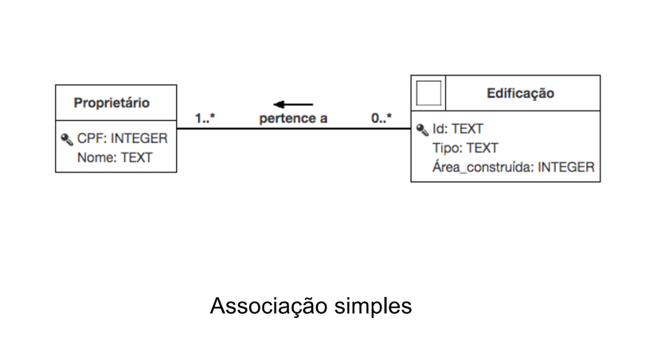
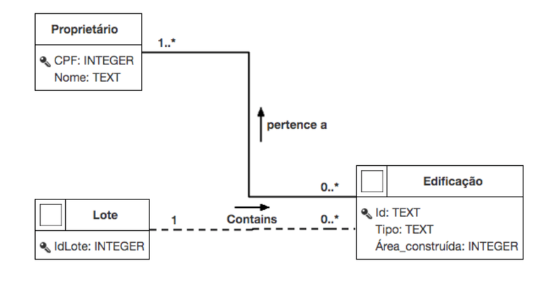
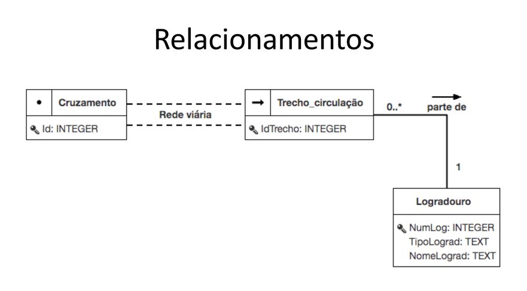
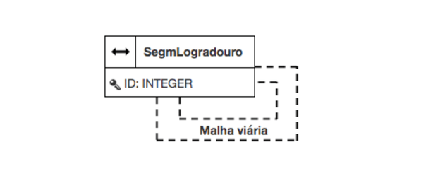
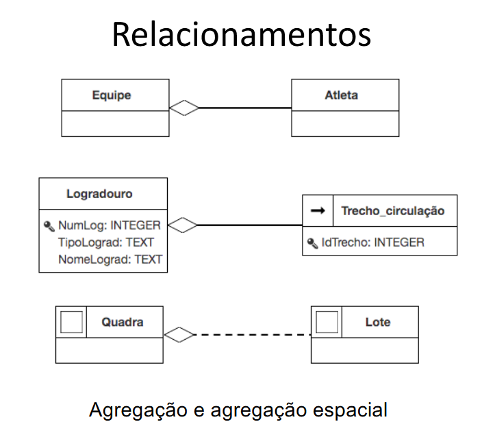
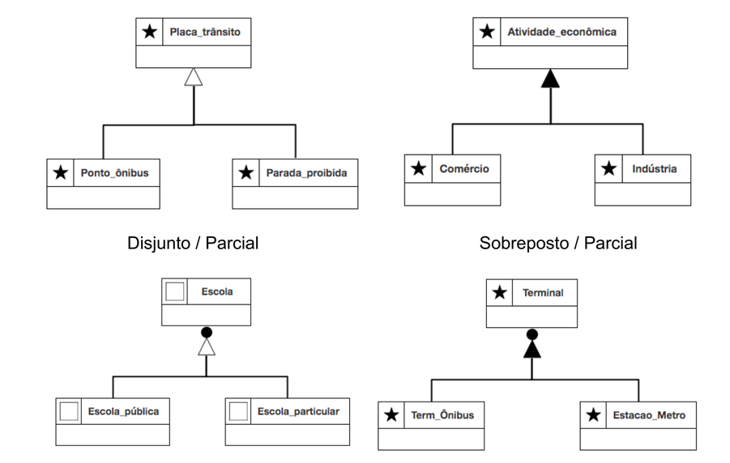

## **Aquisição dos dados** 

## **Modelagem OMT-G**

O OMT-G (Object Modeling Technique for Geographic Applications) é um modelo de dados orientado a objetos voltado para o projeto conceitual de Sistemas de Informação Geográfica (SIG) e bancos de dados geográficos (Um extensão do UML).

### **Classes**

Existem 3 tipos de classe no OMT-G:

#### **Classes convencionais do UML**

Não possuem componente especial como por exemplo: funcionário, proprietário e etc

#### **Geo-objetos**

Geo-objetos são elementos:
- **Individuais**, ou seja, cada elemento tem seus atributos/caracteristicas proprias -> cada arvore no centro de BH tem sua propria altura, idade e endereço.
- **Discretos no espaço**, ou seja, não existem para qualquer coordenada mas sim para algumas especificas -> se existe uma arvore na coordenada (x,y) não necessáriamente tem outra na coordenada (x+0.001,y).

Os principais tipos são:

- **Pontos:** Uma coordenada no espaço como por exemplo arvores
- **Linhas:** Uma lista de coordenadas no espaço como por exemplo meio-fio
- **Poligonos:** Uma lista de coordenadas em que a primeira coordenada é igual a ultima (um poligono é por definição fechado e 2 poligos podem ter interseção mas isso não é obrigatorio). Além do poligono principal, podem ter poligodos extras que representam buracos dentro do poligono que não fazem parte do poligo principal, ou seja, a area do poligono é igual a area do poligo principal subtraida pelas areas dos poligonos extras. Um exemplo disso são lotes. 
- **Rede/Grafo:**
    - **Vértices:** São representados como pontos normais, como por exemplo conexões de esgoto.
    - **Arestas:** são representadas como linhas que começam em um vértice e terminam em outro, como por exemplo o encanamento entre duas conexões de esgoto. Cada aresta é ligada topologicamente aos nós que ela conecta e portanto carrega referencia deles.

#### **Geo-campos**

Um geo-campo representa um fenômeno de variação contínua no espaço, algo que existe em todo ponto de uma região, não só em locais discretos e portanto:
- **Não é individualizavel**, pois é um fenomeno de toda região, se fosse a contagem seria infinita.
- **Não é discreto e sim continuo,** para qualquer coordenada o geo-campo tem um valor.

Os principais são:

- **Amostras:** Literalmente um ponto no espaço continuo que possui uma coordenada e um valor. Por exemplo uma medição de temperatura no ponto (x,y). Arvore é uma entidade que você identifica e nomeia e portanto é um geo-objeto; a amostra é só uma medição pontual de um fenômeno que, em teoria, existe em todo lugar, o ponto é apenas onde você conseguiu medi-lo.
- **Sub-divisão planar:** São poligonos porém com restrições de que não podem se sobrepor, precisam cobrir toda a área de interesse e cada poligono tem um valor especifico de amostra. Um bom exemplo são zonas climaticas em que não podem ter 2 climas simultaneamente e cada uma tem um valor de clima.
- **Isolinhas:** Linhas conectando as coordenadas de *amostras* com o mesmo valor no espaço, além disso elas não se cruzam. Por exemplo curvas de nivel em que a linha tem a mesma altitude.
- **Triangulação:** Representado por amostras (pontos) e esses pontos geram poligonos (triangulos). Dado essas 3 amostras que temos usamos interpolação para aproximar todos os outros pontos dentro do triangulo com base nos seus 3 vértices. Util quando se tem pontos de amostra irregularmente distribuídos e quer superfície contínua interpolada (ex. relevo).
- **Tesselação:** Grade regular de células, cada uma com um valor. Util se o dado já vem em grade regular (imagem) ou você quer um formato uniforme para processar. Unico com representação diferente dos outros pois não usa pontos e vetor e sim algo chamado raster.

#### **Atributos**

As classes tem atributos também assim como no UML normal

### **Relacionamentos**

#### **Relacionamento Simples**

Relacionamento sem nenhuma restricao espacial embutida, ou seja, um relacionamente como qualquer outro do UML normal. Um exemplo disso é departamento tem funcionário. Basicamente uma linha preta com uma seta no meio descrevendo a relacao.

#### **Relacionamento Espacial (topologico)**

Ocorre quando a geometria de uma classe se relaciona com a geometria de outra. Por exemplo lote está dentro de Quadra. Linha tracejada com o nome da relacao em cima.

- A disjunto de B, A toca B, A igual B, A sobrepoe B
- A dentro de B / B contem A 
- A coberto por B / B cobre A

#### **Relacionamento de rede** 

Ambos aqui sao representados por 2 linhas tracejadas e o nome da relacao no meio delas (ex: malha viaria)

- *aresta-nó:* liga a classe aresta à classe nó (cada arco referencia o nó inicial e o nó final)

- *aresta-aresta:* auto-relacionamento dentro da própria classe arco, usado quando arcos se conectam diretamente entre si sem um nó explícito modelado (ex.: trechos de rio que se emendam).

#### **Agregacao**

- *Agregação comum:* relação todo-parte convencional, sem exigência geométrica (ex.: Departamento é composto por Funcionários, mas funcionário não "preenche" o espaço do departamento).
- *Agregação espacial:* além do todo-parte, exige que geometricamente as partes preencham o todo, cada parte contida no todo, o todo inteiramente coberto pela união das partes, e as partes só podem se tocar ou ser disjuntas entre si (nunca se sobrepor). Exemplo: Quadra (todo) formada pelos Lotes (partes).

#### **Generalizacao/especializacao**

Divisao em subclasses:

- *Triângulo preto/preenchido* ->	Total, toda instância da superclasse obrigatoriamente cai em alguma subclasse (não pode "sobrar" instância sem categoria)
- *Triângulo vazado/contorno* -> Parcial, pode existir instância da superclasse que não pertence a nenhuma subclasse
- *Com bolinha* -> Sobreposto, uma mesma instância pode pertencer a mais de uma subclasse simultaneamente
- *Sem bolinha* -> Disjunto, as subclasses são mutuamente exclusivas; uma instância só pode estar em uma delas

### **Cardinalidade**

Indicada em cada ponta do relacionamento, no formato *(mínimo, máximo)*:

(0,1) → participação opcional, no máximo um
(1,1) → participação obrigatória, exatamente um
(0,*) → participação opcional, pode ter vários
(1,*) → participação obrigatória, pelo menos um, pode ter vários

### **Restricoes**

