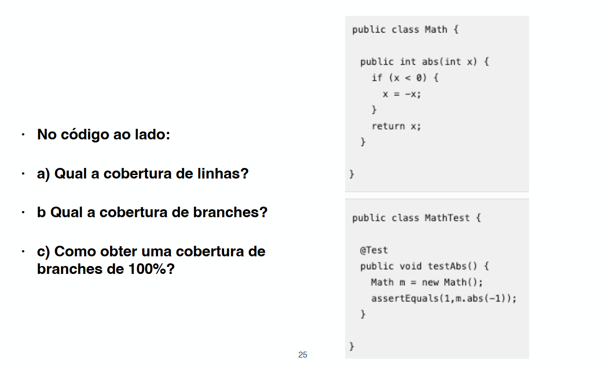

## **Cobertura de testes**

Mede o percentual de linhas do codigo executadas pelos testes. (Linhas executadas / total de linhas)

### **Cobertura ideal**

Nao existe cobertura ideal pois a resposta varia de projeto e em projeto e nem todas as linhas precisam ser testadas (100%) pois algumas sao triviais. Nao é interessante fixar uma meta especifica para ser atingida pois coloca pressao nos desenvolvedores fazendo com que eles facam de qualquer jeito, o ideal é verificar se esta evoluindo junto com codigo ou se mantendo. Google recomenda 85% pelo menos variando por linguagem.

### **Outras definicoes**

Pode ser cobertura baseada em percentual de linhas, funcoes ou branchs (caminhos possiveis com if/else).

- Exercicios:
    1. Cobertura de testes mede o percentual de código coberto por testes. (V)
    2. Devemos sempre buscar cobertura de 100%. (F)
    3. Em geral, cobertura tende a variar por linguagem de programação. (V)
    4. Existem diferentes definições para cobertura, tais como cobertura de linhas, cobertura de funções e
    cobertura de branches. (V)
    5. Linha amarela indica que o comando é um desvio e que apenas um dos caminhos possíveis do
    desvio foi exercitado pelos testes de unidade.(V)
    6. Recomenda-se fixar um valor de cobertura que tenha que ser sempre atingido.(F)
    7. Podemos afirmar que a cobertura de branches é mais rigorosa do que cobertura de linhas. (V)
    8. Valores abaixo de 50% de cobertura tendem a ser preocupantes (V)

- a: cobertura de linhas 100% pois o codigo executa todas as linhas
- b: cobertura de branchs 50% pois o codigo só executa o caso em que o IF é verdadeiro
- c: adicionar um teste em que x > 0

### **Boas praticas ??**

- **Facilita fluxo de trabalho:** Permite verificar quais partes do codigo nao estao testadas e revisar elas
- **Cobertura alta nao significa qualidade:** Cobertura fala de quantidade testada e nao da qualidade dos testes
- **Baixa cobertura significa algo:** Areas do codigo sem testes
- **Nao existe numero ideal:** Se fixar uma cobertura a qualquer custo os Devs preguisocos podem usar pragmas para remover codigos da cobertura e aumentar artificialmente ela.
- **Cobertura além de 90%:** Nao tem retorno que compense o custo de criar esses testes 
- **Codigo cresce muito:** Cobertura tem que crescer junto ou se manter constante

    - Exercicio: 

        1. Descreva a principal limitação da métrica de cobertura.

            Mede a quantidade de código executada, mas não a qualidade ou a corretude dos testes.

        2. Elabore uma solução para essa limitação.

            Mutation Testing: cria pequenas variações modificadas do seu código original (os "mutantes"). Ela altera um operador de if (x > y) para if (x >= y) ou muda um + para -. Se os seus testes falharem ao rodar contra o mutante, o mutante foi morto (isso é ótimo, significa que seu teste detectou a alteração).

