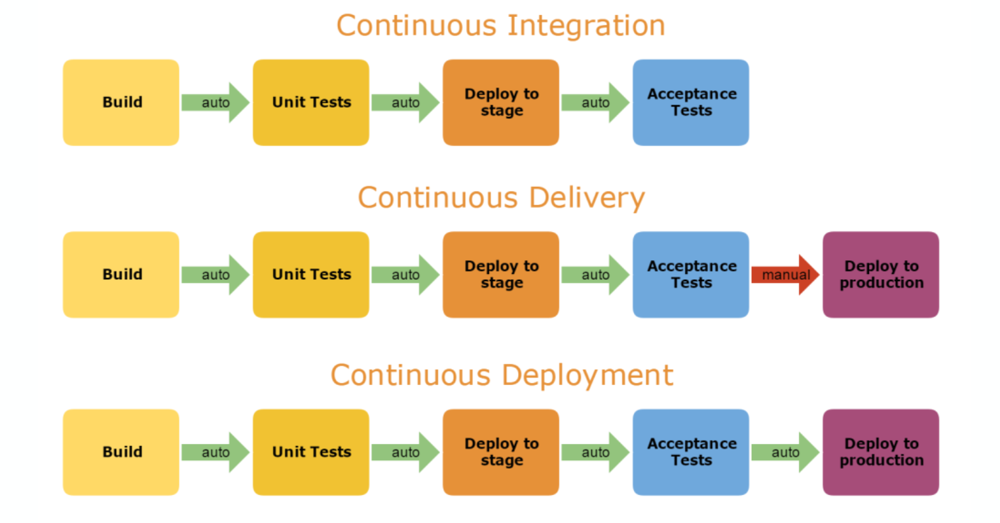

## Devops

### Antes

Antigamente equipe de operações (Infra/rede) era dividida da equipe de desenvolvimento (software). Isso gerava problemas de comunicação entre as equipes devido a requisitos e consequentemente atrasos no deploy.

### Agora com DevOps

Uma forma de unificar o desenvolvimento e e operações e conseguir fazer deploy mais rapido antecipando os problemas. (Não necessáriamente um cargo novo e sim uma aproximação para evitar isolamento das equipes, ou seja, são pessoas que ficam na interseção entre as equipes). Grande parte do trabalho do devops é automatização do deploy, testes e CI e CD.

### Principios

- **Processo repetivel e confiavel:** Tornar simples o deploy para um desenvolvedor

- **Automatizar:** Todos os passos de deploy devem ser automatizados 

- **Versionamento:** Todas as versões em deploy tem que ser facilmente recuperaveis

- **Executar tarefas trabalhosas mais:** Se uma tarefa fica mais complexa conforme voce espera mais para realizar, realize varias vezes (CI).

- **Concluido = pronto para deploy:** Uma tarefa só é concluida se ela esta 100% pronta e testada para deploy.

- **Deploy é responsabilidade de todos:** Não pode ter isolamento entre equipes

### Continuos Deployment

No CI geralmente o deploy não é feito automaticamente a cada integração continua dos desenvolvedores. Varias integrações podem ser acumuladas antes de um deploy. No CD sempre que um commit chega na branch main do repositorio principal e passa com sucesso pelo servidor de CI (testes), o commit entre imediatamente em produção. Vantagens:

- Novas funcionalidades rapidamente

- Favorece experimentação e feedback rapido

### Continuos Delivery

Deployment continuo não faz sentido para alguns tipos de aplicações como desktop e celular pois vc teria que atualizar toda hora seu aplicativo. Ai entra a entrega continua em que todo commit pode entrar em produção imediatamente mas não necessáriamente vai acontecer isso. Alguém ira tomar a decisão do melhor momento. Então meio que apenas entregamos o codido para o repositorio de forma contiua mas não fazemos deploy... dai vem a diferença de Continuos Deployment em que entregamos e o deploy é feito na hora.

- Exercicios: 

    1. Descreva duas vantagens de um Sistema de Controle de Versões Distribuído, como o git.

        Trabalho Offline e Autonomia: Como cada desenvolvedor possui uma cópia completa de todo o histórico do repositório em sua máquina local, é possível fazer commits, criar branches e visualizar o histórico sem depender de conexão com a internet ou com um servidor central.

        Velocidade e Redundância (Segurança): Operações como commits, histórico (git log) e alternância de ramificações (git checkout) são instantâneas porque são locais. Além disso, se o servidor central falhar ou quebrar, qualquer repositório local dos desenvolvedores serve como um backup completo para restaurar o sistema.
    
    2. Considere a seguinte frase: “adotar uma ferramenta de CI não necessariamente significa que você está praticando CI”. Você concorda ou discorda? Justifique a sua resposta.

        Para praticar CI de verdade, os desenvolvedores precisam integrar seu código no branch principal com alta frequência (várias vezes ao dia). Se a equipe usa o Jenkins, mas mantém branches abertos por um mês sem integrar, eles têm a ferramenta, mas não praticam Integração Contínua.
    
    3. Apresente as diferenças entre Integração Contínua (CI), Entrega Contínua e Deployment Contínuo.

        Integração Contínua (CI): Foca na automação do início do fluxo. Toda vez que o código muda, ele é buildado e testado automaticamente para garantir que a integração não quebrou o sistema. O produto final é um artefato testado.

        Entrega Contínua (Continuous Delivery): Vai um passo além da CI. Garante que o código testado esteja sempre pronto para ir para a produção a qualquer momento. No entanto, a decisão final de colocar o sistema no ar (deploy) é manual (depende de um clique ou de uma decisão de negócios).

        Deployment Contínuo (Continuous Deployment): É a automação de ponta a ponta. Se o código passou por todas as etapas de CI e testes automatizados com sucesso, ele é enviado automaticamente para a produção sem nenhuma interferência ou aprovação humana.

    4. Em uma empresa que desenvolve aplicações web, qual prática você 
    adotaria: delivery contínuo ou deployment contínuo? Justifique.

        Aplicações web rodam do lado do servidor ou no navegador do usuário, o que facilita correções e atualizações instantâneas (diferente de softwares embarcados ou aplicativos de celular que exigem que o usuário baixe uma atualização). Adotar o Deployment Contínuo permite que novas funcionalidades e correções de bugs cheguem aos usuários em minutos, acelerando o ciclo de feedback e gerando alto valor de negócio, assumindo que a empresa possua uma suite de testes automatizados extremamente robusta.

    5. O seguinte pipeline de CI/CD detalha um processo de Integração Contínua (CI), Entrega Contínua ou Deployment Contínuo?

        Entrega Continua
    
    6. Em sites de oferta de empregos na área de TI, é comum encontrarvagas para “Engenheiro DevOps”, requerendo habilidades como as seguintes:

        • Ferramentas de controle de versão (Git, Bitbucket, SVN, etc.)
        
        • Gerenciadores de dependência e build (Maven, Gradle, etc.)

        • Ferramentas de integração contínua (Jenkins, Bamboo, VSTS)

        • Administração de servidores em Cloud (AWS e Azure)

        • Sistemas Operacionais (Ubuntu, CentOS e Red Hat)

        • Banco de dados (DynamoDB, Aurora Mysql)

        • Docker e orquestração de Docker (Kubernetes, Mesos, Swarm)

        • Desenvolvimento com APIs REST, Java

        Considerando a definição de DevOps, você considera adequado que
    a função de um funcionário seja “Engenheiro DevOps”? Justifique.

        DevOps é um movimento cultural, uma filosofia de colaboração que visa quebrar a barreira histórica entre os times de Desenvolvimento (Dev) e Operações (Ops). DevOps não é um cargo, uma pessoa ou um conjunto de ferramentas.

        Quando o mercado cria a vaga de "Engenheiro DevOps" exigindo a lista citada, ele geralmente está cometendo um erro conceitual:

        Criando um novo silo: Em vez de unir Dev e Ops, cria-se uma terceira equipe/pessoa intermediária, o que vai contra a ideia original.

        Confundindo a cultura com ferramentas: O anúncio foca puramente em habilidades técnicas (GCP/AWS, Jenkins, Kubernetes), o que na verdade descreve o papel de um Engenheiro de SRE (Site Reliability Engineering) ou um Engenheiro de Infraestrutura/Plataforma.