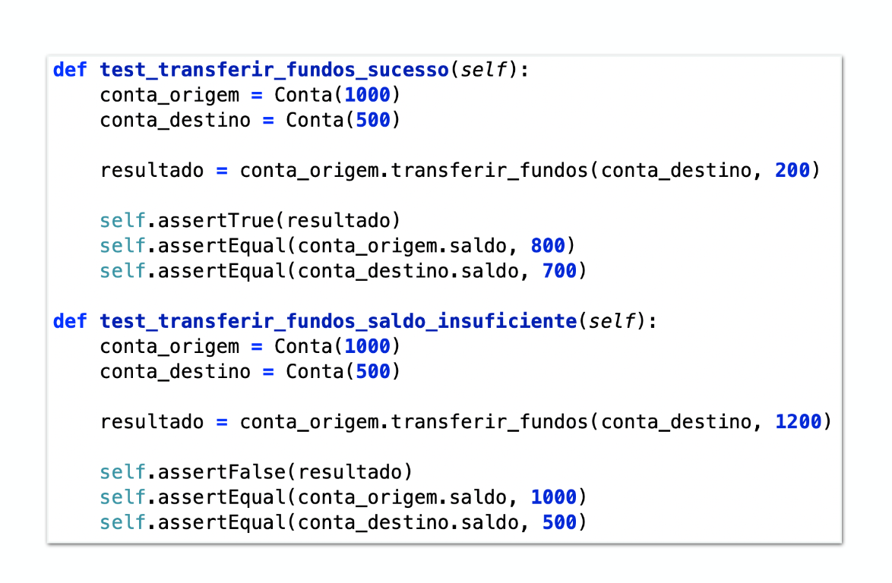

## **Testes de unidade**

Em testes de unidade o codigo pode ser dividido em 2 grupos: Classes da aplicação e testes. Cada classe pode ter um ou mais testes ou pode ter 0 testes caso seja muito simples ou caso alguém tenha esquecido de testar ela.

### **Convenção**

- Classes de teste (que os metodos são os testes) são nomeadas com **nome da classe** testada + **sufixo Test**.
- Metodos dessa classe serão sempre **publicos**, **sem parametros** e com **prefixo test**

### **Estrutura de um teste (AAA)**

1. **(Arrange)** Preparamos nosso fixture que é o estado inicial (construtores neceessários) e controlado de todos os testes (garante reprodutibilidade) 
2. **(Act)** Usar um metodo da classe testada e pegar seu retorno
3. **(Assert)** Verificar usando Asserts se o valor retornado esta correto

Existem ferramentas para auxiliar durante a preparação do fixture como SetUP que são metodos que serão executados sempre ao inicio de um teste (uteis para instanciar objetos) e tearDown que são metodos que são executados apos cada teste (limpar memória ou objetos criados). 

### **Conceitos**

- **Teste (test method):** metodo que implementa um teste
- **Fixture:** Estado inicial da classe que será testada
- **Test Case:** Classe de teste com os metodos de teste para uma classe do sistema
- **Test Suite:** Conjunto de classes de teste
- **System under test (SUT):** Sistema sendo testados (produção)

### **Quando escrever testes de unidade ?**

Podemos implementar os testes antes da funcionalidade em si **(TDD)**, também pode ser assim que uma **funcionalidade pequena** for implementada, para reproduzir **bugs ou debugar**. **NUNCA** implementar assim que o sistema esta totalmente pronto.

### **Boas praticas**

- **Estabilidade:** Testes uma vez escritos só devem (no melhor dos casos) ser alterados se o comportamento do sistema testado mudar propositalmente.

    - Se um teste quebra com refatoração por exemplo significa que ou a refatoração mudou o comportamento ideal do sistema ou o teste esta mal escrito.
    - Novas features não devem mudar o comportamento do sistema e portanto não quebrar/alterar os testes já existentes e apenas adicionar novos
    - Sempre que um bug for encontrado e corrigido é ideal criar um teste para evitar que aquele bug aconteça novamente

- **APIs publicas (interface do usuário):** Ao escrever testes sempre use a mesma interface que o usuário usa pois ela muda menos e identificamos erros que iriam para o usuário mais cedo, afinal ela é mais realista.

- **Teste comportamentos e não metodos:** Testar comportamentos do sistema ao invés de metodos pois se criamos para todo metodo um teste, se essa classe cresce muito com N metodos vamos ter N testes no test case da classe. Uma alteração na classe testada leva a uma ou mais alterações nos testes.

    - Um **comportamento** é qualquer é um conjunto de ações/outputs de um sistema dado uma entrada e um estado atual (Somar, multiplicar)
    - Uma **feature** é um conjunto de comportamentos (Calcular)
    - Metodos e comportamentos tem uma **relação NxN** pois um **metodo pode ter varios comportamentos** diferentes que viram testes diferentes e um **comportamento sozinho (teste) pode se basear em mais de um metodo**.

