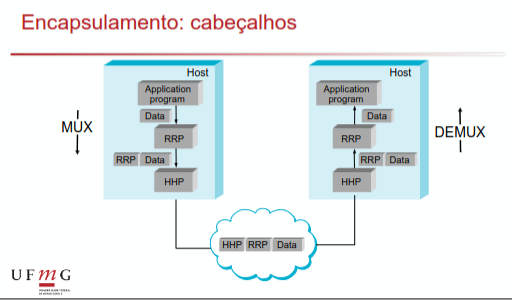

## **Introdução**

As perspectivas/visões sobre redes são construidas em cima de alguns requisitos como:

- **Conectividade:**Ligação que permite transportar informação entre 2+ computadores
- **Compartilhamento de recursos:** As ligações não são usadas exclusivamente por apenas um computador
- **Serviços comuns:** Construição em camadas permitindo implementação e uso para aplicações especificas

Uma rede em si pode ser definida recursivamente como duas ou mais redes interconectadas. Redes são grafos em que nós são os hosts (computadores) ou elementos de interconexão (roteadores/switches) e as arestas são os links... link é o canal de comunicação que conecta dois ou mais nodes... esses links podem usar materiais/tecnologias diferentes e trabalharem com protocolos de enlace(link) diferentes.

- **Meios fisicos como:** Cabos de cobre para LANs, Fibra optica para longas distancias e ondas de radios (wifi/satelite) que são transmitidas pelo ar.

- **Topologias como:** Ponto-a-ponto que conecta apenas 2 maquinas e multi-acessso em que varias maquinas competem no mesmo link.

- **Protocolos de Enlace:** Regras que organizam os dados para serem transmitidos nesses links... como Ethernet que é padrão para LANs, Wifi que é padrão para links multi-acesso e PPP que é padrão para links ponto-a-ponto.

O compartilhamento de recursos é feito através do grafo e suas arestas e mais de um nó pode usar essa aresta para chegar em diferentes lugares... essa transmissão de multiplas informações pelo mesmo espaço fisico é feita pela **multiplexação** ... existem 3 tipos principais:

- **Divisão de Frequencia:** Aqui a largura de banda total do canal é dividida em faixas de frequencia que não se sobrepoe, cada cliente aqui sintoniza no canal que quer receber. È necessário não utilizar banda nos espaços entre as frequencias para evitar qualquer tipo de interferencia causando um subuso da rede. Os usos mais comuns são com radio (FM com suas sintonias) e televisões antigas (canais).

- **Divisão de Tempo:** Aqui ao invés de manter um fluxo constante de dados em frequencias diferentes, cada usuário pode usar toda a largura de banda porém com tempo limitado a um time-slot que são frações de tempo pequenas. Se nenhuma informação for enviada nesse slot de tempo ele ainda será gasto gerando desperdicio de banda. Usado antigamente em redes telefonicas...

- **Divisão estatistica:** Nos 2 ultimos existia muito disperdicio de banda seja por time-slots ou frequencias de segurança e também o numero maximo de participantes na transmissão é pre-fixado. Aqui ao inves dos usuários revesarem um time-slot de forma estatica os pacotes são enviados sob demanda então se um usuário não esta enviando nada outro usuário pode enviar no lugar dele. Faz necessário existir uma fila/buffer para caso varios usuários queiram falar ao mesmo tempo e que a informação (pacote) carregue o destinatário junto com ela (cabeçário/header) pois agora não é mais fixo. Casos de uso mais comuns é em redes modernas e roteamento.

Os serviços em comuns são alcançados através de protocolos e padronizações existentes que varias aplicações podem usar.

### **Protocolo**

Redes é composta por uma hierarquia de protocolos e cada um deles define duas interfaces: interface de comunicação no mesmo nivel (camada) e interface com camadas superiores através de operações.

Os protocolos tem uma hierarquia propria e conforme os dados são preparados para serem enviados para outra maquina (multiplexação) acontece os encapsulamentos em protocolos de camadas mais baixas... quando o pacote chega na outra maquina (demux) acontece o desencapsulamento dos niveis interiores que permite a comunicação padronizada entre as maquinas.

### **Pacote**

Pacote = Dados do usuário + headers de controle (encapsulamentos)

### **Modelo TCP/IP**

- **Camada 1 (Fisica/Hardware):** Lida com sinais elétricos e cabos (conversão para ondas de radio (eletromagneticas) e etc)

- **Camada 2 (Enlace/link):** Lida com o encapsulamento do protocolo IP, a tradução dos dados para um formato que possa ser transmitido (entrega e leitura) dentro de uma LAN.

- **Camada 3 (Rede/Roteamento):** Lida com roteamento e conversão entre tipos de links diferentes para transmitir dados entre diferentes LANs.

- **Camada 4 (Transporte)** Lida com transporte dos pacotes e garantias de entrega

- **Camada 5 (Aplicação):** Onde rede interage com diversos softwares diferentes

### **Desempenho**

Como avaliar o desempenho de um protocolo de rede:

- **Largura de banda (Bandwidth):** capacidade teórica máxima de dados que um canal fisico pode transmitir (Quão largo é um tubo) em uma unidade de tempo (600mb/s)
- **Vazão (Throughput):** Quantidade de dados que chega no destino em alguma unidade de tempo (sempre <= banda pois existem perdas no caminho ou colisões)

O atraso/delay de um pacote sair e chegar em outro ponto é uma soma de outros atrasos:

- **Atraso de transmissão:** tempo que leva para colocar aquele volume de dados inteiro no cabo para ser deslocado (Quantidade de dados/Banda)
- **Atraso de propagação:** tempo que leva para que o primeiro bit viajar fisicamente ate o destino (Distancia/Velocidade (luz por exemplo))
- **Atraso de Fila e processamento:** tempo de espera em filas e empacotamento
- **One-way Delay:** Transmissão + Propagação + Fila + Processamento
- **RTT (two-way delay):** Tempo de enviar e ter uma respostas (2 x One-way delay)

Exemplo: O tempo de enviar um arquivo de **1000 MiB** por **1000 km** (dado que a taxa de transmissão é 1 GB/s (**10⁹ b/s**) e a velocidade da fibra otica é **2*10⁸ m/s**) muda dependendo de como você envia:

- **Enviamos o pacote todo de uma vez:** 

    - **delay de transmissão** = 1000 MiB / 1 GB/s = ((8 x 10⁹ b) / (10⁹ b/s)) = 8 segundos

    Agora sabemos que o tempo ate todo o arquivo estar se deslocando no cabo é 8 segundos.

    - **delay de propagação** = 1000 km / 2*10⁸ m/s = (10⁶ m / 2 * 10⁸ m/s) = 1/2 * $10^{-2}$

    Agora sabemos o tempo que leva para cada bit chegar no destino.Podemos agora calcular o tempo de entrega do arquivo que é o One-way delay.

    - **tempo total** = 8 + 0,005 = 8,005 segundos

- **Envio o arquivo em pacotes de tamanho fixo (1 KiB) em que enviamos um, esperamos resposta de confirmação e enviamos o proximo:** 

    - **delay de transmissão de um pacote** = 1 KiB / 1 GB/s = ((8 x 10³ b) / (10⁹ b/s)) = 8 * $10^{-6}$ segundos

    - **delay de propagação de um pacote** = 1000 km / 2*10⁸ m/s = (10⁶ m / 2 * 10⁸ m/s) = 1/2 * $10^{-2}$

    - **tempo de um pacote inteiro chegar** = ((8 * $10^{-6}$) + (1/2 * $10^{-2}$)) 

    - **tempo do pacote chegar e a confirmação chegar** = 2 * ((8 * $10^{-6}$) + (1/2 * $10^{-2}$)) ≃ $10^{-2}$

    - **numero de pacotes para enviar** = 1000 MiB / KiB = 10⁹ b / 10³ b = 10⁶ 

    - **tempo total** = 10⁶ x $10^{-2}$ = 10⁴ segundos

O **volume máximo** de dados que pode estar "em trânsito" dentro do link a qualquer momento. É como calcular o volume de água dentro de um cano de uma ponta a outra:

$$\text{Dados em trânsito} = \text{Banda} \times \text{Atraso/Delay One-way}$$

#### **Endereço MAC**

MAC serve como identificador unico da sua placa de rede (wifi ou ethernet)... servindo como uma espécie de CPF para seu computador. Geralmente é composto com 48 bits sendo alguns deles responsavel para identificar o fabrincante e outros metadados da peça.

#### **Topologias de cabo**

- **Barramento:** Um unico cabo principal conecta todos os computadores (computadores se ligam ao cabo)

- **Ring:** Um cabo circular entre varios computadores (usavam um token para dizer quem esta mandando pacotes)

- **Star:** Um switch/roteador central em que varios computadores fazem ponta-a-ponta

- **Arvore:** Hierarquia de switches

