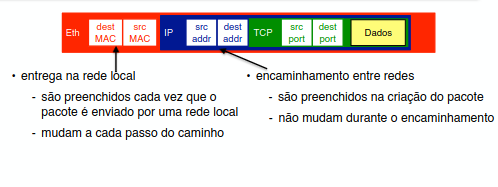

# **Interconexão de redes (internet'working)**

O problema central abordado aqui é que nenhuma tecnologia de rede local (LAN) consegue cobrir uma quantidade de nodes em escala global. Um cabo Ethernet sozinho mal suporta 1024 conexões (nodes) pois a chance de colisão é muita alta, wifi é limitado por distancia e link ponto a ponto envolve apenas 2 nodes.

A ideia então é ter varias subredes locais (LANs) diferentes uma da outra e conectar elas ... isso é chamado de internet. 
Primeiro passo é conectar de maneira eficiente maquinas proximas (mesma LAN) que compartilham o mesmo tipo de link (tipos são iguais se o protocolo de enlace é igual)... isso é alcançado por meio de **switches** que recebem pacotes em uma porta e enviam para outra. Em seguida, precisamos conectar LANs separadas de diversas partes do mundo que usam diferentes tipos de links e para isso existem os **roteadores** que fazem essa tradução (usam o padrão global IP). Depois temos que encontrar **algoritmos** que consigam fazer o roteamento de forma eficiente e tolerante a problemas de uma LAN para outra... isso inclui **hardware especializado** para isso. Redes compostas por redes locais são chamadas de redes chaveadas.

## **Switches (chaves)**

### **Bridge**

O antecessor do Switch para quando os computadores eram conectados por barramento (um fio unico)... dividiamos o fio em 2 pedaços e cada pedaço conectava grupos separados de computadores. Esses grupos são conectados por uma bridge que filtra pacotes... só passam para o outro grupo se o destinatario estiver lá (evitar colisões no outro grupo)... além disso ele reenvia o sinal recuperando a energia tbm.

### **HUBs (repetidor)**

Tecnologia antiga que atua na camada 1 do modelo OSI e funciona como um switch porém ao invés de redirecionar e armazenar sinais ele simplesmente pega o sinal eletrico recebido e faz broadcast para todos os outros nodes conectados. Ainda possuem problemas graves de colisão e segurança pois todos pacote é recebido por toda a LAN.

### **Encaminhamento**

Switches podem comunicar não apenas com sua propria LAN mas também com outros switches (e roteadores tbm) através de links ponta-a-ponta... eles fazem o transporte de um pacote de entrada ate uma (ou mais) saida correta, mas como o pacote vai encontrar ela? o pacote tem que levar essa informação em seu cabeçário/header mas como usar essa informação... existem 3 principais estratégias de encaminhamento: 

- **Datagrama (Sem conexão e o mais usado):** 

    1. Enviamos cada pacote de forma independente com o endereço completo do destino (MAC)... fica no header ocupando grande espaço
    2. Cada switch tem uma tabela que mapeia endereço -> porta para chegar nele... usamos bastante espaço no switch então se feito de maneira burra
    3. Seguimos as saidas respectivas do endereço ate chegar ao final

    - Como cada pacote é independente, eles não necessáriamente seguem a mesma rota (por exemplo se um switch cair, ele entrega por outra rota) e consequentemente podem chegar fora de ordem... 
    - Sem overhead de setup

- **Circuito Virtual (Orientado a Conexão):** 

    1. Setup que definimos uma rota fixa para o destino e prenchemos o vetor dos switches com ID_rota_x -> (Porta de saida, New_id_rota_x)... overhead de envio mais alto. Trocar o id se chama Label Swapping e evita que 2 usuários usem o mesmo id. Os ids são chamados de VCI
    2. Seguimos os IDs da nossa rota fixa e suas respectivas portas de saida ate chegar ao destino... precisamos carregar no header o ID atual da rota (int, então é pequeno) 

    - Todos os pacotes para o mesmo destino seguem a mesma rota e se um link cai perdemos os pacotes
    - Mais rapido que datagrama pois usamos indice inteiro ao invés de hash 
    - Um VCI não é um endereço IP global que vai até o final. Ele é só uma "etiqueta" colada no cabo físico entre dois equipamentos. Quando o pacote entra em um switch, a etiqueta é trocada para o próximo cabo.
    - A rede sempre tenta atribuir o VCI 0. Se o 0 estiver ocupado naquele cabo, ela pega o 1, depois o 2, etc.
    - Se no passo (a) você usou o VCI 0 em um cabo, essa conexão continua ativa. No passo (b), se o pacote precisar passar por esse mesmo cabo (em qualquer direção), o VCI 0 estará bloqueado e a rede terá que usar o VCI 1.

- **Source Routing:** 

    1. Antes de enviar o pacote definimos uma rota fixa e colocamos todos os ids das portas de saida dos switches no header do pacote... usando bastante espaço header
    2. Seguimos a rota descrita no header

    - Mesmos problemas do circuito virtual
    - Necessário conhecer toda rede

### **Switches para Ethernet**

Antigamente as redes locais de ethernet eram simplesmente varios computadores conectados em um unico cabo de rede longo... isso gera alguns problemas como:
- 2 computadores enviam pacotes simultaneamente e acontece uma colisão 
- Sinal enfraquece conforme atravessa cabos muito longos
- Sinal é compartilhado com todos da LAN

Hub resolve apenas o problema do sinal fraco repetindo o sinal para todos... porém switches não apenas recebem repetem o sinal, ele recebe em uma porta especifica, armazena temporariamente, verifica a integridade e então entrega o pacote em outra porta. Isso acaba com o problema de colisão e acaba com o problema de privacidade... claro, supondo que as maquinas estejam em formato estrela.

#### **Aprendendo tabelas de redirecionamento em datagramas**

Uma premissa do datagrama é que os switches tenham uma tabela que aponte para qual porta enviar o pacote... isso é dificil de garantir pois:

- Redes grandes como internet tem milhões de nodes e para ter uma tabela desse tamanho é necessário muita memória.
- Mesmo com memória infinita se trocarmos a porta de entrada de rede do nosso computador ? Adicionarmos um novo computador na rede ? teriamos que alterar todos os outros switches.

Inicialmente a tabela do switch não possui nenhuma entrada... vai aprendendo conforme os pacotes são enviados.

A ideia é: 

- Quando um pacote chega no switch sabemos que o remetente deste pacote esta na porta em que o pacote chegou... então criamos uma entrada na tabela que mapeia endereço do remetente para porta que o pacote chegou. 
- Quando um pacote chega no switch, se o destino esta na tabela, seguimos a porta mapeada... se não sabemos qual porta fica o destino, fazemos broadcast para todas as portas (menos a que recebeu) ate encontrar o destino (isso é chamado de flooding). Todos os switches que recebem do broadcast também atualizam as tabelas com o remetente do pacote. Se o destino responder o remetente, o remetente aprende onde o destino esta de agora em diante, ou seja, switch aprende apenas onde quem enviou o pacote esta.
- Se o remetente e destino estao na mesma porta, o pacote é descartado. Se a entrada na tabela não for mais usada ela tem um timeout e é removida.

#### **STP para o problema de ciclos**

Problema: um ciclo + nó desconhecido faria o pacote circular infinitamente pela rede... solução: encontramos uma arvore geradora STP (arvore que minimiza a distancia da raiz para todos os outros nós) da rede (nós são os switches) e caso alguma coisa na rede mude como um nó cair nos executamos o algoritmo novamente.

Ideia do STP: 

- Cada switch (nó) tem um ID unico inteiro, usamos o switch com menor ID como raiz da arvore... além disso tem também o ID da raiz da arvore, distancia do nó a raiz da árvore e os estados das portas.
- Inicialmente todos os nós se consideram a raiz e fazem **multicast (só envia para switches, não para computadores (multicast é enviar para alguns/grupo))** de uma mensagem especial chamada BPDU, se o nó recebe sinal de outro nó que o ID é menor que o dele, ele para de enviar sua mensagem e passa a reenviar as mensagem do nó raiz. Se voce recebe o mesmo pacote por outra porta verifica a distancia (dentro do pacote) daquela porta para o nó raiz e deixa apenas a porta mais proxima da raiz ativada.
- Quando convergir todos da arvore vão ter a mesma raiz e vão continuar recebento esse pacote da raiz de tempo em tempo... se esse pacote sumir por muito tempo significa que algo na rede mudou e outro caminho vai ser encontrado.

#### **Limitações de switches e VLANs**

Problemas: STP é um algoritmo linear no numero de switches e se a rede for grande demais isso fica caro... além disso pode encontrar arvores ruins pois não leva em conta capacidade dos nós. O broadcast durante o aprendizado da rede gera uma grande difusão/trafego de mensagens em literalmente toda a rede... redes fora do seu contexto de trabalho não precisam receber esses pacotes.

VLAN: Criação de LANs virtuais (lógicas) dentro de uma rede e dividir responsabilidades... um VLAN por departamento por exemplo. Isso separa os trafegos independentes, reduz o numero de broadcasts desnecessários e mantem uma STP para cada VLAN. Isso é feito colocando uma tag de 4bytes no dataframe da ethernet que identifica qual VLAN o pacote tem que chegar... o switch ve e manda para as portas corretas (multicast). Fisicamente todos as VLAN estão no mesmo Switch fisico porém elas não podem se comunicar sem antes passar por um roteador... um pacote com tag x só vai para os da mesma VLAN.

## **Internet Protocol (IP)**

Tudo ate agora foi para redes locais... na realidade existem varias tecnologias de rede diferentes e nenhuma delas é melhor que todas em todos os casos. Então precisamos fazer com que elas consigam se comunicar. O protocolo IP é o idioma/padrão universal que roda em todos os computadores e roteadores e permite que redes com tecnologias totalmente diferentes (Ethernet, Wifi...) conversem entre si.

### **Modelo de serviço IP**

IP é um modelo que tenta o melhor que for possivel na rede atual, ou seja, se a rede cair ou algo assim o pacote é perdido... pode chegar corrompido ou fora de ordem. Ele não tem garantias de entrega pois quem lida com isso é a camada 4 de transporte... A ideial principal do IP é permitir a comunicação entre varias redes sem ter nenhuma contexão anterior.

### **Endereçamento**

#### **Endereço IP** 

È o endereço global de uma interface da sua rede... ele é composto por duas partes e tem n bits: 

- **NETWORK:** Parte esquerda (prefixo) x bits que identifica a rede local globalmente -> $2^x$, redes locais possiveis desse tamanho
- **HOST:** Parte direita de n - x bits que identifica seu "dispositivo" localmente chamado de HOST  -> $2^{n-x} - 2$ hosts possiveis. Esse sufixo de host é unico dentro de uma mesma rede e só pode ser usado por um dispositivo por vez... (-2 pois o host 0 é o IP representante da rede e o host 255 é um sinal para broadcast).

Esse IP esta envolvido na escalabilidade pois ele tira a responsabilidade dos roteadores saberem onde esta a maquina, deixando a responsabilidade dos roteadores ser encontrar a rede local (LAN) que possui o sufixo do IP (onde a maquina esta)... o restante quem faz é a rede local com seus switchs e MAC (igual visto anteriormente). Geralmente IP são 4 bytes (32bits) ou seja 4 numeros que variam de 0 a 255. 

O ip de uma maquina em uma mesma rede pode mudar ? Sim mas depende de como o roteador esta alocando IPs... quando conectamos uma maquina no cabo ethernet por exemplo: se existe um servidor DHCP, o servidor vai alocar algum host (sufixo) livre da rede para sua maquina (não necessáriamente o mesmo). Se não existir DHCP, precisamos achar manualmente um host livre da rede.

Enquanto o MAC muda sempre que precisamos transportar o pacote por roteadores (o MAC é sempre do hardware que vai receber o pacote IP, seja um roteador ou maquina) o IP não muda durante o transporte.

#### **Mascara de rede (submask net)**

No endereço IP o numero de bits destinados para o prefixo e sufixo não é aleatório, quem decide isso é a mascara de rede... pode ser vista como um numero depois do IP como por exemplo "xxx.xxx.xxx.xxx / 24" e isso significa que 24 dos 32 bits são destinados ao network, ou seja, $2^{24}$ redes possiveis de prefixo e 32-24=8 bits destinados ao host, ou seja, $2^{8} - 2$ interfaces de host possiveis. A notação 255.255.255.0 representa extamente /24 pois 255 em binário é 11111111, e temos exatamente 24 1s na string.

#### **Classes de endereço e CIDR**

Antigamente existiam classes (A, B e C) que engessavam o tamanho das redes pelo primeiro octeto do IP. O problema é que essas classes eram muito rígidas: Classe C: Tinha apenas 254 hosts. Classe B: Pulava direto para 65.534 hosts...para resolver esse desperdício, criaram o CIDR (Classless Inter-Domain Routing - Roteamento Sem Classes). O CIDR basicamente aboliu as classes engessadas e introduziu a notação da barra (ex: /24, /25, /20). Com o CIDR, a máscara pode ser cortada em qualquer bit de 0 a 32, permitindo fatiar as redes (subnetting) para o tamanho exato da necessidade da empresa, economizando endereços de forma global e diminuindo o tamanho das tabelas de rotas nos roteadores da internet.

#### **Network vs Subnetting/Agregacao vs Internetwork**

- **Network:** É o agrupamento lógico de dispositivos que compartilham o mesmo prefixo de endereço IP. Dispositivos na mesma rede conseguem se comunicar diretamente via Camada 2 (Switch/MAC) sem precisar de um roteador. O identificador da rede é o endereço onde todos os bits de host são 0. Por exemplo, na rede 192.168.1.0/24, o "nome" da rede é esse endereço finalizado em .0

- **Subnetting e Agregacao:** Subnetting acontece quando subdividimos os hosts que temos na nossa rede grande em 2 ou mais redes menores... por exemplo se temos um roteador/rede 123.145.134.** * /24 e queremos dividir em redes menores por motivos de organizacao/seguranca. Criamos mais um nivel de rede interna aumentando os bits da rede como /25 em que agr um bit serve para dividir nossos hosts em 2 subredes (rede de quando o bit 25 = 0 e de quando o bit 25 = 1) ... essas subredes sao vistas como hosts da rede anterior que tinha /24 e elas precisam ter um roteador proprio logico ou fisico. Agregacao é quando criamos um nivel acima na hierarquia de redes removendo um bit da rede... estamos criando um roteador que enxergara varias redes como subredes (123.145.** *.*** por exemplo enxerga 123.145.134.** * como hosts/subredes). 

- **Internetwork:** é o que acontece quando você conecta duas ou mais redes (networks) diferentes, possivelmente com tecnologias diferentes. A "Internet" (com I) é a maior internetwork do mundo.

Agregacao e Subnetting é o que faz o IP ser hierarquico! Gracas ao CIDR. A busca por IP da rede funciona tentando casar o maior prefixo do destino na tabela do roteador atual antes de dar jump.

#### **IPv4 vs IPv6**

A motivação basica da criação do IPv6 é o esgotamento de IPs unicos dado o crescimento absurdo de dispositivos... o numero de bits foi aumentado de 32 para 128.

### **ARP (Address Resolution Protocol)**

Quando um pacote chega ao roteador precisamos saber se o destino desse pacote é a rede daquele roteador ou se temos que passar o pacote para outro roteador... para verificar se é da rede atual fazemos uma comparação usando operação AND, mascara da rede, IP de destino e IP do roteador... fazendo: IP_DEST & MASK == IP_ROT & MASK. 

Se o endereço IP for o da rede local atual podemos encapsular (Camadas mais acima estão sempre mais internamente no pacote **Sinais(Ethernet(IP(TCP(Dados)))))** em um protocolo do enlace por exemplo e enviar, porém, não temos o endereço MAC do destino, apenas o endereço IP... precisamos do endereço MAC para os protocolos de enlace e para se locomover nos switchs. Ai entra o ARP, sua responsabilidade é encontrar o MAC do destino dado que já estamos na rede local certa e ele funciona da seguinte forma: Faz broadcast "perguntando" quem tem o IP do destino, se a maquina não tiver ela ignora e se tiver ela responde para a maquina que perguntou com o seu MAC... uma vez que temos o MAC podemos criar um quadro/frame ethernet e enviar para um switch por exemplo.

### **Fragmentação**

Como lidar com redes com tamanhos máximos de pacotes diferentes ? Se o pacote é maior que o suportado pela tecnologia de rede ele precisa ser fragmentado em pedaços (pacotes menores)... mas cada protocolo pode fazer isso de maneira diferente.

- **IPv4:** cada fragmento tem o mesmo id do pacote original, flags e offset de ordem para reconstrução. A remontagem acontece no computador destino que mantem um temporizador para cada pacote, se esse pacote não chegar completamente ate o tempo acabar todos que chegaram serão descartados. Pode ser feita tanto pelo computador de origem quanto por qualquer roteador no meio do caminho.

- **IPv6:** Roteadores IPv6 que não são a origem não fragmentam pacotes sob nenhuma hipótese. Usa um header especial.

### **Protocolos Auxiliares**

- **DHCP:** Serve para alocar IPs livres para alguma maquina da rede. Maquina entra na rede -> faz broadcast e busca servidor DHCP -> DHCP pega na pool um ip livre e entrega para maquina (ip, mascara e default gateway (roteador para buscar, quando ninguém sabe onde esta (provedoras de rede)), DNA).

- **ICMP:** Um protocolo mais leve e rapido que atua para troca de mensagens pequenas como de erros e mudar rotas.

- **VPN:** Funciona fazendo algo chamado tunelamento (tunel) em que mantemos um pacote IP dentro de outro pacote IP... temos um servidor VPN, o pacote mais interno é criptografado de uma forma que só a VPN sabe, esse pacote então é colocado dentro de outro pacote IP externo que será enviado pela Internet para o servidor VPN, descriptografado e enviado apartir do servidor VPN para o destino do pacote IP interno. Para o retorno, fazemos o mesmo processo.

- **NAT:** Utiliza portas de protocolos de transporte (como TCP e UDP) para um unico IP publico (internet) conseguir ter internamente um grande numero de ips privados mapeados pelas portas... por exemplo se temos um ip privado x.x.x.x e internamente ips privados, se o ip y.y.y.y privado fizer uma requisição para fora da rede privada, nos pegamos o ip privado e a porta p1 utilizada por ele que é um inteiro de 16 bits e mapeamos para uma porta p2 no ip publico x.x.x.x, agora tudo que chegar na porta p2 do ip x.x.x.x vai ser redirecionado para o ip privado y.y.y.y:p1 ... isso permite que varios ( $* 2^{16}$) ips sejam reutilizados (iguais) em redes privadas diferentes.

### **Roteamento** 

Enquanto encaminhamento (fowarding) cuida de transferir o pacote recebido pelo roteador para a respectiva interface correta usando a tabela de roteamento e o IP de destino. O processo de roteamento em si representa a construção da tabela de roteamento dentro dos roteadores... para construir essa tabela precisamos enxergar a rede como um grafo ponderado em que os nós são os roteadores e as arestas as conexões entre eles.

Entidades/organizações grandes na rede global ? são chamadas de **Autonomous system (AS)** e representam grandes redes espalhadas globalmente (como a da UFMG)... por existir essa hierarquia, existem roteamento em 2 niveis:

- **Internal Gateway Protocol:** protocolo de roteamento (algoritmo) interno de cada AS.

- **External Gateway Protocol:** protocolo de roteamento global

Globalmente falando a rede é um grafo que os AS (representados pelos seus roteadores de borda) são os nós... dentro de um AS existe um grafo dos roteadores internos dele... e dentro da rede local de cada roteador temos o grafo de switches que conectam as maquinas.

### **Protocolos de roteamento interior**

#### **Vetor de distancias(RIP)**

Roteadores aqui tem tabela do tipo (destino, dist, next_jump) em que destino é o IP/mask de outros roteadores, dist é a distancia do roteador atual ate o destino e next_jump é o proximo roteador que devemos enviar o pacote para chegar mais proximo do destino.

Cada roteador envia para seus vizinhos (conexões da interface) a cada intervalo de tempo (uns 10s) ou quando alguma coisa na tabela atual mudou (trigger) uma minitabela contendo quem ele conhece (destinos da tabela dele) e a respectiva distancia dele para o destino.

Roteador A recebe anuncio de B:

- Para cada linha (destino, dist_B_dest) do anuncio de B:

    soma_dist = dist_B_dest + dist_A_B # soma da distancia entre A e B com a distancia de B para o destino
    - Se o destino não esta na tabela de A:
        - Criamos uma entrada na tabela para o destino (destino, soma_dist, B)
    - Senão, o destino já esta na tabela e precisamos verificar se o novo caminho é melhor:
        - Se soma_dist < curr_dist_A_dest:
            - Trocamos a entrada atual de A para (destino, soma_dist, B)
        - Senão:
            - se next_jump == B, então mesmo que a distancia seja maior precisamos atualizar para manter a tabela atualizada: # importante caso a rota mais curta aumente de tamanho
                - Trocamos a curr_dist_A_dest para soma_dist

Se uma entrada da tabela fica muito tempo sem ser atualizada ela é removida por timeout... se uma conexão cair isso fara tabelas que seguiam o caminho por ela serem atualizadas com distancias infinitas. Loops são combatidos com o TTL (time-to-live) que diz o maximo de jumps que o pacote pode dar em roteadores antes de ser ignorado.

#### **Link State (OSPF)**

Todos os roteadores (nós) da rede irão fazer as seguintes etapas:

1. Descobrir quem são seus vizinhos imediatos e respectivo custo através de broadcast
2. Com essa informação, cada nó gera seu pacote de estado (LSP - Link state packet) que contem:
    - nó que criou o pacote
    - vizinhos imediatos e seus custos
    - TTL (time-to-live)
    - NSEQ contador que começa em zero assim que o roteador é ligado e incrementa a cada LSP (serve para dizer qual LSP é mais atualizado).

3. Etapa de imundação (flooding) em que todos os roteadores enviam seu LSP para seus vizinhos... Se B recebe pacote de A e B, então B salva uma copia do pacote e retransmite A para todos os seus vizinhos. Ao final todos os roteadores vão ter informação estrutural da rede suficiente gerar o grafo inteiro da rede. Se receber o mesmo pacote mais de uma vez ignora as seguintes. 

4. Dado que todos os nós tem informação suficiente da rede inteira, cada nó usa ela para construir a arvore de caminhos minimos dele para todos os outros nós... para calcular ela dividimos os N nós em 2 conjuntos, um conjunto de tamanho M que colocamos nós que o caminho minimo para a raiz já é conhecido e um conjunto de tamanho N-M para o restante dos nós. A cada passo indentifique os vizinhos dos nós em M que não estão em M, adicione em M o vizinho com menor distancia da raiz... continue ate todos os nós estarem em M.

### **Protocolos de roteamento exterior (roteamento de sistemas autonomos)**

O problema de roteamento de sistemas autonomos é existir um acordo/padrão global entre instituições separadas... o protocolos comum que eles seguem é o BGP-4 que compartilha apenas os caminhos externos (fora do sistema autonomo).

Existem 3 tipos de sistemas autonomos:

- **Stub:** Tem apenas uma conexão com algum provedor externo. (Empresas pequenas)

- **Multi-homed:** Possui conexão com dois ou mais provedores diferentes com objetivo de ter redundancia caso um cabo de uma provedora caia. Entretanto mesmo existindo um caminho passando por ele que conecta provedor A e B, ele não transmite pacotes entre eles.

- **Transit:** Possui varias conexões como o anterior porém conduz trafego de provedores diferentes.

#### **BGP-4**

O objetivo aqui não é mais achar a rota otima mas sim achar pelo menso uma rota que funcione e respeite acordos. Aqui cada AS tem um ou mais roteadores de borda que vão converser com outras AS e dizer quais redes tem dentro da AS... são chamados de speakers.Esses roteadores de borda também trocam tabelas como os vetores de distancia mas ao invés de distancia trocam caminhos inteiros para maior liberdade de acordos e evitar loops. As 3 ações do speaker: trocar informações com vizinhos e alcance de vizinhos

- Vetor de caminhos: Em vez de enviar apenas a distância, o BGP envia a lista completa de todos os Sistemas Autônomos (ASes) pelos quais a rota passa. Esse atributo é conhecido como AS_PATH.

    - A Mensagem: "Eu sei chegar na Rede X. O caminho é: [AS 100 -> AS 300 -> AS 500]."

    - Como funciona a **Prevenção de Loop:** É instantânea e infalível. Se você é o AS 200 e recebe de um vizinho uma rota contendo o caminho [AS 100 -> AS 200 -> AS 500], você a descarta imediatamente. Como o seu próprio AS já está na lista, você sabe que aceitar essa rota criaria um loop.

Os ASes tem relações verticais (dinheiro) e horizontais (politica):

- **Verticais:** Envolve provedores e clientes em que o cliente paga o provedor para ter acesso a internet global.

- **Horizontal:** Clientes podem trabalhar com acordos de transmissão gratuita entre eles com intuito de ambos economizarem pois não precisam passar pelo provedor.

O BGP vai sempre escolher o caminho que minimize o custo financeiro, evitando passar por provedores e preferindo rotas peering onde não se paga nada. Levando em consideração também o custo do roteamento externo e roteamento interno.

Como rede interna e externa se comunicam ? Em stubs é simples pois existe apenas um provedor, então se o IP não é da rede uma rota padrão para o provedor é usada. Em transits medios os roteadores de borda compartilham com todos os outros roteadores (borda ou não) o prefixo da AS que eles conectam... agora em grandes transits isso não escala então os roteadores de borda usam um protocolo especifico chamado **IBGP** em que apenas os roteadores de borda conversam entre si.

