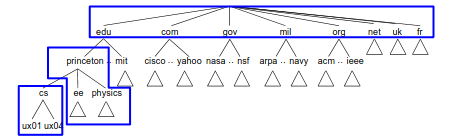

# **Transporte**

## **Motivação Transporte**

A camada de rede só sabe entregar um pacote de um computador para outro (host-to-host) mas **como entregar o pacote para o processo correto** dentro daquela maquina (process-to-process) ? Esse é o trabalho da **camada de transporte**.  

Enquanto o processo precisa dos pacotes com entrega garantida, ordem correta, sem duplicação e de forma sincronizada. A rede (IP) entrega o **best effort** dele que pode perder mensagens, duplicar mensagens ou entregar fora de ordem. Isso é um conflito de interesse... o objetivo dessa camada é **mascarar essas falhas** utilizando protocolos como UDP e TCP que fazem isso de maneira diferente.

## **UDP (User Datagram Protocol)**

È o protocolo de transporte mais simples possivel que não resolve nenhum dos problemas de rede citados. Unica função adicional em cima do IP que ele cria é a **capacidade de separar os pacotes de um fluxo e entrega-los aos processos corretos (demultiplexador)**.

### **Portas e Fila de mensagens** 

Para saber o processo correto ele usa um conceito chamado de **porta que é um ID de 16 bits**. Consequentemente o indentificador agora é o par **(IP, Porta)** (**Nunca** vão existir 2 processos na mesma porta). Portas são padronizadas (well-known) por alguns serviços como HTTP, HTTPS e SSH, então se fazemos uma requisição HTTPS por exemplos ela por padrão chegará na porta 443 e uma vez nessa porta pode ser redirecionada para outra. Em serviços não padronizados pode existir uma consulta para descobrir a porta.

O sistema operacional **implementa portas como filas**, quando um pacote de porta x chega ele é colocado no fim da fila dessa porta. Se a fila estiver cheia, o **pacote simplesmente é descartado** sem avisar o remetente.

### **Checksum**

O UDP não garante entrega mas tenta garantir que se o pacote chegou ele **não esteja corrompido**. Ele faz isso através de **checksum**. Nesse checksum ele usa o **header UDP, dados e pseudo-header** (esse pseudo-header são algumas informações que ele pega do protocolo IP como **IP do destino para garantir que pelo menos chegou no lugar correto** e não foi desviado)

## **TCP (Transmission Control Protocol)**

Diferente do UDP que simplesmente joga o pacote na rede e espera pelo melhor o TCP é um protocolo orientado a conexao que garante que um fluxo de bytes seja entregue de forma confiavel e em ordem tirando essa responsabilidade das aplicacoes. O TCP é bidirecional entao significa que dados podem percorrer em ambas as direcoes e implementa 2 mecanismos de controle importantes:

- **Controle de fluxo:** Evita que o remetente envie pacotes mais rapido que o destino consegue consumir para evitar estourar o buffer
- **Controle de congestionamento:** Evita enviar muitos pacotes na rede para nao sobrecarregar os roteadores no caminho

### **Garantia End-to-end**

Diferente do ethernet que é um cabo (geralmente curto) e torna o algortimo mais simples na internet temos mais problemas:

- **Conexao:** Como nao existe um cabo entre eles é necessário uma fase de conexao entre as maquinas
- **RTT variavel:** Tempo de ida e volta pode varias muito dependendo de quais maquinas estao trocando mensagens
- **Recursos variaveis:** Links de rede com capacidades diferentes e computadores com quantidades de memoria diferentes
- **Pacotes fantasma:** Pacotes pode atrasar muito na rede passando muito do timeout entao precisamos filtrar

O princípio fim-a-fim defende que a confiabilidade só pode ser verdadeiramente garantida pelas pontas finais da comunicação (os computadores do cliente e do servidor). Garantias parciais no meio da rede podem falhar devido a erros de hardware em roteadores ou caminhos heterogêneos.

### **Formato do segmento**

Diferente do UDP que envia um bloco de dados (datagrama) o TCP envia um fluxo de segmentos. Segmentos sao pacotes de bytes de tamanho variavel e cada segmento tem um header com as seguintes informacoes: \

- **Porta (Origem e Destino):** A chave de demultiplexacao que identifica a conexao é a tupla com portas e IPs de origem e destino. Os IPs ficam no protocolo IP e nao no header do TCP.
- **SequenceNum e ACK:** Pense que todo conteudo enviado é um vetor de bytes, SequenceNum é o indice do primeiro byte do segmento nesse vetor (ajuda o servidor a montar e permite que os dados cheguem fora de ordem e nao necessáriamente comeca em 0 sempre pois isso evita que outra conexao com mesmo SequenceNum interfira). ACK é a mensagem de confirmacao que o servidor envia ao receber e ele é o indice do proximo byte a ser recebido.
- **PiggyBack:** Se a conexao for bidirecional, a confirmacao de chegada (ACK) vem junto com a proxima mensagem (dados) que o destino enviar para voce.
- **AdvertisedWindow:** Avisa quanto espaco no buffer do destinatario ainda esta livre atuando como um controle de fluxo. Se o espaco esta pouco enviamos janelas menores.
- **Checksum:** Cada segmento tem seu proprio checksum

### **Estabelecimento e termino de conexao**

Para comecar a conexao é usado ao Three-way Handshake que funciona assim:

1. Host A manda flag de sincronizacao -> **SYN** (SequenceNum)
2. Host B recebe e retorna a confirmacao ACK e manda junto também seu SYN (SequenceNum) pois é bidirecional -> **SYN + ACK**
3. Host A recebe o ACK e SYN depois retorna a confirmacao do SYN (Se quiser pode ja comecar a enviar dados tbm) -> **ACK** 

**!** SequenceNum inicial deles é diferente (e aleatório) pois sao fluxos e direcoes diferentes **!**

Uma vez que a conexao esta feita eles trocam segmentos no fluxo de bytes e para finalizar a conexao algum dos Hosts tem que terminar primeiro:

1. Host A envia flag FIN (terminou) e espera -> **FIN** 
2. Host B recebe flag FIN e retorna ACK -> **ACK**
3. Host A recebe o ACK e espera o FIN do Host B (B terminar)
3. Host B termina seus envios e retorna FIN -> **FIN**
4. Host A recebe o FIN, retorna ACK e espera um pouquinho para evirar pacotes fantasma -> **ACK**

### **Principais pontos sobre a nova janela deslizante**

- **Ethernet (Enlace):** A janela deslizante tem um tamanho fixo. Ela serve basicamente para garantir a entrega confiável e ordenada naquele cabo/link físico específico.

- **TCP (Transporte):** A janela deslizante é variável e dinâmica. Além de garantir a entrega de ponta a ponta, ela embute o Controle de Fluxo. O receptor usa o campo AdvertisedWindow para avisar ao remetente exatamente quanto espaço livre ainda tem no seu buffer de memória. Isso impede que um computador muito rápido afogue um computador lento.

- **Silly Window Syndrome (Síndrome da Janela Boba):** Um problema clássico onde o receptor lê os dados muito devagar, a janela fica minúscula, e o TCP começa a enviar pacotes ridículos (ex: enviando 1 byte de dado útil acompanhado de 40 bytes de cabeçalho TCP/IP), destruindo a eficiência da rede.

- **Algoritmo de Nagle:** É a solução do remetente para a Síndrome da Janela Boba. Em vez de enviar pacotinhos minúsculos imediatamente, ele os segura no buffer até acumular um pacote cheio (MSS) ou até que o pacote anterior seja confirmado (ACK).

### **Retransmissao Adaptativa**

O TCP precisa saber quanto tempo deve esperar o ACK antes de assumir que o pacote foi perdido e retransmiti-lo. O problema é que o tempo de ida e volta na internet é influenciado por muitas coisas... distancia, trafego e recursos da rede. Dito isso, o TCP tem 3 maneiras de lidar com isso:

- **Algoritmo original:** Usa media movel em que o valor estimado do RTT atual é atualizado como o **valor anterior vezes um alpha somado a um novo valor observado vezes (1 - alpha)**. Alpha serve para definirmos o quanto do passado queremos manter. Definimos entao o **timeout como 2x RTT estimado**.

- **Karn/Partridge:** No algoritmo original se restransmitirmos um pacote e em seguida recebermos um ACK, esse **ACK é da mensagem anterior atrasada ou da retrasmitida ?** Dependendo de qual considerarmos vamos atualizar a media movel com valores errados. A solucao foi **nao atualizar o RTT com segmentos retransmitidos** e sempre que retransmitimos **esperamos 2x mais que no envio anterior**.

- **Jacobson/Karels:** Se o RTT variar muito a media movel nao vai conseguir capturar essa ocilacao. Para isso calculamos o desvio (diferencia do RTT observado com a media) e a cada nova observacao atualizamos o desvio e a media com RTT_estimado = RTT_estimado + delta* desvio  e Desvio = Desvio + delta* (novo desvio - desvio). timeout vai ser definido como a* RTT_estimado + b* Desvio.

### **Extensoes modernas do TCP**

Como o header do TCP tem tamanho variado varias opcoes extras: 

- **Timestamps:** permite o remetende enviar o timestamp atual no segmento e o destinatario devolver no ACK permitindo uma computacao mais precisa do RTT

- **Window Scaling:** O campo de Janela (para controle de fluxo) era pequeno demais para as redes modernas com alto produto banda-atraso. Essa extensão adiciona um multiplicador que permite aos computadores avisarem que possuem buffers gigantescos.

- **SACK (Selective Acknowledgment):** Originalmente, os ACKs do TCP eram cumulativos (ex: "Recebi tudo até o pacote 10"). Se o pacote 11 fosse perdido, mas o 12, 13 e 14 chegassem perfeitamente, o destinatário não tinha como avisar sobre os que chegaram. O SACK permite que o destinatário diga: "Recebi tudo até o 10. O 11 sumiu, mas também já recebi o 12, 13 e 14". Isso evita retransmissões redundantes e otimiza a recuperação.

### **Controle de congestionamento TCP**

Em redes IP baseadas no modelo best-effort (melhor esforço), **não há garantias prévias de banda**; qualquer transmissão que ocorra acima da capacidade suportada pelos roteadores é simplesmente **descartada**. O controle de congestionamente **impede que um conjunto de transmissores injete dados demais na rede a ponto de esgotar os recursos** (como largura de banda e espaço nos buffers dos roteadores). Como erros de transmissão física são raros, a **perda** de um pacote é considerada pelo protocolo como um sinal claro de congestionamento.

O TCP lida com esse problema alterando dinamicamento o tamanho da sua janela de transmissao (quantidade de dados enviados simultaneamente) seguindo a seguinte logica: a **janela de transmissa**o vai ser sempre o **minimo entre o anuncio de janela (buffer livre) que veio do receptor no ACK e um valor de janela de congestionamento (cwnd) que é o limite da rede**. Essa janela de congestionamento é reduzida sempre que perdas de pacote forem identificadas e aumentada constantemente para testar os limites da rede.

Para gerenciar essa dinamica existem alguns algoritmos:

- **AIMD (Aumento aditivo e reducao multiplicativa):** A cada RTT concluido sem retransmissao a janela de cogestionamento é adicionada em 1. A cada perda detectada a janela é dividida pela metade para aliviar a rede rapidamente.

- **Slow Start (Partida Lenta):** O objetivo aqui é determinar a capacidade da rede logo no inicio sem ter que crescer de 1 em 1. A ideia é a janela comeca de tamanho 1 e duplica a cada entrega com sucesso. 

(Existe um threshold de tamanho de janela de congestionamento em que trocamos do slow start para o AIMD)

O mecanismo básico do TCP dependia do estouro de temporizadores (timeouts) para perceber que um pacote foi perdido, o que levava a longos períodos de inatividade na rede. Para resolver isso, foram introduzidos dois refinamentos:

- **Fast Retransmit:** Quando por exemplo um segmento 3 se perde mas o seguimentos seguintes 4,5 e 6 chegam o ACK retornado na chegada deles é o ACK do segmento 3... isso gera **repeticao de ACKs pois o ACK do 3 chegará 2x**. O emissor identifica isso e retransmite imediatamente mesmo que o timeout nao aconteceu. Podemos tentar apartir do numero de ACKs repetidos descobrir quem falta ou usar o SACK para ver quem falta.

- **Fast Recovery (Recuperação Rápida):** O retorno ao slow start sempre que o fast retransmit acontecer é muito agressivo (volta a janela de tamanho 1). Ao invés de voltar para janela de tamanho 1, pegamos a janela atual e dividimos pela metade e usamos o numero de ACKs repetidos para mandar segmentos ineditos aumentando a janela de acordo com essas repeticoes.

A internet evoluiu, e redes com alta capacidade e alta latência exigiram atualizações no protocolo. Hoje, o padrão adotado pelo Linux é o TCP CUBIC:  Diferente do TCP tradicional que baseia seu crescimento nos ACKs recebidos (RTT), o CUBIC altera a janela em função do tempo decorrido desde o último evento de congestionamento. O aumento da janela é mais rápido logo no início e acelera novamente se houver muito tempo sem novos congestionamentos.

## **Implementacao do UDP e TCP no SO**

Para que os processos utilizem o TCP ou o UDP, o Sistema Operacional fornece uma abstração chamada de **Sockets** (a API de Sockets POSIX). O SO gerencia essa comunicação através de buffers de memória e tabelas de estado.

- **Socket UDP:** Não tem estado de conexão. O SO precisa apenas de uma fila de entrada e uma de saída associadas à porta local. Cada chamada de envio (sendto) precisa especificar o IP e a porta de destino explicitamente.

- **Socket TCP:** Mantém estado (uma máquina de estados complexa: LISTEN, SYN_SENT, ESTABLISHED, TIME_WAIT, etc.). O SO cria estruturas de controle chamadas TCBs (Transmission Control Blocks) para armazenar o RTT estimado, ponteiros de buffers, e os números de sequência.

## **RPC (Remote Procedure Call)**

RPC é um padrao de API que busca fazer com que uma chamada de funcao pela rede se comporte extamente igual uma funcao local. Isso permite que para o dev nao importe se a funcao será executada em um computador ou outro, ele apenas chama a funcao e pega o resultado (Em java e outras linguagens POO é chamado de RMI (remote method invocation)). Porém existem alguns problemas nessa abstracao de funcao local:

- **Rede é imprevisivel:** A mensagem/pacote enviado de um computador para outro pode se perder, chegar fora de ordem e etc...
- **Arquitetura diferente:** Cliente e servidor podem rodar em diferentes SOs, processadores ou linguagens.

Para resolver isso a implementacao do RPC tem que tem 2 componentes principais:

- **O protocolo:** Algum protocolo que garante a entrega da mensagem na ordem correta, resiliente a queda, sem duplicacao e corrupcao como por exemplo o TCP ou alguma implementacao propria.
- **Os stubs e compilador de stubs:** Para permitir que diferentes maquinas se comuniquem sem erro de compatibilidade nos definimos em um arquivo uma interface das funcoes remotas. Lá colocamos nome, parametros e retorno com seus respectivos tipos. Uma vez definida a interface o compilador vai gerar os codigos de serializacao/deserializacao usando os protocolos de transporte (o codigo de pack(tipos, dados)). Quando o cliente chamar a funcao na maquina dele, o stub do cliente recebera os parametros, serializa e envia para o servidor, o stub do servidor deserializa, executa a funcao e serializa o resultado enviando para o cliente novamente.

### **Identificadores no RPC**

Para **identificar qual funcao esta sendo chamada no servidor** o RPC leva com ele um id unico de funcao ou o caminho completo do sistema de arquivo para definicao da funcao. Agora para **identificar qual cliente entregar o resultado** ele usa o **BootID concatenado com o MessageID**. **MessageID identifica a requisica** o e o **BootID (um ID unico gerado ao ligar o computador)** serve para caso o cliente caia depois de enviar uma mensagem, a proxima mensagem que ele enviar por coincidencia tenha o mesmo MessageID da anterior, fazendo com que o servidor interprete como repeticao de mensagem e descarte a mais nova.

### **RPC + UDP**

RPC frequentemente implementa sua própria camada de confiabilidade por cima de protocolos simples como o UDP e para isso ele usa: 

- **Confirmacao e timeout:** se deu timeout e nao recebeu confirmacao reenvia
- **Canais:** Cliente pode fazer varias chamadas remotas simnultanemente em canais diferentes (sequencial no canal)
- **Alive:** Se o processamento demorar muito o cliente envia um ping para ver se o servidor ainda ta online para ver se vale a pena continuar reenviando.
- **At-most-once ou Zero-or-more:** O servidor pode seguir duas semanticas: Garante que o servidor não vai executar a mesma ação duas vezes caso receba uma mensagem duplicada devido a atrasos na rede (salvando no servidor historico) **OU** Não se importa se a função rodar várias vezes. Isso só serve se a função for idempotente (ex: perguntar "Que horas são?")

### **Sinc vs Assinc**

Protocolos podem ser classificados em 3 tipos:

- **Assincronos:** O cliente envia o pacote e volta imediatamente a trabalhar e portanto nao sabe se mensagem chegou

- **Sincronos:** O cliente fica esperando a resposta chegar (RPC)

- **Meio-termo:** O cliente espera apenas ate a confirmacao de que chegou no servidor

### **Implementacoes do RPC**

- **SunRPC:** RPC minimalista que adota filosofia de fazer o basico e deixar o resto para camada de transporte ou aplicacao. Ele usa geralmente **UDP ou TCP**. Usa um **ID de requisicao que o servidor esquece assim que responde** podendo fazer com que uma funcao execute duas vezes por atraso de rede.

- **gRPC:** O mais recente e usado que foi desenvolvido pela google tem algumas caracteristicas interessantes.

    - **LoadBalancer e containers:** Ao invés de enviar uma requisicao para uma maquina manda para um loadbalancer que redireciona para algum container livre.
    - **Terceirizacao:** Ele nao reinventa roda e usa HTTP2 para garantir entrega segura. 
    - **Streaming:** gRPC suporta 4 formatos de comunicacao:
        - Simples: 1 Requisição -> 1 Resposta (o padrão clássico).
        - Server Streaming: O cliente pede 1 vez, o servidor devolve um fluxo contínuo de dados (ex: feed de cotações da bolsa).
        - Client Streaming: O cliente manda um fluxo de dados e o servidor devolve 1 resposta (ex: upload de um vídeo pesado).
        - Bidirecional: Cliente e servidor ficam trocando dados ao mesmo tempo, de forma independente (ex: chat em tempo real).
    - **Protocol Buffers:** Ao invés JSON que é texto e pesado, usa um formato binário muito mais rapido.

### **Representação de Dados para RPC**

Computadores diferentes representam dados de formas diferentes. É aqui que entra o Marshalling (ou serialização), que é o processo de empacotar os argumentos de uma chamada (como em RPC) em uma mensagem de rede padronizada e, no destino, desempacotar (unmarshalling/decoding) para o formato local.

Nas implementações existem diferentes formas de resolver o problema: 

- **Conversão:**
    - **Tipo intermediario:** Definimos um formato padrão intermediário em que as maquinas cuidam da conversão para o tipo intermediario e o conversão de volta para seu tipo. Evita que toda maquina precisa saber converter todos os tipos.

    - **Destino converte:** Deixamos como responsabilidade do destino converter. Exige que o destino saiba converter tudo.

- **Tags:**
    - **Com tags:** Colocamos tags de tipagem antes dos bytes. Consome banda.
    - **Sem tags:** Definimos estritamente uma conexão que em alguns tipos fixos. Muito limitado.

- **Stubs:** 
    - **Compilados:** Um stub compiler lê a definição da interface do RPC e gera um código de stub super otimizado e customizado especificamente para aquela função.

    - **Interpretados:** O sistema fornece stubs "genéricos" que leem a descrição da interface em tempo de execução para descobrir como processar os dados. Ganha em flexibilidade pois nao precisa recompilar mas perde em eficiencia.

# **Aplicacoes**

A camada de aplicação é onde residem os **protocolos que os programas utilizam diretamente** para interagir com a rede. Ela utiliza os serviços da camada de transporte (TCP ou UDP) para enviar mensagens fim-a-fim e tornar possivel a comunicação entre 2 processos em maquinas diferentes.

## **DNS (Domain Name System)**

Maquinas e roteatores conversam usando IPs mas para humanos é muito mais facil e intuitivo conversar utilizando nomes. IPs carregam informação de onde o computador esta na rede e seres humanos na maioria das vezes não precisam dessa informação... **DNS age como um middleware que dado um nome busca o IP**.

### **Hierarquia de dominios**

Antigamente era mantido arquivos HOSTS.txt em que lá era feito o mapeamento de nomes para IPs mas isso obviamente não escala conforme a internet cresceu. Portanto uma solução hierarquica e distribuida foi proposta.

- **Espaço de Nomes (Name Space):** Define o conjunto de nomes possíveis. No DNS, é uma estrutura em árvore.

- **Mapeamentos (Bindings):** A associação entre o nome e o seu valor (geralmente o IP).

- **Mecanismo de Resolução:** O processo de perguntar a um servidor qual é o IP de um nome específico.

O DNS é lido da direita para a esquerda em sua estrutura lógica. A hierarquia funciona como uma árvore invertida:

1. **Raiz (Root):** O topo absoluto.

2. **TLDs (Top-Level Domains):** O primeiro nível visível, como .com, .edu, .org, ou domínios de países.

3. **Domínios de Segundo Nível:** Como princeton.edu ou google.com.

4. **Subdomínios/Hosts:** Como cs.princeton.edu ou o servidor específico cicada.cs.princeton.edu.

Para que uma única entidade não precise gerenciar tudo, a árvore é dividida em Zonas. A ICANN cuida do topo, uma universidade cuida do seu domínio, e o departamento de computação pode gerenciar sua própria subzona. Cada zona é suportada por **Servidores de Nomes (Name Servers)**, sempre em **pares ou mais** para garantir redundância (se um cair, o outro responde). Todos esses name servers conhecem seus servidores superiores imediatos (pai), seus servidores inferiores imediatos (filhos) e a raiz da arvore.

### **Registros** 

Cada servidor de nomes guarda as informações da sua zona em uma tabela com 5 informações: (name, TTL, Type, Class, Value). Os principais tipos de registros são:

- **A** Mapeamento direto de nome para IP 
- **NS:** Mapeamento de um nome para outro Name server (Eu não sei mas esse cara sabe)
- **CNAME:** Apelidos que permitem que maquinas sejam identificadas por outros nomes além do seu
- **MX:** Servidor de correio de um endereço

TTL é o tempo ate aquela informação precisar ser atualizada

### **Consulta (Resolução de nomes)**

O seu computador (cliente) só tem acesso ao servidor DNS local que é configurado pelo computador ou fornecedora de internet.

1. O computador pergunta o servidor DNS local: "Qual o IP de penguins.cs.princeton.edu?"
2. O servidor retorna se souber (cache) e se não souber pergunta o servidor raiz.
3. A Raiz responde: "Não sei o IP final, mas isso termina em .edu. Aqui está o IP do servidor TLD do .edu." (Registro NS).
4. Perguntamos o servidor do ".edu" se ele sabe onde o nome esta se ele tiver o registro do tipo A ele responde, se não tiver retorna o servidor que pode ter.
5. fazemos a etapa 4 recursivamente ate achar o registro em um servidor com autoridade e quando o servidor local encontrar ele salva no cache e retorna.

UDP é usado como transporte pois é importante a resposta ser rapida e a ordem não importa.

## **HTTP** 

Web (World Wide Web) é diferente de Internet. A Internet é a infraestrutura de redes; a Web é um sistema criado em 1989 que funciona sobre a Internet. A ideia central da web é o hipertexto: a capacidade de um documento (arquivo estruturado com HTML) ter links/endereços (URLs) para outros documentos. Para isso funcionar os navegadores e os servidores com os arquivos precisam falar a mesma lingua que é o HTTP.

### **URL** 

È o endereço do documento que queremos, por exemplo: 

http://www.cs.princeton.edu/index.html

- http:// é o protocolo de comunicação
- www.cs.princeton.edu é o nome do host que o DNS vai transformar em IP
- /index.html arquivo fisico ou virtual que vamos acessar na maquina

### **Requisição HTTP**

A estrutura da requisição/resposta HTTP é:

- **header:** 
    - Metodo de requisição ou codigo de retorno
    - Metadados do navegador
    - Parametros
- **Body:**
    Dados em si como o arquivo HTML ou JSON enviado do cliente

Metodos mais comuns:

- **GET:** Não enviamos nada no body, apenas oq queremos e parametros
- **POST:** Enviamos dados geralmente em formato JSON
- **PUT:** Atualizamos um documento
- **DELETE:** Apagamos um documento

Principais coddigos de resposta:

- **2xx:** Sucesso
- **4xx:** Erro no cliente
- **5xx**: Erro no servidor

### **Versões do HTTP**

O protocolo HTTP foi originalmente construído em cima do protocolo TCP para garantir que nenhum dado fosse perdido. Porém, a forma como o HTTP usava o TCP mudou drasticamente para melhorar o desempenho:

- **HTTP 1.0:** Ineficiente. Abria e fechava uma conexão TCP separada para cada item da página. Se uma página tivesse 1 HTML e 12 imagens, ele abria e fechava 13 conexões, causando muita lentidão.

- **HTTP 1.1:** Introduziu as conexões persistentes. O cliente e o servidor mantêm a mesma conexão TCP aberta para transferir múltiplos arquivos, economizando tempo e processamento.

- **HTTP/2 (2015):** Trouxe a multiplexação. Permite que várias requisições se sobreponham (ocorram em paralelo) na mesma conexão TCP. Também permitiu que o servidor "empurre" (push) recursos proativamente para o cliente antes mesmo dele pedir.

- **HTTP/3 e QUIC:** O limite do HTTP/2 era o próprio TCP (se um pacote de dados é perdido, toda a fila de arquivos trava). O HTTP/3 resolve isso abandonando o TCP e adotando um novo protocolo de transporte chamado QUIC. O QUIC lida com múltiplas transmissões de forma independente e estabelece conexões seguras de maneira muito mais rápida.

### **Caching** 

O cache pode ocorrer em vários níveis: no seu próprio navegador, em servidores proxy da sua universidade ou nos roteadores do seu provedor de internet (ISP). O HTTP facilita isso usando cabeçalhos (como o Expires) que dizem ao cache até quando aquela cópia armazenada é válida antes de precisar consultar o servidor original novamente.

## **Correio Eletrônico (SMTP, MIME, IMAP)**

O primeiro protocolo para enviar emails foi o RFC 822 que era estruturado em 2 partes: 
- **header** com metadados como assunto, remetente
- **body** com texto da mensagem

o problema era quando queriamos enviar fotos, PDFs ou qualquer coisa que não seja texto. 

### **MIME**

O MIME é uma extensão que permite que o email lide com diversos arquivos complexos por causa de 2 coisas:

- Header com **content-type**
- **Transforma os bytes do documento em char** (Por isso uma imagem por exemplo vai virar um conjunto de caracteres aleatorios, um para cada pixel por exemplo)

### **SMTP (Simple Mail Transfer Protocol)**

È quem faz o trabalho pesado de levar a mensagem ate o destino:

- **MTA (Message Transfer Agent):** É o software que roda nos servidores de e-mail (como o Postfix ou Sendmail). O seu navegador/app entrega a mensagem para o seu MTA local, e esse MTA conversa com o MTA do destinatário.

- **Gateways de E-mail:** Raramente um e-mail vai direto da sua máquina para a máquina do seu amigo. Ele passa por intermediários chamados Gateways. Eles armazenam a mensagem e a repassam adiante (Store and Forward). Isso é útil por motivos de escala e para garantir que, se o servidor do destinatário estiver fora do ar temporariamente, o gateway guarde a mensagem e tente de novo mais tarde.

O SMTP, assim como o HTTP, é baseado em texto. O servidor do remetente e o do destinatário abrem uma conexão **TCP** e batem um papo literal:

1. Cliente: HELO (Olá, eu sou o servidor X)

2. Cliente: MAIL FROM: <voce@dominio.com> (Tenho uma mensagem deste remetente)

3. Cliente: RCPT TO: <amigo@dominio.com> (É para este destinatário. Ele existe aí?)

4. Servidor: 250 OK (Sim, pode mandar o texto)

5. Cliente: DATA (Aqui vai a mensagem codificada com MIME) -> Encerra com um ponto final .

### **Ler email** 

O smtp envia o email mas como o usuário lê ? Para isso existem 2 protocolos principais: POP e IMAP

- **POP:** Mensagens são entregues a um servidor compartilhado e o cliente acessa e baixa as mensagens

- **IMAP:** Diferente do modelo antigo onde você baixava a mensagem e ela sumia do servidor, o IMAP mantém o seu cliente (seu celular ou navegador) sincronizado com o servidor.

