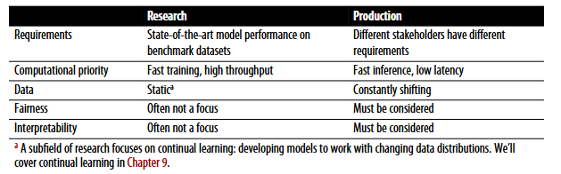
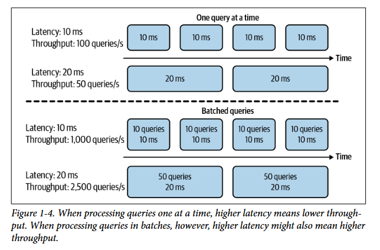
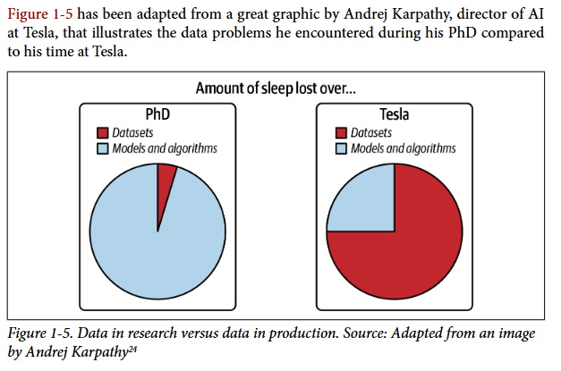

## **Quando usar solucoes com machine learning ?**

**Existem algumas implicacoes de problemas que machine learnig pode resolver:**
- Dados para aprender: Os modelos aprendem padroes atraves de grandes quantidades de dados entao sem eles é improvavel ou muito dificil uma solucao... Se eles nao existem podem ser adquiridos usando solucoes com mao de obra humana como anotaca. 
- Padroes complexos: Se um padrao é simples, entao nao é necessário solucoes complexas como modelos (Voce nao precisa de um modelo para prever o dia do lixeiro, ele normalmente virá em 1 ou 2 dias fixos)
- Seus dados de treino tem que refletir a populacao: Se sua amostra nao é representativa, ou seja, os padroes observados nelas nao sao observados na populacao entao temos um problema pois esse modelo nao ira generalizar bem.
- Custo de erros é pequeno: Cenários ideais de solucoes com ML tem custo de erro pequeno (como sistemas de recomendacao). Se um erro pode levar a algo catastrofico como a morte de pessoas entao o problema é muito complexo... modelos nunca tem 100% de precisao e portanto o custo de acerto tem que valer a pena em comparacao ao custo de erro.
- Custo de desenvolvimento: O desenvolvimento dessas solucoes nao é trivial e barato e portanto tem que ser analisado com cuidade se vale a pena para o problema. O ROI (retorno de investimento) é bom ? 
- Padroes mudam: Modelos em producao tem sempre que ser atualizados uma vez que padroes mudam com o tempo... conceitos como continual learning e online learning sao importantes.

**Quando nao usar ML?**
- É antiético ? usa dados ilegais ?
- O custo de investimento baixo ? custo de erro alto ?
- Solucoes mais simples fazem o trabalho ?

## **ML in research VS in production**

**Requisitos e Stakeholders:**

Cenários de pesquisa geralmente tem um foco maior em otimizar/criar modelos para maximizar métricas em determinados benchmarks...todo o foco geralmente é nessa métrica independentemente do tempo de inferencia ou complexidade da solucao. Em cenários de producao normalmente temos varias pessoas do time com objetivos e opinioes diferentes. Por exemplo em recomendacao, o time de engenheiros de ML vao estar interessados em criar um modelo com maior acuracia na recomendacao... o time de vendas vai estar interessado em recomendar os itens mais caros e o tecnico na velocidade que essa recomendacao vai ter. Entao temos varios stakeholders com objetivos diferentes mas nem todos sao obrigatórios... requisitos obrigatórios muitas vezes eliminam opcoes pois talvez essa opcao demore muito mas precisamos obrigatoriamente de uma resposta rapida. Quandos os requisitos nao sao obrigatórios e queremos atender ambos podemos usar 2 modelos em que cada um segue um requisito e ponderamos a saida usando ambos. Competicoes como kaggle e etc sao muito criticas pelo fato de que os problemas mais dificeis já sao resolvidos para voce e seu trabalho é otimizar alguma métrica sem pensar sobre latencia ou interpretabilidade... tornando pouco util para producao. Para algumas tarefas um aumento de performace pequeno pode aumentar muito o lucro mas outras nao... nesse segundo caso utilizar modelos simples é mais interessante a nao ser que a margem de melhoria seja muito melhor.

**Prioridades computacionais:**

Em cenários academicos normalmente a latencia nao é tao importante e sim o throughput. Latencia é o tempo de resposta desde a requisicao do usuário ate ele receber os resultados. Throughput mede quantas requisicoes foram respondidadas em um intervalo de tempo atual. (Largura de banda é o maximo que um canal pode transmitir de uma vez e portanto throughput <= largura). Em pesquisas muitas vezes é mais importante a velocidade de treino dos modelos para testarmos varios modelos pois nosso foco é a métrica escolhida... mas em producao o principal é a velocidade de inferencia que esta mais ligada a latencia. Imagine em uma maquina de busca: Se seu sistema processa apenas uma query de cada vez e a latencia de cada query é 10ms ... teremos um throughput de 100 queries/segundo, se aumentarmos a latencia para 100 teremos 10 queries/segundo entao nesse caso de um de cada vez temos que se a latencia aumenta o thoughput reduz. Porém em sistemas mais novos as queries sao processadas em batches, ou seja, acumulamos um lote de queries de usuários e processamos todas juntas... isso geralmente aumenta a latencia pois precisamos esperar um pouco para acumular queries suficiente antes (ou qualquer outra estratégia se estivermos falando de batch online em producao) de enviar a requisicao porém nesse caso o throughput pode aumentar junto pois se conseguimos agora processar 10 queries de uma vez com uma latencia de 10ms, vamos conseguir uma vazao de 1000 queries/segundo. Se aumentarmos a latencia em 2x mas o tamanho do batch 5x, teremos que a vazao aumenta junto com a latencia.

Para reduzir latencia muitas vezes é necessário reduzir o numero de queries processadas de uma vez (tamanho do batch) e isso pode levar a sub utilizacao da maquina pois se ela consegue mais e vamos usar menos entao estamos gastando dinheiro atoa por cada query (preco de cada query aumenta). Além disso, latencia nao é um numero e sim uma distribuicao... normalmente usamos uma estimativa de posicao para representar a latencia como media porém media é sensivel entao é melhor usar métricas baseadas em quantis como mediana.

**Dados:** 

Dados usados em pesquisa normalmente sao estaticos (nao mudam), ja estao limpos e pre-processados em datasets especificos (caso nao esteja é facil achar um script na internet ou biblioteca). Dados em producao, se existirem ... sao ruidosos, desbalanceados e cheios de vieses. Isso permite que a pesquisa foque no desenvolvimento de novas arquiteturas e abordagens de modelos pois eles sao os principais problemas. Em producao normlmalmente os dados sao o maior problema e nao os modelos...

**Fairness (Justica):** 

Metricas de predicao muitas vezes sao pouco afetadas por vieses enraizados tanto nos dados de treino quanto no dados de teste, ou seja, um problema da populacao em si que nós mesmos criamos. Os dados sao muitas vezes reflexo de comportamentos humanos e consequentemente pode estar enviesado por genero, raca e minorias. Por mais que as métricas em geral do modelo sejam boas... investigar e mitigar esses vieses é de extrema importancia. Isso nao é importante normalmente em pesquisas de modelos.

**Interpretabilidade:**

Enquanto os modelos sao otimizados em uma métrica especifica, a interpretacao dos seus resultados nao recebe um foco tao grande. Porém, em casos muitos criticos de decisao em que existe ali uma opiniao humana envolvida muitas vezes é importante que as decisoes sejam interpretaveis pois assim os especialistas podem identificar possiveis erros ou vieses e também para debgar e otimizar o modelo. Isso nao é importante normalmente em pesquisas de modelos.

## **Engenharia de Software VS ML**

Existem muuitas coisas em comum entre desenvolvimente de software tradicional e Ml e varias boas praticas de engenharia podem ser reaplicadas em ML... Entretanto existem desafios que sao unicos de problemas de machine learning como por exemplo: O versionamente nao apenas de codigo mas também dos dados e amostras... os dados em ML sao tao importantes como qualquer outra parte do software pois se utilizarmos qualquer dado que entrar para treinar os modelos isso provavelmente nao vai terminar bem. Outro desafio é a escala e tamanho dos modelos, hoje em dia (2026) os modelos estao cada vez maiores em termos de parametros e para carregar em memória é necessário uma grande quantidade de RAM ou VRAM entao é necessário estratégias para fazer deploy desses modelos e torna-los uteis e rapidos... afinal um autocomplete é inutil se ele demorar 5 segundos para cada recomendacao de complete...

