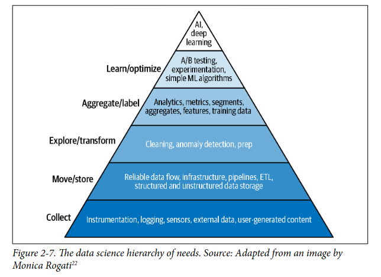

## Objetivos de Negocios (Business) X objetivos de ML

Quando estamos desenvolvendo modelos de machine learning focamos em métricas de qualidade de modelo como precisao, recall e F1 porém nos negocios seu gerente/chefe não ligam para essas palavras chiques e sim para métricas que eles geralmente conhecem e envolvem o negocio como retorno de investimento, aumento receita e usuários (KPIs, que sao metricas de sucesso de negocio)... portanto é importante saber traduzir métricas de ML para métricas de negocio por exemplo melhorar a recomendação de itens para um usuário influencia a quantidade de itens vendidas no total e isso afeta nossa receita final. È importante saber conectar os objetivos de ML com objetivos de Business. Outro exemplo é a identificação de anomalias em transações financeiras por exemplo... evitar fraudes faz com que perda de dinheiro seja evitada e portanto isso afeta o negócio. Empresas tendem a acreditar que soluções com ML milagrosamente e de um dia para o outro transformam totalmente a empresa... elas podem ate milagrosamente mudar mas não de um dia para outro pois o returno de investimento (ROI) em ML depende muito da maturidade da empresa em ML, ou seja, quanto tempo elas ja adotam (empresas com maior maturidades gastam menos tempo e recurso na implementação e atualização gerando maior ROI). Em muitos casos pode ser menos custoso para empresa um falso positivo e em outros um falso negativo, por exemplo em fraudes é mais barato desbloquear um cliente que foi erroneamente escolhido como anomalia que uma fraude que passou pelo sistema...

## Requisitos de Soluções de ML

- Confiabilidade: O sistema tem que ser resiliente a falhas de hardware, software ou humano... a confiabilidade é desafiadora em ML uma vez que o sistema pode parecer estar funcionando corretamente mas fazer predições extremamente erradas.
- Escalabilidade: O sistema tem que escalar junto com o trafego de usuários ativos através de autoscaling (downscaling para economizar recursos e upscaling para atender trafego) e monitorar de forma automatica em sistemas que temos mais de um modelo (pois é impossivel monitorar manualmente muitos)... O sistema pode escalar nao apenas em trafego como em complexidade de hardware (memoria utilizada) e numero de modelos em produção(ir de um modelo e colocar mais 9)
- Mantibilidade: O sistema tem que ser facil de dar manutenção por varios trabalhadores e ser versionado e reprodutivo para que não apenas o autor consiga trabalhar com o modelo.
- Adaptabilidade: O sistema tem que ser atualizado com dados e requisitos novos sem interromper os funcionamento dele.Alterações nas distribuições dos dados com tempo são chamados de data distribution shifts.

## Iteratividade do processo

O processo de desenvolvimento não é linear em que terminamos uma etapa e vamos para proxima e nunca mais voltamos... na verdade é bem ciclico (depois de analises de erros temos que voltar para corrigir codigo ou métricas) em que começamos com definições do problema, requisitos, limitações e objetivo. Depois cuidamos dos dados na etapa de engenharia de dados com sampling e rotulagem... Em seguida criamos, treinamos e otimizamos o modelo... Deploy em produção... Monitoramento e aprendizado incremental... e por fim nos chegamos na estapa do Business em que avaliamos o modelo/projeto em relação a métricas de rentabilidade e ROI e tirar conclusoes de coisas que precisam melhorar ou tirar.

## Modelando problemas de ML 

Um passo importante de solucoes ML é a modelagem do problema e para isso precisamos definir entrada, saida e função objetivo... imagine que seu chefe por inveja de outras empresas que usam ML para acelerar seu suporte a clientes pede para que voce acelere o suporte do cliente também... porém isso nao é algo que podemos otimizar diretamente pois nao é uma tarefa de ML... entretanto sabemos que gastamos muito tempo direcionando as reclamacoes para seus respectivos departamentes responsaveis (financeiro, logistico e etc). Isso pode ser modelado como uma tarefa de classificacao em que nosso modelor recebe de entrada a mensagem do usuário e retorna qual departamente é responsavel. Nela queremos minimizar a diferenca entre o departamente previsto para ir e o real departamente...

Tipos comuns de tarefas supervisionadas: 

- Regressao e Classificacao: Ambas as tarefas queremos prever um valor y chamado de target ou label mas a diferenca é que em classificacao nosso label é discretizado em classes/categorias e na regressao em numeros continuos... problemas de regressao podem ser convertidos em classificacao se convertermos os valores continuos em intervalos e prever o intervalo. De forma analoga, uma classificacao binária pode ser transformada em regressao se prevermos uma probabilidade de uma classe [0-1] e usarmos um limiar/limite para decidir entre sim e nao.

- Classificacao Binária e Multiclasses: Na classificacao binária temos apenas 2 classes que representam SIM ou NAO para algum target observado. Nela queremos decidir se o elemento é ou nao alguma coisa e para isso usamos a funcao de ativacao Sigmoid e funcao de loss binary-entropy. (-SUM((y.log(y') + (1-y).log(1 - y')))). Já na classificacao multiclasse temos varias categorias possiveis ao inves de duas e usamos como saida um vetor binários [0,0,1] que modela qual classe ele pertence. Usamos softmax para normalizar as saidas (logits) de redes neurais e deixar eles entre 0-1 e somando 1... ou seja, uma distribuicao de probabilidades entre as classes. Depois usamos uma loss chamada cross entropy que é uma generalizacao da loss binária. Em problemas com muitas classes (cardinalidade alta) é comum fazer uma classificacao em hierarquia em que agrupamos as classes em grupos e fazemos uma classficacao inicial para decidir qual grupo, depois uma classificacao dentro do grupo (Por exemplo se temos roupa e sapatos, primeiro descobrimos qual grupo ele é e depois qual item). Além disso, esses problemas de alta cardinalidade precisam de muitos dados e eles tem que ser balanceados uma vez que cada classes precisa de pelo menos 100 exemplos para conseguir prever bem.

- Classificacao Multilabel: Esse é um problema mais dificil ainda pois temos que cada instancia pode pertencer a mais de uma classe... podemos representar a saida como um vetor com mais de um valor igual a 1 [1,0,1] mas nesse caso tem um problema pois se a saida do modelo é algo como [0.3,0.2,0.4,0.1] nao sabemos se o elemento faz parte de apenas uma classe, ou duas ou tres... Uma segunda abordagem mais interessante é ter 4 modelos de classificacao binárias, um para cada classe e passamos nosso exemplo em cada um dos 4 modelos e saberemos as classes com maior clareza. Além disso, nesses problemas é mais dificil fazer rotulagem uma vez que tem mais discordancia entre os rotuladores...

Multiplas formas de abordar um problema:

Um problema pode ser abordado de varias forma em ML... imagine que voce quer prever o app que o usuário mais provavelmente vai abrir em seguida usando dados do usuário e do ambiente. Dado um conjunto N de apps podemos treinar uma classificação multiclasse em que cada um dos N apps são classes... o problema disso é que caso um app novo seja instalado teremos N+1 apps e consequentemente teriamos que treinar o modelo novamente do zero (from scracth). Uma forma melhor de abordar isso é usando regressão e treinando um modelo que agora aceita features (informações) do app que entrarão no input do modelo em conjunto com as outras features. Dessa forma, caso um app novo apareça apenas precisamos colocar as features dele no input.

Funções Objetivo:

Toda tarefa tem uma função objetivo que é traduzida para loss functions que será usada para otimizar o modelo... mas imagine que voce tem 2 ou mais objetivos para cumprir como por exemplo melhorar o retorno de engajamento mas sem apelar para conteudos extremos. Podemos juntar duas losses em um modelo apensa e ter algo como a*loss1 + b*loss2 e minimizar essa soma. Porém, se voce precisar alterar um dos parametros a ou b, será necessário retreinar o modelo inteiro toda vez pois é parte da loss e otimização. Em cenários como esse é legal desassociar os objetivos em modelos diferentes e combinar as saidas deles ponderando de alguma forma... para alterar as ponderações nao é necessário retreinar modelo e manter eles fica muito mais simples.

