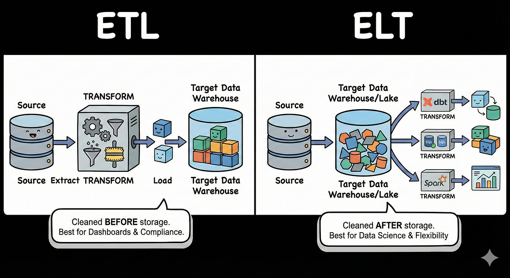

# **Fundamentos de engenharia de dados**

## **Fontes de dados (Data source)**

Sistemas de ML podem lidar com dados de diferentes fontes, cada uma com *características e desafios próprios*: dados gerados pelo usuário, dados gerados pelo sistema, dados internos da empresa e dados de terceiros.

### **Gerados por usuários**

- Esse tipo de dado é rico em problemas, pois **se existe a possibilidade do usuário enviar um input errado, ele vai enviar**, talvez propositalmente ou sem querer enviar formatos errados. Devido a isso:

    - É essencial **pré-processar** dados gerados por usuários antes de qualquer uso validação de formato, tratamento de valores ausentes/inconsistentes, etc.

    - Precisa ser **rígido e rápido** (validação robusta, mas com baixa latência), já que esse processamento acontece no caminho entre o input do usuário e a resposta do sistema. E sabemos que o usuário nao gosta de esperar.

### **Gerados pelo sistema**

Dados gerados pelo próprio sistema (outputs do modelo, logs de infraestrutura, stack traces de erro) são **mais bem comportados**, já que o formato de geração é controlado, por isso, geralmente exigem pouco ou nenhum pré-processamento brusco. Entretanto é importante processar logs pois:

- Sistemas de ML são difíceis de debugar (comportamento probabilístico, múltiplas etapas, dados, features, modelo, que podem falhar silenciosamente). Por isso, é recomendado gerar o máximo de logs possível para cada operação, já que eles fornecem **visibilidade do estado atual do sistema**.Porém gerar muitos logs cria dois problemas:

    - **Volume**: fica humanamente inviável analisar manualmente um volume tão grande de logs para achar um problema específico. Solução: ferramentas de análise automática de logs (ex: Datadog, Logstash), que inclusive usam ML para monitorar os próprios logs do sistema.
    - **Armazenamento**: logs crescem rapidamente, mas esse problema é mais brando do que parece, eles podem ser descartados após um período e/ou armazenados em memória secundária (mais lenta, porém mais barata), já que raramente precisam de acesso instantâneo depois de um tempo.

Além de logs, métricas de comportamento do usuário (feedback implícito/explícito), cliques, visualizações, compras, etc. Esses dados são especialmente úteis para sistemas de recomendação e motores de busca. Dados gerados pelos sistemas da empresa junto com usuários formam os dados de **First-party**.

### **Dados de terceiros (Second-party e Third-party)**

Além dos dados internos, é possível comprar dados de outras empresas, dados comportamentais (redes sociais, deslocamento, compras) que podem enriquecer processos de recomendação e personalização.

| Tipo de Dado | Origem | Relacionamento | Exemplo Prático |
| :--- | :--- | :--- | :--- |
| **First-party** | Sua própria empresa | **Direto**: Coletado via seus próprios canais. | Histórico de compras, cliques no site, cadastros no CRM. |
| **Second-party** | Outra empresa (parceira) | **Indireto**: São os dados "First-party" de um parceiro. | Uma cia aérea compartilha dados de viajantes com uma rede de hotéis. |
| **Third-party** | Agregadores de dados | **Nenhum**: Coletados de fontes diversas (públicas/cookies). | Perfis de interesse e demografia comprados de grandes data brokers. |

## **Formatos de dados**

Dados complexos como objetos de classes e modelos para serem armazenados ou transmitidos pela rede, precisam passar por um processo chamado **serialização**: a conversão de uma estrutura de dados em memória para um formato que pode ser salvo ou enviado, e posteriormente reconstruído através da **desserialização**.Esses formatos podem ser classificados em duas categorias: **texto** e **binário**.

### **Formatos de texto**

Formatos textuais são mais *expressivos e legíveis por humanos*, se você abrir o arquivo, consegue ler e entender o conteúdo diretamente.

- **JSON**: formatado em pares chave/valor, muito usado por sua legibilidade e flexibilidade (APIs, requisições web, configuração de LLMs, etc.)
- **CSV**: muito usado na área de dados. Armazena cada instância em uma linha e cada feature em uma coluna, esse arranjo lógico é chamado de **row-major**.

**Row-major vs. column-major**: a diferença está na **ordem física de armazenamento em disco**, ou seja, localidade espacial:

- **Row-major** (ex: CSV): os dados são gravados fisicamente linha por linha. Isso torna a **escrita** rápida, adicionar uma nova instância na memória é só concatenar no final.
- **Column-major** (ex: Parquet): os dados são gravados fisicamente coluna por coluna. Isso torna a **leitura de uma coluna inteira** muito mais rápida, como os valores de uma mesma feature já estão contíguos em disco, você lê um bloco só, sem precisar pular por dados de outras features no meio do caminho. Agora para escrita de uma linha precisariamos adicionar em todos os blocos contiguos um novo valor.

**Em resumo:** Column-major é melhor para analises analiticas (calcular medias e etc) e o Row-major para leituras e gravacoes constantes.

### **Formatos binários**

No formato binário temos **Parquet** e **Pickle**.

- **Parquet**: além de ser binário, também usa organização colunar (column-major)
- **Pickle**: formato de serialização nativo do Python, usado para serializar praticamente qualquer objeto Python (listas, dicionários, DataFrames, modelos treinados, etc.), preservando sua estrutura original.

Vantagens do binário:

- **Compressao**: Ocupam menos espaço em disco. Por exemplo, o número `255` em formato texto precisa de **3 bytes**, um byte para cada caractere ASCII: `'2'` → `00110010`, `'5'` → `00110101`, `'5'` → `00110101`. Já em formato binário, `255` cabe inteiramente em **1 byte**: `11111111`.

- **Leitura mais rápida**: ler um arquivo de texto exige interpretar byte a byte e consultar a tabela ASCII/Unicode para decodificar cada caractere.

**Recomendação da AWS**: AWS recomenda o uso de Parquet no S, citando ganhos de performance de leitura e redução de espaço em disco 3em relação a formatos como CSV.

## **Modelo de dados (Data Model)**

Modelos de dados são formas de representar objetos do mundo real através de features/atributos. Por exemplo, podemos representar um carro com um modelo que usa cor, ano e tipo de direção. Dois modelos muito famosos são o **Modelo Relacional (SQL)** e o **Modelo Não Relacional (NoSQL)**.

### **Modelo Relacional:**

Aqui os dados são modelados como **relações** (tabelas): conjuntos de tuplas de atributos, onde cada linha é uma tupla (ex: `id, nome, email`). É geralmente preferível que essas relações estejam **normalizadas**, seguindo um conjunto de regras (1FN, 2FN, 3FN...), embora na prática a **desnormalização** seja frequentemente feita em prol de latência (menos joins = respostas mais rápidas).

**Exemplo de normalização**:
- **Antes (não normalizado)**: uma única tabela onde cada cliente tem, entre suas colunas, o nome e o estado da empresa em que trabalha. Se 4 clientes trabalham na mesma empresa, o nome dessa empresa aparece duplicado em 4 linhas. Se o nome da empresa mudar, é preciso atualizar as 4 linhas.
- **Depois (normalizado)**: os dados da empresa são movidos para uma relação separada (`empresas`), e a relação de clientes passa a referenciar apenas o `id` dessa empresa. Agora, se o nome ou endereço da empresa mudar, basta atualizar **uma única linha** na tabela de empresas.

O modelo relacional usa a linguagem declarativa **SQL** (e variações) para consultas. Linguagens declarativas especificam **o que** você quer, não **como** obtê-lo, essa decisão de "como" fica a cargo do próprio SGBD (Sistema de Gerenciamento de Banco de Dados), que otimiza a execução da query. Isso contrasta com uma linguagem imperativa como Python, onde você mesmo especifica passo a passo como o resultado deve ser calculado. 

Vale notar que alguns bancos relacionais suportam também modelos de dados não relacionais, o **Postgres**, por exemplo, tem suporte nativo a colunas do tipo documento (JSONB), o que pode evitar a necessidade de manter dois bancos de dados separados.

### **Modelo Não Relacional (NoSQL)**

O modelo não relacional surge fundamentalmente da insatisfação com os **schemas fixos** do modelo relacional. Nas relações tradicionais, o número de colunas (features) e o tipo de cada uma são fixos, isso é limitante quando:
- Os dados são **não estruturados**
- O schema **muda com frequência**: se antes a relação tinha 5 features e agora precisa de 6, é necessário alterar o schema de todo o banco e popular a nova feature para os registros existentes ou deixá-la nula.

Em cenários de **big data**, sacrificar algumas consistência (normalizacao) tende a acelerar significativamente a leitura/escrita. Também é mais fácil escalar **horizontalmente** (sharding), já que cada instância de dado costuma ser independente e não exige joins entre partições.

#### **Modelo de Documentos**

Os dados são armazenados em **coleções de documentos**, o que antes era uma linha de tabela agora é um documento dentro de uma coleção.

**Vantagens**:
- **Schema flexível**: a coleção não impõe uma estrutura rígida, cada documento pode ter campos diferentes, embora normalmente compartilhem semelhanças na prática
- **Melhor localidade de dados**: todas as informações relacionadas a uma entidade ficam dentro do próprio documento, então uma única leitura já traz tudo, sem necessidade de joins para buscar dados relacionados

Esses documentos costumam ser armazenados como **BSON** (Binary JSON), uma variação binária do JSON que usa sequências de bytes para economizar espaço e acelerar o processamento. Esse modelo é **ideal para:** dados não estruturados, dados com muitos valores nulos, estruturas que mudam constantemente, e dados com poucas relações entre si e entre outras coleções.

**Limitação**: joins entre documentos são caros. Por exemplo, filtrar documentos por um valor `x` exige carregar cada documento inteiro, ler seu conteúdo e comparar com `x`, enquanto em SQL bastaria consultar diretamente a coluna alvo. Por outro lado, se você quer recuperar **todos os dados de uma entidade de uma vez**, o modelo de documentos é mais simples: basta um único retrieve, sem joins.

> Nota: o modelo de documentos **também tem um "schema"**, a diferença é que esse schema não é validado pelo banco no momento da leitura/escrita, mas sim definido e assumido pelo sistema (aplicação) que consome os dados.

#### **Modelo de Grafo**

Aqui o foco é o oposto do modelo de documentos: as **relações entre os dados** são o elemento central.

- **Nós**: representam entidades, com um **tipo** e um **valor** (ex: nó do tipo `usuário` com valor `Luis Antonio`) — de forma similar a uma célula numa tabela, que também carrega um tipo (a coluna) e um conteúdo (o valor)
- **Arestas**: modelam o **relacionamento** entre nós (ex: uma aresta do tipo `mora_em` conectando o nó `Luis` ao nó `Belo Horizonte`)

Esse modelo é extremamente útil quando as queries exigem atravessar relações entre muitos tipos de dados diferentes, algo que, no modelo relacional, exigiria uma quantidade grande de JOINs ou consultas muito complexas. No modelo de grafo, essa mesma consulta se torna simplesmente **percorrer conexões** entre nós **(um problema de múltiplos JOINs vira um problema de caminhar em um grafo)**.

#### **Modelo Chave-Valor**

Modelos chave-valor são muito usados para **cache**, já que sua implementação (semelhante a uma hash table) os torna extremamente eficientes para buscas de pertencimento (existe ou não essa chave?).

## **Dados Estruturados x Não Estruturados**

- **Dados estruturados** são dados que seguem algum schema, como no modelo relacional, que define o formato das tabelas e o tipo de cada coluna. Além dos problemas de flexibilidade também é difícil consumir várias fontes de dados diferentes simultaneamente, já que cada uma pode seguir um schema próprio.

- **Dados não estruturados**: texto, vídeos, imagens, áudios. Eles oferecem maior flexibilidade na hora de armazenar dados, mas são menos interessantes para fazer análises e buscas diretas (não há um schema fixo para consultar).

O repositório onde armazenamos dados estruturados, já prontos para análise após um processamento (ETL), é chamado de **data warehouse**, normalmente otimizado para análises. Já o repositório para dados não estruturados (ou dados brutos, sem processamento) é chamado de **data lake**. Além disso, features usadas no data warehouse podem vir do processamento de dados do data lake.

## **ETL (Extract → Transform → Load) e ELT (Extract → Load → Transform)**

### **ETL**

O pipeline ETL consiste em três etapas:

1. **Extração (Extract)**: coleta simultânea de dados de várias fontes, bancos internos/externos, APIs, sistemas de monitoramento, data lakes, arquivos. O problema aqui é que **cada fonte modela o dado de forma diferente**: uma fonte pode representar gênero como `"M"/"F"`, outra como `0/1`, outra como `"Fem"/"Masc"`.

2. **Transformação (Transform)**: nessa etapa, limpamos os dados de todas as fontes, padronizamos num formato único, e extraímos as features necessárias.

3. **Carregamento (Load)**: os dados já limpos e padronizados são carregados no destino final, que pode ser um data warehouse, o banco de dados de uma aplicação, ou uma feature store.

### **Por que o ELT surgiu**

Antigamente, tanto **armazenar** quanto **transformar** dados eram caros, então fazia sentido minimizar o volume de dados armazenados, daí a lógica do ETL: transformar (e reduzir) os dados **antes** de carregá-los no destino final. O problema é que isso gera **perda de informação** para certas aplicações (como ML, que às vezes precisa de dados brutos/detalhados) e cria incompatibilidades óbvias (não há como armazenar áudio dentro de uma tabela relacional).

Hoje, armazenar dados na nuvem ficou muito mais barato (avanços de hardware), enquanto o número de fontes de dados diferentes cresceu bastante, aumentando a complexidade da etapa de transformação. Isso inverteu o cálculo de custo-benefício: hoje compensa mais **armazenar os dados brutos (não estruturados) direto num data lake, e transformá-los sob demanda**, apenas quando forem efetivamente necessários.

Esse é o pipeline **ELT (Extract → Load → Transform)**: extraímos os dados de várias fontes e os **carregamos diretamente em um data lake, sem pré-processamento**, a transformação acontece depois, sob demanda, conforme a necessidade de cada aplicação. Além disso, existem soluções híbridas chamadas **lakehouses**, que aceitam tanto dados estruturados quanto não estruturados no mesmo repositório.

### **Comparando ETL e ELT**

**ETL** ainda faz sentido em casos específicos quando queremos conformidade para analises bem focadas ou criar dashboards. **ELT** é mais flexivel, perdendo menos dados e deixando o destino final decidir oq fazer.

## **Formas de Fluxo de Dados (Dataflow)**

Como processos separados, rodando em máquinas diferentes, vão se comunicar. ou seja, compartilhar dados sem ter uma memória compartilhada ?

### **Banco de dados intermediário**

O processo A escreve seus dados num banco compartilhado, e o processo B lê o que A escreveu.

**Problemas**:
- Escrita e leitura em disco podem ser relativamente lentas, e esses sistemas normalmente exigem **baixa latência**
- Exige um banco em comum entre os dois sistemas, o que pode ser complicado se pertencerem a empresas diferentes
- Qualquer alteração no schema do banco precisa ser refletida (e coordenada) em ambos os sistemas que dependem dele

### **Serviços (Request-Driven)**

Os dois processos se comunicam via conexão de rede, de forma **síncrona** (manda e espera a resposta) ou **assíncrona** (manda e segue fazendo outra coisa enquanto aguarda), usando APIs como **REST** ou **RPC**.

- **REST**: implementação sobre HTTPS, com metodos como GET/POST/DELETE
- **RPC** (Remote Procedure Call): faz a comunicação entre processos parecer uma chamada de função local, através de uma interface definida. Geralmente usa **Protocol Buffers (protobuf)**, um formato binário mais rápido que o JSON.

**Ponto negativo**: dependência direta entre serviços, se um serviço cai, todos que dependem dele são afetados. Isso pode ser mitigado com autoscaling ou réplicas. Além disso, os dois serviços precisam **se conhecer** previamente (endereço, contrato da API), e a comunicação é um **comando do presente**, nada aconteceu ainda antes da requisição; é a própria requisição que vai fazer a ação acontecer.

### **Transporte em tempo real (Event-Driven)**

Aqui usamos um **broker** (intermediário) para transmitir e coordenar dados entre os serviços, centralizando a comunicação e evitando que cada serviço precise conhecer todos os outros diretamente.

Nesse modelo temos **produtores** e **consumidores**, não requisições com retorno direto:
- Produtores enviam dados para o broker **sem se importar** com quem (ou quantos) vão consumir aquilo
- Um mesmo serviço pode atuar como produtor de um tipo de dado e consumidor de outro

Esse intermediário poderia ser um banco de dados mas bancos têm leitura/escrita relativamente lentas por trabalharem com memória secundária. Por isso, soluções desse tipo geralmente usam **memória principal (volátil)**, ou implementações otimizadas de memória secundária feitas especificamente para esse fim (ex: **Kafka**). Esse modelo é chamado de **"movido a eventos"**, já que cada dado transmitido representa um evento.

**Duas arquiteturas principais**:

- **Publisher-Subscriber (Pub-Sub)**: publishers enviam mensagens para um "tópico"; subscribers recebem apenas as mensagens dos tópicos aos quais assinaram. A mesma mensagem pode ser entregue a múltiplos subscribers.
- **Fila de mensagens (Message Queue)**: a fila recebe mensagens dos produtores e as distribui aos consumidores, mas, diferente do pub-sub, cada mensagem é consumida por **um único consumidor** e depois removida da fila (não é "armazenada" para múltiplos leitores). Ainda assim, é possível replicar a mesma mensagem para filas diferentes caso mais de um serviço precise consumi-la.

**Vantagens do modelo event-driven**:
- **Assíncrono**: o sistema pode continuar trabalhando enquanto aguarda outros eventos
- **Tolerância a falhas**: mesmo que um consumidor caia, as mensagens ficam retidas no broker por um tempo (antes de serem descartadas ou movidas para memória secundária), evitando perda de dados
- **Componentes independentes**: produtores e consumidores não precisam se conhecer nem estar disponíveis ao mesmo tempo

### **Quando usar cada abordagem**

- **Request-Driven**: mais interessante para aplicações com **baixo volume de dados por transação** e onde se espera uma resposta imediata — a maioria das aplicações web (ex: um fluxo de login, que é essencialmente uma sequência de requisição → resposta → requisição → resposta). Também faz mais sentido quando a **lógica de negócio é mais complexa que o volume de dados** transportado.

- **Event-Driven**: mais interessante quando o dado produzido por um serviço é consumido por **múltiplos outros serviços**. Se isso fosse implementado via requisições, seria necessário fazer múltiplos POSTs repetidamente, gerando overhead constante de comunicação. No modelo de eventos, produtores publicam de forma assíncrona e consumidores leem sem qualquer dependência direta entre eles.

## **Batch Processing vs. Stream Processing**

Sistemas e usuários geram dados o tempo todo, mas nem todo dado tem a mesma urgência de processamento. "Processar" dados significa coletar, transformar e extrair valor de informações brutas e isso pode ser feito de duas formas principais.

### **Batch Processing (Processamento em Lote)**

Processa um bloco (batch) de dados históricos, acumulados, em intervalos de tempo fixos (diário, semanal, etc.).

- **Exemplo**: calcular a média diária de notas de um motorista, não é necessário atualizar a média a cada nova avaliação; basta processar todas as avaliações acumuladas ao final do dia.

Gera **features estáticas**, atributos que mudam pouco ou lentamente com o tempo. Muito comum no treinamento de modelos em **offline learning**.

### **Stream Processing (Processamento em Fluxo)**

Processa o dado no exato momento em que é gerado, tipicamente usando arquiteturas event-driven (ou em janelas de milissegundos/segundos). A prioridade aqui é **baixa latência** e extração de valor imediato.

- **Stateful Processing**: motores de stream (como **Flink** ou **Kafka Streams**) mantêm **estado**, eles "lembram" de informações recentes. Por exemplo, para calcular uma média móvel dos últimos 30 dias, o motor não recalcula tudo do zero a cada novo dado: ele usa uma estrutura de **janela deslizante (sliding window)**, adicionando o dado novo e descartando o mais antigo, economizando processamento.

Gera **features dinâmicas** — que representam o estado atual do sistema (ex: "quantos motoristas estão disponíveis num raio de 2km agora?"). Essencial para **continual learning** e inferência em tempo real **(stream prediction)**.

### **Batch é um caso particular de Stream**

Processamento em batch pode ser visto como um caso específico de stream processing, onde o "intervalo" do fluxo é artificialmente grande e fixo (ex: uma janela de 24 horas acumulando dados).  complexos (motores de busca, recomendação, detecção de anomalias) costumam precisar das **duas abordagens trabalhando juntas**, uma arquitetura conhecida como **Arquitetura Lambda**.

- **Exemplo**: para rankear resultados de busca ou detectar uma fraude, o modelo precisa combinar tanto **features estáticas** (histórico de comportamento do usuário ao longo de meses, gerado em batch) quanto **features dinâmicas** (o que o usuário clicou ou buscou nos últimos 5 minutos, gerado em stream) para tomar uma decisão precisa e imediata.

