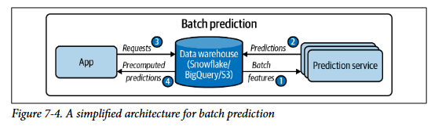
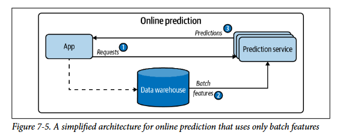
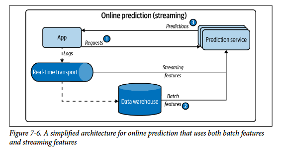
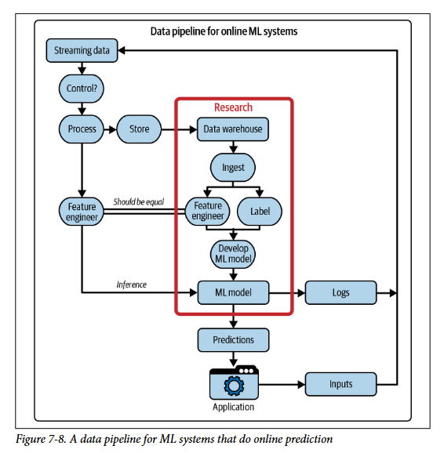

# **Model Deployment and Prediction Service**

Nesse capitulo será discutido o deploy de modelos e servicos de predicao. Fazer deploy é uma tarefa extremamente simples se a parte dificil for ignorada uma vez que é só criar um endpoint POST chamado prediction, criar um container e colocar ele na AWS. Entretanto outros pontos importantes como latencia e escalabilidade tem que ser discutidos. 

## **Mitos sobre ML deployment**

- **Mito 1 - Só acontece deploy de 1-2 modelos ao mesmo tempo:** uma empresa nao terá apenas um modelo em producao, pois existem diversas tarefas correlatas que irao usar features diferentes e consequentemente modelos diferentes serao treinados. Além disso, nao necessáriamentente para cada tarefa vamos ter apenas um modelo pois um modelo apenas pode nao generalizar de forma suficiente para todos os clientes daquela tarefa. A ideia aqui é pensar na infraestrutura nao apenas para um modelo mas varios simultaneamente.

- **Mito 2 - Se nao fizermos nada a performace se mantem:** Modelos tendem a performar bem logo depois do treino e devido ao data shift de producao o desempenho vai caindo com tempo.

- **Mito 3 - Voce nao precisa atualizar seu modelo tanto:** Atualizacao de modelos tem que acontecer a menor frequencia permitida e que faz sentido para o problema/empresa.

- **Mito 4 - ML Engineers nao precisam pensar em escala:** Se a empresa tem pelo menos 100 funcionários é muito provavel que ela também tenha usuário suficientes para a escala do sistema se tornar um problema e por isso é necessário pensar sobre isso tbm.

## **Batch Prediction Versus Online Prediction**

Existem duas formas principais de definir como gerar e servir predicoes para usuários e decidir entre elas muda totalmente como a arquitetura tem que ser construida.

- **Batch Prediction:** Quando as predicoes sao geradas periodicamente ou apartir de algum gatilho, sao armazenadas em um banco e recuperadas quando necessárias (requisicao). Também é conhecido como predicao assincrona pois a predicao é calculada de forma assincrona com a requisicao HTTP (REST). 
    - Ex: Um bom exemplo é o calculo de recomendacoes de filmes para cada usuário da netflix que acontece de hora em hora e as ultimas predicoes sao apenas buscadas quando o usuário faz login na plataforma.

- **Online Prediction:** Quando as predicoes sao geradas e retornadas assim que a requisicao pela predicao chega. Sao conhecidas também como predicao sob demanda ou predicao sincrona pois é sincrona com a requisicao (Caso o transporte usado seja HTTPS). As pessoas acham que Online é menos eficiente porque não dá para processar várias requisições juntas (vetorização), mas o autor diz que dá sim para acumular requisições online em pequenos "mini-batches" para otimizar o hardware. Além disso, se apenas 2% dos usuários entram no app por dia (como o exemplo do Grubhub), fazer Batch Prediction para 100% dos usuários joga 98% do processamento no lixo. Online economiza porque só calcula para quem aparece. 
    - Ex: Um bom exemplo disso é pesquisar a traducao de uma frase no google em que ele imediatamente vai usar um modelo de linguagem para traduzir 

**Terminologia:** A terminologia pode confundir pois um predicao online pode ser feita em batch, ou seja, acumular predicoes de varios usuários para calcular juntas e aumentar o througput (e uso do hardware) com custo em latencia. E predicoes batch podem ser feitas a uma unica instancia também se quiser. Devido a isso costumam chamar de predicao assincrona e sincrona porém se a predicao online usar um sistema de streaming/mensagens para requisicoes agora a predicao online nao é mais sincrona e sim assincrona mas muito rapido.

Em geral os tipos de predicoes podem ser separadas em 3 de acordo com o tipo de features usadas batch features (precomputadas) e streaming features (tempo real):

- Batch prediction usa batch features precomputadas

- Online predictions que usa apenas batch features precomputadas (comum com embeddings) e baixa latencia

- Online predictions que usa batch features precomputadas e streaming features. Também conhecido como **streaming prediction**.

    - **Online Features:** Qualquer feature usada na predição online (inclusive as que foram pré-calculadas em batch e guardadas na memória, como embeddings de itens).

    - **Streaming Features:** Exclusivamente as features computadas em tempo real a partir de dados em fluxo (ex: "quantos pedidos o restaurante recebeu nos últimos 10 minutos").

Entretando batch e online **nao precisam ser mutuamente exclusivos** pois podemos precomputar predicoes para queries populares e gerar online para menos populares.

- Ex: UberEats usa batch prediction para recomendações de restaurantes (são muitos restaurantes, batch é mais viável) mas usam online prediction para recomendações de itens de comida assim que você clica em um restaurante.

| | Predição em Batch (assíncrona) | Predição online (síncrona) |
|---|---|---|
| **Frequência** | Periódica, como a cada quatro horas | Assim que as solicitações chegam |
| **Útil para** | Processar dados acumulados quando você não precisa de resultados imediatos (como sistemas de recomendação) | Quando as predições são necessárias assim que uma amostra de dados é gerada (como detecção de fraude) |
| **Otimizado para** | Alta vazão (High throughput) | Baixa latência |

## **From Batch Prediction to Online Prediction**

Online prediction é a forma mais natural das coisas acontecerem, uma vez que, segue o padrao comum de sob demanda (pedir, fazer e receber) entretanto os problemas comecam a aparecer quando a **inferencia do modelo demora muito** e isso acaba tornando a latencia de resposta do cliente muito alta. A predicao em batch funciona bem nesses cenários em que calculamos o resultado de tempo em tempo pois nao precisamos dele imediatamente e o cliente apenas consulta os resultados mais recentes... o problema é que **nem sempre conseguimos precalcular os resultados** pois precisamos de um input especifico do usuário (traducao de frases) e esses resultados podem **nao ser suficientemente recentes** para evitar uma catastrofe como é comum em deteccao de fraudes que precisa de predicoes e features atualizadas (streaming).

Para lidar com a latencia de predicoes online ou streaming 2 componentes sao necessários:

- Um **pipeline em tempo real (ou quase real)** que consiga consumir dados em fluxo, extrair streaming features, buscar online features e entregar ao modelo.
- Um **modelo** que consiga fazer inferencia rapidamente

## **Unificando Batch Pipeline e Streaming Pipeline**

É comum empresas terem pipelines em batch e streaming separados, sendo o de batch geralmente para treino em que conseguimos facilmente calcular as features de todos os dados de umas vez e o pipeline de inferencia sendo de streaming em que geralmente uma janela deslizante é mantida para features de streaming. O problema de ter dois pipelines é que é mais facil ter bugs e dificil de debugar além de ter duplicacao de codigo. A solucao é tentar unificar Batch e Streaming em um unico pipeline garantindo que o feature engineering seja identico para treino e inferencia, isso geralmente é feito usando ferramentas como **apache flink** que consegue tratar dados de **batch como se fossem streaming**... também existem **feature stores que armazenam tanto features de treino quanto de inferencia**.

## **Reduzindo latencia de inferencia**

Nao é suficiente um pipeline rapido e eficiente se o modelo ainda demora muito na inferencia. Existem algumas principais formas de lidar com isso:

### **Model Compression**

Consiste no processo de fazer o modelo ser menor perdendo o minimo de desempenho. Esse processo geralmente é feito para fazer o modelo caber em um hardwares mais fracos mas geralmente modelos menores também significa inferencia mais rapido.

- **Low-Rank Factorization:** Troca uma matriz de tamanho NxM por sua fatoracao em duas matrizes de dimensao k tal que k << M,N . Uma das matrizes sendo Nxk e outra sendo kxM e a matriz original pode ser reconstruida pelo produto de ambas. Essa tecnica faz com que ao invés de NxM posos temos k*(N+M) pois N e M sao sempre maiores que k e dominam a complexidade. Unico problema é que nao é muito generico para qualquer arquitetura. Um uso comum é o LORA que faz isso com a matriz de adaptadores que é somada aos pesos treinados.

- **Knowledge Distillation:** Consiste em treinar um modelo menor (student) para imitar (treinar usando a saida do modelo maior) um modelo maior (teacher) e conseguir repetir boa parte do conhecimento do professor usando menor parametros. A desvantagem é que é necessário ter um modelo grande ja treinado.

- **Pruning:** Consiste na identificacao e remocao de pesos pouco importantes nas previsoes do modelo reduzindo drasticamente o numero de parametros diferentes de 0 e consequentemente a memoria.

- **Quantization:** Consiste em representar os parametros floats do modelo usando menos bits e consequentemente menor precisao. Por exemplo trocar os parametros de 32bits para 16bits ou até mesmo utilizar inteiros que as operacoes aritmeticas sao mais simples e rapidas. Isso reduz o tamanho do modelo além de acelerar a inferencia e treino... pode ser usado tanto durante o treino quanto pos treino. 

### **Cloud and Edge Devices**

Outro ponto a se decidir é onde a inferencia do modelo ira executar, nas suas maquinas hospedadas na nuvem (Cloud) ou nos dispositivos dos usuários (Edge):

- **Cloud:** Cloud é a forma mais facil de colocar um modelo para funcionar, inclusive existem ferramentas como SageMaker para facilitar isso em ambientes da AWS. Aqui usamos o hardware da disponibilizados por eles para treinar e fazer inferencia dos modelos. O problema disso é a dependencia a servicos externos e os alto valores cobrados por essas empresas para computacao de modelos grandes.

- **Edge:** Consiste em utilizar a maquina do usuário para treinar/executar os seus modelos localmente. Essa abordagem tem diversas vantagens como:
    - reduzir muito a quantidade de computacao em nuvem (menos dinheiro gasto)
    - Nao depende de internet e portanto é mais estavel, nao precisa se preocupar com latencia (a nao ser a de execucao do modelo) e permite usar em situacoes que nao é permitido acesso a internet
    - Nao existe mais problemas relacionados a privacidade de dados pois os dados nao saem do ambiente local

A unica limitacao da Edge Computing é que os dispositivos das pessoas tem que ser fortes os suficientes para executar/treinar o modelo e também com energia (bateria) suficiente para aguentar esse processamento. Devido a essa limitacao vem topicos como compilacao e otimizacoes dos modelos para rodar em hardware especificos.

#### **Compilacao e Otimizacao de modelos para Edge Devices**

O termo compilacao de modelo significa **pegar o codigo do seu modelo escrito em algum framework como pytorch/tensorflow e transformar esse codigo em um codigo otimizado para hardwares especificos** como CPUs, GPUs e TPUs. Porém, imagine que a cada hardware novo os desenvolvedores do framework teriam que otimizar para ele e os desenvolvedores do hardware dar suporte para esse framework... isso é o famoso **problema do NxM** (mesmo problema resolvido pelo MCP) em que a combinacao explode. A solucao para isso foram as **representacoes intermediarias** em que cada framework só precisa saber converter para essa representacao e os hardwares só precisam saber ler essa representacao tornando o **problema N+M**. Geralmente essas representacoes tem niveis diferentes em ir de um nivel mais alto (codigo) para um mais baixo (Grafo de computacao) é chamado de **lowering**.

Diferencas principais entre hardwares:

- **CPU:** escalar (processa números um de cada vez, embora CPUs modernas tenham instruções vetoriais também) - inferência de modelos pequenos e pré/pós-processamento
- **GPU:** vetor 1D (milhares de núcleos simples trabalhando em paralelo) - treino e inferência de modelos grandes 
- **TPU:** tensor 2D (arquitetura especializada feita especificamente pra álgebra linear de ML) - operações de matriz em lote
- **NPU:** chip especializado (geralmente em celulares/edge devices) só pra rodar inferência de redes neurais - baixíssimo consumo de energia e roda modelos leves direto no dispositivo

Mesmo depois de compilado o codigo gerado pode nao ser eficiente em termos de **aproveitar bem a estrutura de memoria, cache e paralelizacao do hardware**. Além disso, se varios frameworks diferentes sao usados qual deles devemos otimizar ? nao existe uma otimizacao entre eles. Isso levava a necessidade de pessoas especializadas em ML e Hardware para otimizar manualmente. A solucao foi **compiladores que otimizam automaticamente** as operacoes e grafo de computacao do modelo, ou em outras palavras, otimizacao local e global.

- **Local:** Otimiza operacoes locais do grafo
    - **Vectorization:** Em vez de processar um item do loop por vez, processa vários de uma vez (que estão contíguos na memória)
    - **Parallelization:** Divide um array em pedaços independentes e processa cada pedaço em paralelo
    - **Loop tilling:** Muda a ordem de acesso aos dados no loop pra aproveitar melhor o cache/memória do hardware específico.
    - **Operator Fusion:**  Junta várias operações em uma só, pra evitar passar pela memória várias vezes 
- **Global:** Fundir varios nós do grafo de computacao de acordo com vantagens especificas como operacoes parecidas. 

O problema é que existem muitas combinacoes para executar o mesmo grafo tornando dificil fazer isso manualmente sempre para novos hardwares e etc. Uma solucao para isso é usam ML para otimizar grafos -> AutoTVM em que prevemos caminhos promissores sem testar todos. Ele faz isso usando tempos reais de execucao de subgrafos para treinar um modelo para prever tempo de caminhos futuros. 

## **ML in Browsers**

A ideia aqui é ao invés de compilar o modelo para hardwares especificos, compilamos para navegadores e conseguentemente o problema que antes era N + M vira N + 1 pois só precisos dar suporte para o navegador. A primeira ideia que vem a cabeca é compilar para javascript pois é a linguagem nativa de navegadores porém JS é muito lendo e nao serve para logica complexa. A melhor solucao encontrada ate hoje foi o WebAssembly que é formato executavel em navegadores que é mais rapido que javascript... mas ainda é muito mais lento que qualquer codigo sendo executado diretamente no SO.
