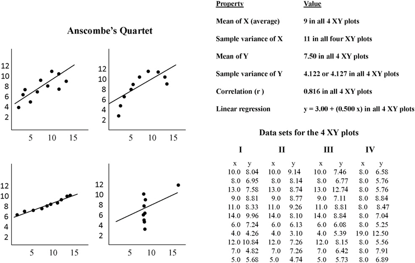
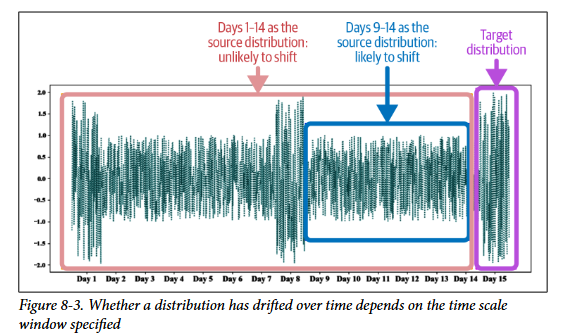
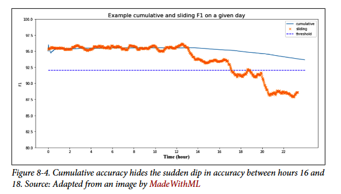
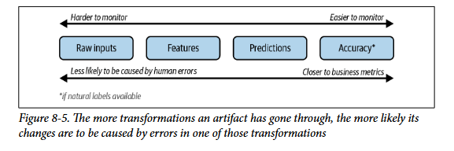

# **Data Distribution Shifts and Monitoring**

## **Causas de sistemas de falhas em Sistemas de ML**

Em geral nos preocupamos com 2 tipos principais de métricas no sistema:

- **Operacionais:** Mertricas relacionadas com latencia e vazao (troughtput) - O modelo esta respondendo ? em tempo razoavel ?

- **ML:** Metricas relacionadas a qualidade do que esta sendo respondido - O retorno do modelo esta correto ? Quao correto ?

Problemas gerados em **requisitos operacionais geralmente sao faceis de identificar** pois o sistema falha completamente e vem acompanhados de timeouts, mensagens de memoria insuficiente ou acessos errados na memoria. Identificar problemas **gerados nas metricas de ML sao mais complexos** pois exigem **monitoramento humano** constante no comportamento do modelo em producao para identificar possiveis **erros silenciosos** que nao sao refletidos nas metricas de qualidade. Existem 2 tipos de falhas:

### **Falhas de software**

- **Falhas de dependencias:** Acontece quando o codigo quebra pois alguma dependencia do codigo muda drasticamente, quebra ou deixa de ser mantido. Isso também pode ser generalizado para quando sua dependencia é o sistema de outras empresas como AWS pois se o servidor deles cair o seu também cai.
- **Falhas de deploy:** Quando versoes antigas de binarios sao colocados em producao ao inves da correta
- **Falhas de Harware:** Quando as CPUs, GPUs e etc falham por excesso de calor ou algo 

Lidar com esses problemas requer conhecimentos mais de engenharia de software que especificos de ML.

### **Falhas especificas de ML**

Por mais que a grande maioria dos problemas sao de software, os problemas de ML sao muito perigosos e dificeis de identificar e corrigir.

- **Dados na producao diferentes de dados no treino:** Quando dizemos que o modelo aprendeu com os dados de treino estamos dizendo que *ele aprendeu a distribuicao dos dados de treino o suficiente para gerar predicoes corretas em dados nao vistos no treino*. Geralmente usamos o conjunto de teste para representar esses dados nunca vistos que estarao em producao... o problema disso é que isso vem com **duas premissas importantes**:

    - **As distribuicoes sao iguais (Treino representa perfeitamente o real):** Quando temos teste e treino podemos garantir na hora de separar os conjuntos que eles sigam uma distribuicao proxima, levando a uma melhor generalizacao. Quando estamos em producao os dados vem de uma **distribuicao desconhecida/escondida (underlying) infinita e sem limitacoes**. Nos dados coletados para treino exisitem **diversos vieses (bias) de amostragem e selecao**, além de processamento e tempo humano ter sido gasto para gerar os dados de treino. Isso pode nos levar ao problema de **train-serving skew** (inclinacao/vies de treino-producao) em que o modelo vai bem em desenvolvimento mas mal em producao pois os dados divergem.

    - **A distribuicao é estacionária:** Mesmo que o dataset de treino seja perfeito e represente bem a distribuicao atual, a **distribuicao vai mudar com o tempo levando a degradacao do modelo aos poucos conforme o que ele aprendeu nao se aplica mais ao que existe**. Essas mudancas podem ser rapidas ou lentas e serem causadas por diversas razoes incluindo eventos no mundo ou o clima mudando. Um ponto importante aqui é **saber distinguir mudancas reais na distribuicao** ou nao apenas bugs/inconsistencias do sistema.

- **Casos de borda:** Casos de borda sao exemplos extremos e inusitados de input que levam o modelo a cometer erros muito grandes. É exatamente esses casos que tornam tao dificil a implementacao de modelos em areas de risco como medicina e carros autonomos mas nao apenas areas criticas pois um chatbot que nao lida bem com casos de borda por exemplo pode em algum momento ser extremamente racista e sexista. A ideia princial entao é sempre estudar e entender a cauda onde existem os casos raros que podem gerar problemas muito grandes.

    - **Outlier:** Um exemplo que difere muito dos outros
    - **Edge Case:** Um exemplo que performa significativamente pior que os outros (Um edge case nao necessáriamente é um outlier). Ex: Uma pessoa atravessando a rua sem olhar pode ser um outlier mas nao é um caso de borda pois o modelo vai identificar a pessoa e parar.

No treino podemos simplesmente remover os outliers para ajudar o modelo a generalizar melhor mas na inferencia real é necessário lidar de alguma forma com esses inputs.

- **Feedback Loop degenerado:** Também conhecido como vies de popularidade, bolhas de filtro e camaras de eco... o problema do loop degenerado é **quando a inferencia do modelo afeta no feedback do usuário que geralmente é usado para treinar novos modelos**. Imagine um sistema de recomendacao que diz que A é minimamente melhor que B para o usuário, o usuário entao clica mais em A pois esta em primeiro. Isso no futuro vira rotulo um novo modelo ser treinado e consequentemente A agora esta mais na frente ainda de B. Outro caso interessante é em selecao de curriculos, se treinamos um modelo para filtragem de curriculos de acordo com os funcionarios atualmente contratados, uma feature em comum X pode fazer com que mais funcionarios com X sejam contratados e depois novamente o modelo será treinado com mais funcionarios com feature X.

    - **Detectando o problema:** Em producao esse problema pode ser identificado conforme as **predicoes vao ficando muito homogeneas com tempo** mas queremos conseguir identificar esse problema antes de enviar o modelo para producao mas só temos o feedback do usuário em producao ? algumas abordagens:
        - **Métricas de diversidade:** Medimos a diversidade das predicoes do modelo para varios usuários usando métricas como **cobertura de cauda e a diversidade de itens** nas recomendacoes. Se a diversidade de itens é baixa significa que o modelo esta retonando as mesmas coisas as mesmas coisas para todo mundo, ou seja, as **predicoes sao muito homogeneas (sinal de loop)**.
        - **Desempenho em buckets:** Dividimos os itens em buckets de interacao, ou seja, **grupos de itens muito comuns e grupos de itens raros** (basicamente dividir a distribuicao em pedacos) e medimos o desempenho do modelo em cada bucket. Se o desempenho dele é melhor em itens comuns entao ele provavelmente esta enviesado.

    - **Mitigando o Problema:** existem duas abordagens principais de mitigacao:

        - **Randomizacao:** A ideia aqui é mitigar o vies **colocando itens aleatorios nas recomendacoes para conseguir feedback nao viesado** (Tiktok faz isso colocando videos aleatorios para certos usuários e pegando o feedback deles antes de colocar o video para mais pessoas). O problema dessa abordagem é que é um trade-off pois custa experiencia do usuário e existem alternativas melhores como contextual bandits. 

        - **Posicional Features:** Como nosso problema é a probabilidade do clique ser afetada pela posicao, podemos **dar ao modelo essa informacao de posicao através de features como um booleano de 'primeiro-colocado'** e agora durante o treinamento o primeiro colocado vai ter um pesinho a mais por causa da flag = 1, mas durante a inferencia todas as flags estarao como 0 e isso ira balancear o modelo como se estivessemos colocando um pouco do vies naquela flag e depois tiramos. Outra abordagem melhor é **treinar dois modelos**, um modelo que preve a probabilidade do usuário ver e considerar o item dado a posicao dele (usando algum proxy como aparecer na tela) e o segundo modelo preve a probabilidade do usuário clicar no item sem levar em consideracao a posicao. Assim **separamos o efeito qualidade do item e o efeito de vies de popularidade**.

## **Data Distribution Shifts**

Consiste no fenomeno em que a distribuicao target (inferencia/real) muda com o tempo fazendo com que a distribuicao source (treino) fique desatualizada.

### **Tipos de Data Shifts**

Em aprendizado supervisionado podemos dizer que nossos dados de treino seguem uma distribuicao **P(X,Y)** que é a distribuicao de probabilidade das features X e o rotulo Y aparecerem juntos. Os modelos em ML tentam se aproximar da distribuicao **P(Y|X)**, probabilidade do rotulo dado as features. A probabilidade da sample pode ser decomposta de duas formas: **P(X,Y) = P(Y|X)P(X) = P(X|Y)P(Y).**

- **Covariate Shift:** A distribuicao de rotulos dado um exemplo (P(Y|X)) nao mudou mas a distribuicao de exemplos P(X) mudou. **Um exemplo disso é fazer oversampling ou coletar mais amostras (vies) de uma doenca rara, a regra de ter a doenca (P(Y|X)) nao mudou mas agora a quantidade de amostras com a doenca P(X) mudou**.

- **Label Shift:** A distribuicao dos dados dado um rotulo especifico (P(X|Y)) nao muda mas a probabilidade de P(Y) muda. Por exemplo a quantidade de **churn (P(Y)) aumentou na empresa mas o padrao de clientes que churnam e nao churnam continua o mesmo (P(X|Y))**.

- **Concept Shift:** A distribuicao dos dados P(X) nao muda mas a probabilidade do rotulo dado esse X (P(Y|X)) muda drasticamente. Acontece quando efeitos externos efetam o rotulo sem afetar os dados, por exemplo a **valorizacao de um bairro afeta os precos (Y) das casas sem que a casa (X) mude**.

### **General Data Distribution Shifts**

Existem mais tipos de data shift nao muito estudados mas que ainda podem afetar a performace do modelo:

- **Feature change:** Que é quando as **features do modelo mudam** como uma nova feature adicionada, uma antiga removida ou o universo possivel daquela feature mudar. 
- **Label Schema change:** Que é quando as **possibilidades ou universo do rotulo muda**. Em classificacao seria como novas classes aparecerem e em regressao o intervalo e previsao mudar drasticamente.

Nao existe regra que defina que apenas um tipo acontece de cada vez, podem acontecer simultaneamente.

### **Detectando Data Shift**

Idealmente para detectar o data shift seria interessante **monitorar métricas de qualidade em producao (por exemplo F1, recall ou AUC-ROC)** porém nem sempre temos o rotulo real e se tivermos geralmente é demorado para ficarem prontos e confiaveis. Quando nao é possivel monitorar os rotulos, o ideal seria **monitorar outras distribuicoes de interesse** e essas distribuicoes sao: P(Y), P(X|Y), P(Y|X) e P(X). Nas 3 primeiras precisamos saber o rotulo... existem pesquisas sobre como detectar label shift sem ter acesso a P(Y) da distribuicao target porém **em geral na industria a maioria dos metodos é focado no shift do input P(X)**.

#### **Metodos estatisticos**

- **Comparando Estatisticas Simples:** A forma mais simples seria **comparar estatisticas** como media, mediana, variancia e quantis dos dados de treino com os dados de producao, se existir uma diferenca muito grande das duas amostras com certeza o shift aconteceu, mas **se nao existir uma diferenca muito grande (sao parecidos), nao podemos afirmar nada** pois amostras diferentes com mesmas estatisticas podem ter formatos totalmente diferentes como mostrado no exemplo do quarteto de anscombe.

- **Testes Estatisticos:** Outra forma mais robusta é usar testes estatisticos para comparar as duas amostras (treino e producao). Alguns testes interessantes:
    - **Kolmogorov (KS):** Nao paramétrico (nao assume nada da distribuicao) mas só funciona para dados unidimensionais (geralmente features sao multi)
    - **Least-Squares Density Difference e MMD:** Funciona com dados multidimensionais mas é mais usado em pesquisa que industria

    Em geral é interessante que exista uma **reducao de dimensionalidade antes dos testes** pois eles funcionam melhor com cardinalidade baixa. Além disso, significancia estatistica != importancia pratica... mas uma boa heuristica é: **Se é significante com amostras pequenas entao o efeito (drift) provavelmente é muito forte**.

#### **Qual janela dos dados comparar?**

Para executar esses testes e comparacoes e identificar o drift é necessário **definir a granularidade da nossa janela de comparacao**, afinal mudancas abruptas (muita mudanca de uma vez só) sao mais faceis de identificar que mudancas graduais. A ideia aqui é dicidir se comparamos os dados de atuais com o ultimo dia ? ultima semana ? ultimo mes ? tudo isso depende do ciclo dos dados. Se a **janela for menor que o ciclo dos dados ela vai identificar drift mesmo nao existindo nenhum e gerar um falso positivo**.

Estatisticas em series temporais geralmente sao de 2 tipos:

- **Estatisticas de janelas deslizantes:** Calculadas em janelas e zerada a cada janela nova
- **Estatisticas cumulativas:** Acumulada com tempo (carrega informacao anterior)

Um perigo de **estatisticas cumulativas é que elas podem camuflar quedas grandes de desempenho**. Isso acontece pois o histico já é tao grande que um ou dois tempos com desempenho ruim afetam pouco a estatistica.

### **Lidando com data drift**

Existem 3 abordagens principais:

- **Treinar com dados massivos:** Treinar com dados massivos para que o modelo consiga se adaptar a qualquer distribuicao no ambiente real. Faz mais sentido com redes neurais.
- **Adaptar os modelos sem treinar com novos dados:** Metodos de correcao de distribuicao para corrigir o modelo.
- **Retreinar com novos dados:** Consiste em treinar o modelo novamente com os dados da nova distribuicao target. Aqui tem duas decisoes importantes:
    - **From Scratch ou Fine tuning:** Treinar do zero o modelo ou apenas ajustar ele apartir do checkpoint atual (Finetuning, Transfer Learning e Domain adaptation sao termos relacionados)
    - **Quanto dos novos dados usar:** usar poucos dados atuais ? dias ? meses ?

Além de retreinar podemos **deixar o modelo mais robusto a drift** através de estrategias como **remover features** que mudam muito (geram muito drift). Ou **bucketizar essas features** instaveis para que elas variem menos. Se temos dois dominios com taxas de drift diferentes podemos ter **dois modelos ao invés de um e cada em é atualizado como precisa**.

## **Monitoring and Observability**

Monitorar é o ato de restrear, medir e logar métricas do sistema para quando algo deu errado.Como sistemas de ML no fim das contas também é software precisamos monitorar metricas operacionais de:
- **Rede:** Como latencia e througtput
- **Maquina:** Como uso de CPU/GPU e memória
- **Aplicacao:** Como numero de requisicoes respondidas com sucesso (codigo 200) ou predicoes por intervalo de tempo

Essas métricas servem para monitorar a saude do sistema em geral, nao adianta nada o resto funcionar e o sistema estar fora do ar

### **Métricas especificas de ML** 

Nao adianta o sistema estar **100% funcinando se as transformacoes nos dados e predicoes enviadas estao incorretas**. É interessante monitorar o pipeline em 4 etapas diferentes: nas métricas de acuracia do modelo, predicoes do modelo, features e input bruto. **Inputs brutos sao mais dificeis de monitorar** e interpretar mas geralmente sao **mais uteis** para encontrar a causa real do problema já que um problmea identificado na acuracia do modelo **pode ser causado por qualquer etapa anterior**.

- **Monitorar métricas de acuracia:** Se labels naturais estao disponiveis no problema entao podemos **monitorar métricas como F1** em producao mesmo. Mesmo sem labels **qualquer tipo de feedback implicito do usuário pode ser utilizado para monitoramento**, como cliques ou tempo de visualizacao, nao necessáriamente um rotulo especifico. Além disso, **permitir feedback explicito através da interface** para conseguir dados de otimizacao do modelo.

- **Monitorar predicoes:** Monitorar a **distribuicao das predicoes do modelo através do tempo**. Util para identificar padroes estranhos na distribuicao e pode ser um bom **proxy para um data shift no input** do modelo afinal se o modelo (pesos) nao mudou entao uma mudanca no output provavelmente é causada por uma mudanca no input. Além disso, por ser de baixa dimensionalidade podemos tranquilamente usar metodos estatisticos para identificar data drift.

- **Monitorar Features:** Monitorar features é o foco **principal na industria** pois diferente do raw elas sao estruturadas e mais faceis de monitorar. O primeiro ponto nesse monitoramento é a **validacao de features que verifica se as features estao seguindo o schema esperado** que foi definido nos dados de treino, um exemplo disso é checar se o min, max, testar regex para padroes definidos e Enums para conjunto definido. Essa etapa também é chamada de table testing (testes de unidade para dados) e tem algumas ferramentas populares como: Great Expectations e Deequ (da AWS). Outro monitoramente que além de validacao sao **testes estatisticos para detectar drift de algumas features** principais. Existem 4 problemas nesse monitoramento:
    - **Custo:** Se uma empresa tem muitos modelos e cada modelo usa centenas de features entao calcular esse tanto de estatisticas pode ficar pesado em questao de memoria e latencia. Além de ser muito mais dificil monitorar tudo isso.
    - **Debug x Degradacao de performace:** Drift em features nem sempre significa degradacao na performace... é importante conseguir distinguir drift importantes e nao importantes para reduzir o numero de falsos positivos.
    - **Causa:** Mesmo um drift detectado na feature é dificil afirmar que isso nao foi causado talvez por um erro nos N pre processamentos anteriores
    - **Schemas mudam muito:** Uma mudanca no schema do pipeline pode gerar um alerta que na verdade foi só falta de atualizar

- **Monitorar inputs brutos:** Ja que mudancas nas features podem vir de bugs e erros no processamento pq nao monitorar antes do processamento ? Eles sao mais dificeis de monitorar pois vem despadronizados e de varias fontes diferentes. Isso é mais um trabalho de quem cuida da parte de engenharia de dados.

### **Ferramentas para monitoramento**

- **Logs:** Registrar qualquer evento que aconteca no sistema com granularidade mais baixa possivel. Alguns problemas aparecem:
    - **volume gigantesco de logs** comeca a ser gerado pois armazenar e buscar dentro disso comeca a ficar caro
    - sistemas ficam mais modularizados em diversos componentes e **fica mais dificil encontrar onde foi o problem**

    **Mitigacoes:**
    - Dar um ID ao processo/request para ser possivel **rastrear a sequencia completa** dele
    - **Usar ML** nso logs para identificar problemas

    **Quando:** Logs podem ser processados tanto em batch periodicamente usando SQL/Spark quanto em stream no momento que sao gerados usando transporte de tempo real como Kafka.

- **DashBoards:** identificar padroes/erros é muito mais facil em um grafico que em uma lista cheia palavras/numeros e além disso também facilita para nao especialistas. Só é preciso ter cuidado pois o grafo sozinho nao é suficiente sem o conhecimento para interpretar e um grafico com 50 curvas diferentes retorna ao mesmo problema de complexidade de interpretacao.

- **Alertas:** Um alerta é composto por 3 componentes: Politica de alerta, que define quando o alerta vai acontecer (acuracia < 80%) -> Canal de notificacao, que define quem é avisado e por onde 

### **Observabilidade**

Com apenas o monitoramento nos monitoramos numeros/logs e alertamos qualquer problema e atividade incomum. Só que **apenas sabemos que um problema aconteceu** mas nao onde aconteceu e pq aconteceu, para descobrir precisariamos testar componentes do codigo... ai entra observabilidade, em que criamos um sistema que se algo der errado, conseguimos **decobrir o motivo apenas olhando para os dados sem precisar tocar no codigo**.

Exemplo: a acurácia do seu modelo caiu de 95% para 80% na última hora

- **Monitoring te diz:** "acurácia caiu para 80% às 14h." Ponto. Você sabe que algo está errado.
- **Observability te permite verificar:**
    - "erros da última hora agrupados por região" -> você descobre que só usuários do Nordeste estão com erro alto
    - "outputs intermediários dessas predições erradas" -> você vê que uma feature específica está vindo com valores nulos
    - "Qual feature mais contribuiu pros erros?" -> você descobre que é a feature X

Isso só foi possível porque o sistema foi instrumentado de antemão para logar tudo isso com granularidade suficiente (por região, por feature, por request individual), não só a métrica agregada de "acurácia geral". Em poucas palavras um **sistema observavel é um sistema com logs com granularidade baixa e logs de varias (partes) do sistema**.
