## Projetar um sistema que escala para milhoes é um desafio que requer refinamentos continuos e diversas melhorias. Vamos passo a passo...

---
### Servidor Unico:

Suponha que temos um servidor unico em que o web app, database, cache e etc estao todos rodando na mesma maquina. 

O funcionamente comum desse servidor é algo como:

1. O usuário acessa o site por nomes de dominios (Domains) como por exemplo youtube.com.br. Porém para acessar um site precisamos de um ip... esse nome de dominio é convertido em ips por algo chamado DNS (Domain Name System):
    - Basicamente um sistema distribuido hierarquico (publicos ou pagos) responsaveis por transformar seu dominio em um ip (Nossa agenda de ips). Exemplo: Queremos acessar google.com.br mas nao sabemos o ip dele e nem nosso computador sabe, perguntamos o resolvedor recursivo que pode ser o DNS da operadora (claro,vivo) ou um DNS publico como a Google DNS / Cloudflare. Ele analisa recursivamente a URL mas ele também nao armazena o ip, ele apenas direciona para os servidores que armazenam... a url tem .br, logo direciona para o servidor do Brasil que armazena os dominios brasileiro. O servidor TLD responsavel por .br mostra em qual servidor autoritativo o dominio esta registrado. Acessamos o servidor autoritativo retornamos o ip para o usuário que solicitou. (normalmente esses servidores sao arvores Trie que sao as mesmas usadas em maquinas de busca).

2. Maquina do usuário agora tem o ip do servidor e envia uma requisicao direta para ele usando HTTP/HTTPS. Mas oq sao esses protocolos de transporte:
    - HTTP é um modelo de requisicao e resposta, o cliente manda uma requisicao estruturada (Metodo (GET,POST...), header que sao metadados sobre quem esta mandando e body que é o conteudo quando necessário) e o servidor responde com estrutura parecida (Status junto com resposta) (O conteudo do body depende do tipo de API que estamos falando, a api é a interface de comunicacao dos dois sistemas e pode ter varias formas... O protocolo apenas transporta e como a carga é estruturada depende do tipo de api). O problema dele é que ele apenas envia os dados/texto de forma bruta sendo muito perigoso uma vez que qualquer pessoa que intercepte ou intermedie a conexao tem acesso facil a todos os dados. Ai entra o HTTPS, que faz oq é chamado de handshake em que inicialmente o servidor apresenta um certificado e abre uma conexao segura e criptografada com o cliente e assim caso alguem intercepte, nao entendera nada.

        Requisicao:

        ```sql
        POST /login HTTP/1.1
        Host: meusite.com.br
        Content-Type: application/json
        User-Agent: Mozilla/5.0
        Content-Length: 35

        {
        "usuario": "admin",
        "senha": "123"
        }
        ```
        Resposta:
            
        ```sql
        HTTP/1.1 200 OK
        Date: Tue, 17 Feb 2026 21:00:00 GMT
        Content-Type: application/json
        Content-Length: 52

        {
        "id": 123,
        "status": "sucesso",
        "mensagem": "Olá!"
        }
        ```

3. O servidor retorna o HTML, CSS, JS (Client-side languages) e etc para renderizer o site localmente.


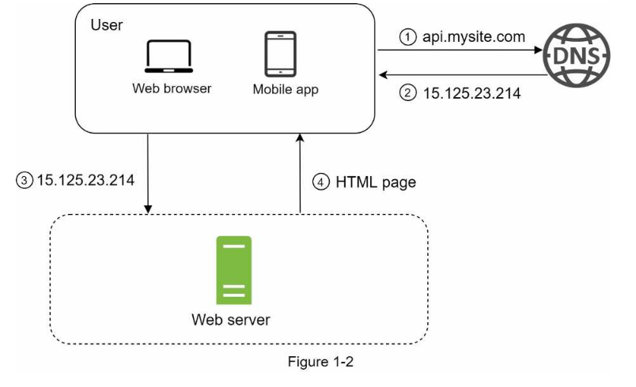


---
### Separando o Database em outro servidor:

O numero de usuários cresceu entao temos mais requisicoes e mais dados ara armazenar, manter e atualizar na mesma maquina. Uma maquina nao é mais suficiente, logo, precisamos separar o banco de dados e a aplicacao web em servidores diferentes.

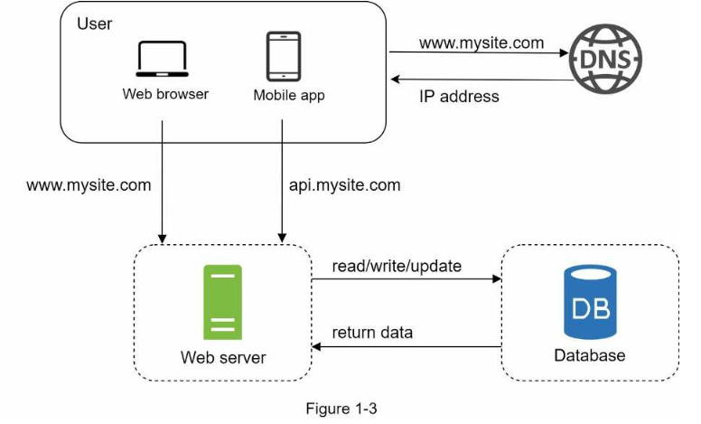

- Qual banco de dados usar ? SQL ou NoSQL.

    - Os bancos relacionais (como oracleSQL, MySQL e PostgreSQL) sao mais comuns na maioria das aplicacoes onde os dados sao armazenados em linhas, colunas e tabelas.
    - Os bancos nao relacionais (como Neo4j, Cassandra, HBase, DynamoDB, CouchDB e MongoDB) sao divididos em varias categorias como Chave-valor, grafo, colunas e documentos.

- Na maioria dos casos bancos de dados relacionais sao a melhor opcao mas exisem casos de uso que NoSQL podem ser melhor:

    - Requisito de latência superbaixa: 

    Bancos relacionais precisam garantir varias propriedades(ACID) e processar Joins complexos. Já muitos bancos como Redis (cache) e Dynamo usam estrutura Chave-Valor e usam bem memória principal (RAM), resultando em consultas diretas e extremamente rapidas.

    - Dados nao estruturados ou sem relacoes: 

    O ponto mais importante do SQL é exatamente as relacoes entre tabelas, seus esquemas do banco e dados bem estruturados e comportados (uma alteracao de estrutura -> alterar o banco inteiro). Se seus dados sao nao estruturados como texto bruto, logs, metadados variaveis é mais interessante bancos como mongoDB que dao liberdade de estrutura.

    - Apenas serialização e desserialização de dados: 

    Muitas aplicações modernas apenas recebem um objeto do front-end e precisam guardá-lo exatamente como ele veio. Bancos de documentos (como o MongoDB) armazenam os dados nativamente em formatos como BSON (um JSON binário). Isso elimina o trabalho do servidor de ter que "desmontar" um objeto JSON para salvar em várias tabelas SQL e depois "remontar" tudo de novo na hora de ler.

    - Armazenamento de quantidades massivas de dados:

    Bancos relacionais costumam escalar verticalmente (você precisa de um servidor cada vez mais caro e potente). Bancos NoSQL foram desenhados para escala horizontal (sharding). Isso significa que, se o volume de dados crescer demais, você apenas adiciona servidores comuns e baratos ao cluster. O banco distribui os dados entre esses servidores automaticamente.

---
### Escalar Verticalmente x Horizontalmente:

Escalar verticalmente significa aumentar o poder de processamente dos servidores que voce já tem, ou seja, por exemplo trocar uma maquina com 64GB RAM por uma de 128GB. Verticalmente funciona principalmente em casos que o fluxo de usuários nao é tao alto mas existem algumas limitacoes como:

- Hardware de um computador nao pode melhorar infinitamente (nao podemos colocar quanta RAM quisermos mas sim o quanto a placa mae aguenta)
- Escalar verticalmente nao auxilia com failover (tolerancia a falhas) pois se o servidor unico cair, todo o sistema para de funcionar...

Escalar horizontalmente signifca adicionar mais servidores (chamados normalmente de nodes) iguais ao original para auxiliar nas requisicoes e também auxiliar na tolerancia a falhas uma vez que se um dos nodes cair, outro ainda podera responder as requisicoes até que algo seja feito. Logo, horizontalmente é mais preferivel em aplicacoes de larga escala.

---
### Load Balancer:

Agora imagine que seu servidor tem uma quantidade de trafego absurda na mesma hora. Se for um unico servidor teremos algo chamado de load limit (Overload/Sobrecarga do servidor) agindo para controlar, o que acontece é que o servidor atinge o limite de recursos (CPU, RAM ou conexões simultâneas) e ocorre uma sobrecarga (overload) fazendo a experiencia do usuário ser prejudicada com lentidoes e erros. Mesmo com 2 servidores eles ainda podem ser sobrecarregados. A solucao perfeita para isso é o load balancer...

O load balancer funciona distribuindo as requisicoes entre varios nodes (servidores) normalmente usando algoritmos de distribuicao como Round Robin, ele possui um ip publico em que todas as requisicoes sao feitas, entao ele distribui elas em ips privados que apenas ele e as proprias maquinas tem acesso, tornando a aplicacao muito mais segura. 
- Se um ou dois servidores cairem, o load balancer vai transferir as requisicoes deles para os que ainda estao funcionando sendo uma tolerancia a falhas. Depois nos corrigimos o servidor e adicionamos um novo servidor saudavel ao pool de servidores.
- Se o trafego aumentar muito de uma hora para outra, o load balancer irá resolver isso de forma simples, basta criarmos mais servidores e ele automaticamente comecara a mandar requisicoes para eles. 
- Load Balancer nao cria servidores sozinho, apenas verifica quais estao funcionando ou sobrecarregadas fisicamente (recursos) e distribui carga entre eles evitando o gargalo físico de uma única máquina. Oq cria novas maquinas automaticamente se chama Auto Scalling...

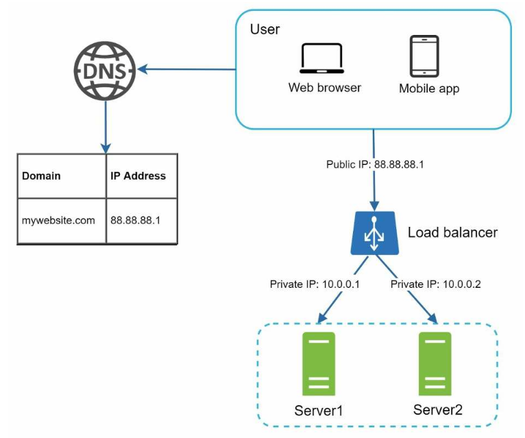

Os servicoes mais famosos de Load Balancer sao da AWS ELB, Google LB ou Azure LB. Eles normalmente sao contratados e usados em conjuntos com orquestradores (como kubernetes).


---
### Database replication

Nos bancos de dados temos os mesmos problemas de tolerancia a falhas e sobrecarga uma vez que se temos apenas uma instancia do banco e ele cai, isso é equivalente ao servidor cair se a aplicacao for super dependende dele. Uma forma comum de se fazer isso é usando o padrao mestre/escravos...

Nesse padrao temos dois tipos de instancias:
- Mestres que suportam apenas operacoes de escrita/alteracao e apagar.
- Escravos que sao copias atualizadas do mestre e que suportam apenas a operacao de leitura. (Como o numero de leituras geralmente é maior que o numero de escritas entao normalmente o numero de bancos escravos > numero de bancos mestres).

Algumas vantagens disso sao:
- Melhor performance pois operacoes de escrita so acontecem no master e portanto varias leituras/consultas sao distribuidas pelos node escravos e podem ser feitas em paralelo.
- A perda de dados é menos provavel pois os dados estao replicados em varias bases de dados
- A tolerancia a falhas (disponibilidade) aumenta uma vez que se um dos escravos cair, a aplicacao pode continuar funcionando redirecionando a leitura para outros escravos. Se todos os escravos cairem o mestre ira temporariamente aceitar operacoes de leitura ate que o problema seja resolvido. Se todos os nodes mestres cairem, entao um dos escravos será promovido (isso pode ser complexo uma vez que os dados do escravo podem nao estar atualizados com o do antigo mestre e portanto é necessário scripts de backup) a mestre e um novo escravo será criado.

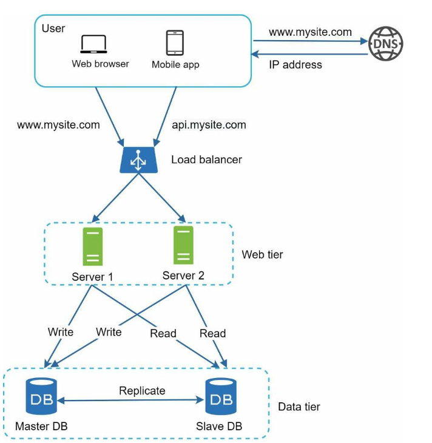


---
### Cache 

Cache é uma memória temporaria de acesso rapido mas que normalmente tem menos espaco e serve para armazenar respostas frequentes ou muito caras (custa muito ir no banco e recuperar) e pode ser usado principalmente para melhorar o tempo de resposta/carregamento de algo. Suponha que temos uma consulta muito comum para certos dados, ao inves de sempre ir no banco e buscar na memoria secundaria podemos manter um cache em memória primária e usar alguma politica de substituicao de cache para manter os dados que mais sao acessados no cache e assim reduzir consideravelmente o tempo de resposta do usuário e também reduzir a sobrecarga aos bancos (alem disso podemos escalar o cache de forma independente). 

Depois de receber uma requisicao o servidor web primeiro checa se os dados que quero nao estao no cache, se eles estiverem, pegamos os dados e retornamos para o usuário (em paralelo tera uma atualizacao na politca de substituicao) mas se eles nao estiverem vamos ao banco e buscamos o dado, colocamos ele no cache (dependendo da politca) e retornamos para o usuário.

Consideracoes ao usar cache:

- Caches sao ideais em casos que o numero de leituras é bem maior que o numero de escritas uma vez que a memória do cache é volatil e portanto se o servidor do cache cair ele perdera os dados.
- Politicas de substituicao/expiracao sao importantes pois se os dados do cache estao a muito tempo parados precisamos tiralos de la para nao gastar recursos atoas. Ou se o cache esta cheio precisamos escolher alguma politca de substituicao.
- O cache precisa estar consistente e sincronizado com o banco de dados uma vez que se modificamos no banco algo que esta no cache, temos que modificar no cache também.
- Para melhorar a tolerancia a falhas e nao deixar o cache como um ponto de falha (ponto que se cair o sistema todo cai) é interessante manter multiplicar servidores de cache.

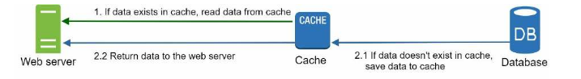

---
### Content delivery network (CDN)

CDN é funciona exatamente como um cache mas ele serve para armazenar conteudos estaticos (existe para dinamicos solucoes mais novas como Edge computing) da pagina web como HTML, CSS, JS, Imagens e Videos. Conteudos estaticos sao arquivos que nao mudam dependendo de quem esta acessando, ou seja, arquivos que vao para todo e qualquer usuário que acessar a aplicacao e nao precisa passar pelo backend. CDN na verdade é uma rede de servidores espalhados geograficamente de forma estratégica (esses servidores sao chamados de edge servers), se eu moro no Brasil e tento acessar um site, ele tentara consultar o servidor do CDN mais proximo de mim para buscar os conteudos. Quanto mais proximo voce esta de um servidor do CDN mais rapido seu site e conteudos vao carregar. Esses edge servers replicam o conteudo do seu site em varios pontos do mundo, o GeoDNS direciona sua requisicao ao CDN mais proximo e se o seu site estiver no cache, ele retorna, se nao ele vai ter que ir buscar no servidor origem.

O processo é algo como:

1. O usuário entra no site e o conteudo estatico é requisitado no servidor mais proximo do CDN para ver se a imagem ou html esta no cache. A consulta é feita com URLs do conteudo, por exemplo, "meusite.com/img/foto.jpg" para um imagem, "meusite.com/home" para arquivos HTML ou "cdn.com/app.min.js" para JS. Repare que o CDN pode agir como hospedagem ou como Proxy (intermediário), no caso de hospedagem voce nao tem o servidor mas usa o servico do provedor para hospedar seus conteudos estaticos na nuvem (como AWS, Google Firebase e Vercel) e eles te dao uma URL para acessar (tipo assim: 
"https://mysite.cloudfront.net/logo.jpg"). Em caso de intermediario (proxy) seu servidor é a origem dos conteudos estaticos e o proxy cuida apenas dos dados no cache (CDN), um exemplo disso é a cloudfare.

2. Se o servidor CDN nao tiver o conteudo estatico no cache para retornar, o CDN pede o conteudo na origem que pode ser seu servidor ou um storage como Firebase Google.

3. A origem retorna a imagem para o CDN. O CDN salva a imagem nele e junto um metadado TTL que signifca time-to-live, ou seja, quanto tempo o CDN devera armazenar esse dado no maximo. 1 ano ? meses ? etc...

4. CDN retorna a imagem para o cliente-side do usuário. Agora se um novo usuário tentar acessar o site já vai estar no cache (CDN) e será retornado rapido. (contanto que o TTL nao tenha expirado)

Consideracoes:

- Existem custos relacionados ao CDN uma vez que sao provedores externos e temos que pagar por transferencia e armazenamento. Colocar no cache coisas que raramente sao usados nao é interessante e devem ser retirados.
- TTL tem ser bem definida, nem muito pequena nem grande. Se for grande o conteudo pode ficar antigo e se for curto vai precisar pedir a origem toda hora.
- Em casos da CDN cair voce precisa consultar diretamente a fonte e isso é uma medida de tolerancia a falhas.
- Voce pode remover um arquivo antigo da CDN de duas formas: Primeiro invalidar o objeto com a API do provedor ou versionar o objeto para versao 2 por exemplo na URL-> "image.png?v=2"

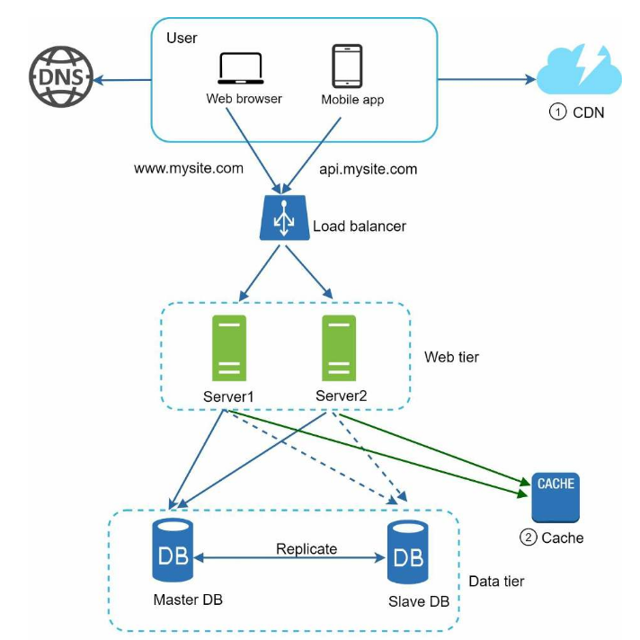

---
### Arquiteturas Stateful vs Stateless

- Stateful: Sao arquiteturas em que o servidor lembra dos dados do usuário também chamado de state/estado de uma requisicao para outra. Esse estado é armazenado em um dos servidores disponiveis pela aplicacao. Ele é mais simples porém tem um gargalo em que o estado de um usuário fica em um servidor apenas normalmente e portanto se o usuário faz uma requisicao ela necessáriamente tem que cair no servidor que o estado dele esta. Isso pode ser feito com sticky sessions: Com a Sticky Session ativada, o Load Balancer "carimba" o seu navegador (geralmente via cookie). Na primeira vez que você acessa, o Load Balancer escolhe o Servidor A e anota: "O Luis agora pertence ao Servidor A". Enquanto aquela sessão durar, todas as suas requisições futuras serão enviadas obrigatoriamente para o Servidor A. Você ficou "colado" nele. Isso é um problema para escalar pois além de adicionar overhead extra, também dificulta o incremento ou decremento de servidores durante o auto-scalling. (existem aplicacoes que isso é necessário como em jogos online que o jogo precisa ser executado no servidor)

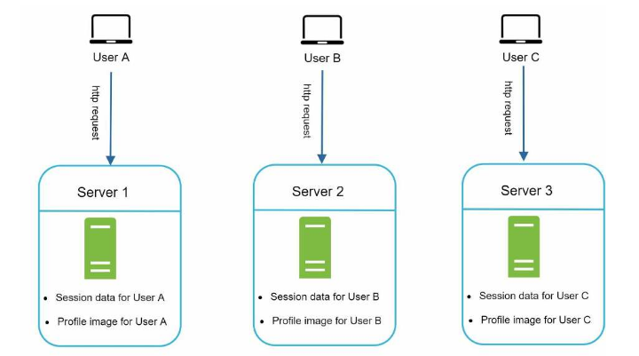

- Stateless: Na arquitetura stateless a requisicao do usuário pode enviar a requisicao dele para qualquer servidor pois o servidor ira simplesmente buscar os dados do usuário (state) em um banco compartilhado entre todos os servidores. Sendo mais robustos e escalaveis. 

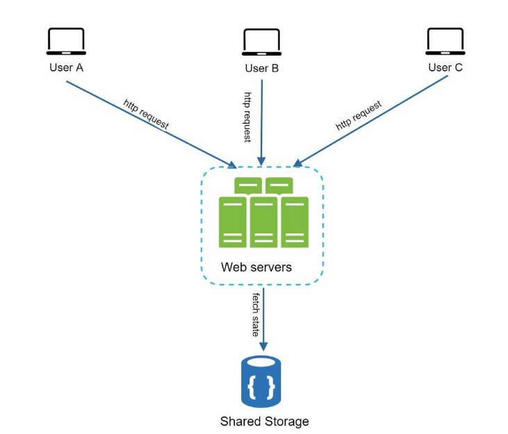


--- 
### Auto-Scaling

Auto-scalers sao mecanismos que permitem que o numero de servidores ativos cresca ou diminua automaticamente de acordo com o carga de trafego atual dos servidores. Ou seja, se temos muito trafego aumentamos o numero de servers (ate um limite superior), se temos pouco trafego reduzimos o numero de servers (ate um limite inferior). Se seu servidor é hospedado em nuvem por servicos como AWS, a propria AWS fornece diversos servicos que facilitam a vida como o proprio AWS Auto Scaling. Se seu servidor é self-hosted (auto hospedado, ou seja, voce tem seu propria servidor) entao é necessário ferramentas de orquestracao de containers como Kubernetes e Slurm que é um gerenciador de trafego no servidor (Speed usa): Imagine que o A1 ou o A2 são máquinas caríssimas e muito potentes. Se 50 alunos tentarem rodar um treinamento de rede neural ao mesmo tempo na mesma máquina: A memória RAM vai acabar, o processador vai travar, ninguém vai conseguir terminar o trabalho. O Slurm resolve isso criando uma fila organizada.

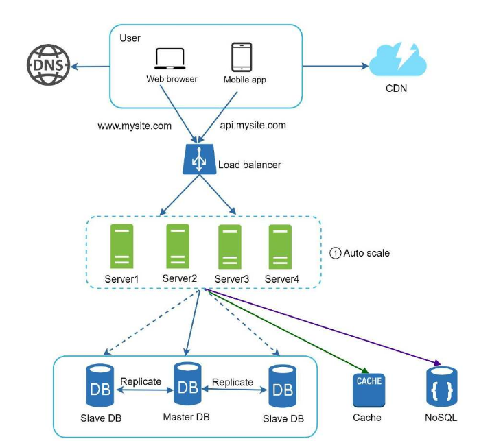


---
### Necessidade de Data Centers

Imagine que sua aplicacao é usada globalmente. Se voce tiver apenas um servidor localizado no Brasil, acessos vindos da europa ou Asia serao lentos prejudicando a experiencia do usuário. Para resolver isso, podemos manter nosso servicos hospedados em multiplos datacenters (cada um com seu IP publico e seus IPs privados internamente, como se duplicacemos tudo que vimos até agr) em regioes estratégicas geograficamente e entao o GeoDNS ira direcionar a requisicao de um usuário para o datacenter mais proximo da localizacao dele. Dentro do datacentes especifico teremos um load balancers, servidores escalados, caches, bancos de dados (unica coisa em comum é o banco de dados do state dos usuários) e etc... Além de velocidade, varios datacenters melhoram a tolerancia a falhas uma vez que se um datacenter falhar o trafego pode ser redirecionado para outro.

Alguns detalhes importantes sobre ter varios data centers:
- Usuários de diferentes datacenters podem usar diferentes bancos de dados e caches locais. Em caso de falha em uma datacenter, outro pode nao ter os dados do usuário que estavam no datacenter que caiu...um solucao para isso é replicacao de dados entre varios datacenters.
- Com varios datacenters ativos é importante monitorar e testar sua aplicacao de forma rapida. Deploy automatico é imprecindivel nesse cenário.


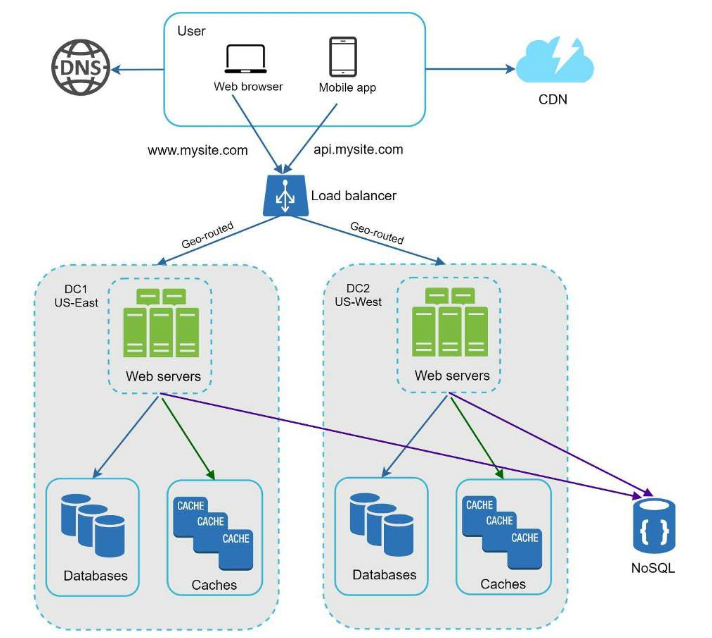

---
### Fila de mensagens (message queue)

Filas de mensagens é um componente intermediário que suporta comunicacao assincrona e é armazenado em memória. Ele funciona como um buffer/armazenamento em que servidores/servicos webs chamados produtores criam jobs/mensagens assincronas conforme a demanda dos usuários e entao colocam nessa fila (e retornam algo para o usuário como dizendo que esta em processamento). Outros servidores chamados consumidores sao servidores de processamento que pegam os jobs da fila e processam e quando terminarem retornam o resultado. Exemplo: Imagine um aplicacao de edicao de fotos, o processo de edicao de fotos normlamente demora entao nao podemos deixar o servidor produtor ocupado realizando esse trabalho. Ele entao coloca na fila e um outro servidor pega esse trabalho e comeca a fazer enquanto o produtor continua a atender outros pedidos.

Esse modelo tem algumas vantagens como:

- O produtor pode produzir independentemente do consumidor estar ou nao funcionando e o consumidor pode consumir independemente do produtor estar funcionando. Para tolerancia a falhas isso é bom pois se o consumidor cai os trabalhos nao sao perdidos pois estao na fila intermediária.
- Produtores e consumidores podem escalar separadamente...se a fila estiver muito cheia entao novos consumidores podem ser criados para reduzir gargalo e se estiver vazia, consumidores podem ser eliminados.
- Produtores e consumidores sao independentes de linguagem contanto que a mensagem seja padronizada entao o consumidor pode ser feito em linguagens mais eficientes como C/C++. 

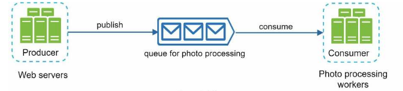

Os principais softwares de fila de mensagens sao KAFKA e RABBITMQ.


---
### Logging, metricas e automacao

- Logging: log de erros sao importantes pois ajudam e agilizam na hora de corrigir algum problema.
- Metricas: metricas nos ajudam a entender como o desempenho do sistema esta atualmente em varios sentidos: metricas de hardware como uso da CPU, RAM, GPU..., metricas de negocio como numero de usuários diário...
- Automacao: Continuos integration permite melhorar a produtividade atravez de builds, tests e deploys automaticos.

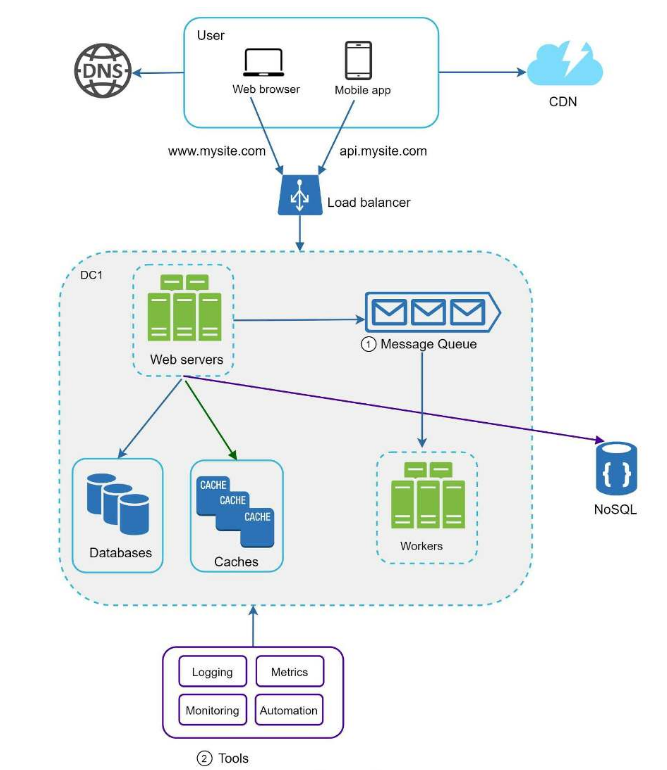


---
### Escalando o banco de dados

Podemos escalar o banco de dados tanto verticalmente quanto horizontalmente:
- Verticalmente: Escalar verticalmente significa servidores melhores (com +RAM, +DISCO e CPU) mas o problema disso é o limite do hardware, problemas com um unico ponto de falha (ter um servidor super forte sozinho é perigoso pois se ele cair o sistema todo para) e além disso servidores potentes sao extremamente caros.
- Horizontalmente (Sharding): Escalar um banco horizontalmente significa servidores menores mas em maiores quantidades e isso nos leva a fragmentacao (sharding) dos dados, ou seja, os dados agora nao vao ficar em apenas um banco e sim em varios bancos menores que compartilham o mesmo esquema. Cada dado nesses bancos é unico e o banco é escolhido com base na sharding_key que por exemplo pode ser o mod 4, do id. 

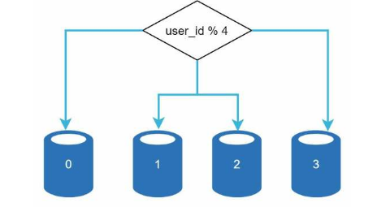

Sharding é uma otima estratégia mas introduz complexidades e desafios novos:


- Resharding data: Re fragmentar todos os dados é necessários nas seguintes situacoes: quando um dos shards esta quase lotado e quando a funcao de hash sobrecarrega mais um banco do que outro.
- Problema da celebridade: Contas de celebridades que tem muitos acessos (como em instagram e facebook) pode causar sobrecarga no banco e pode ser necessário criar um banco apenas para aquela celebridade...
- Operacoes de join e desnormalizacao: Operacoes de Join em bancos fragmentados sao extremamente caras e em muitos momentos é melhor desnormalizar os dados (por exemplo deixar um tabelao para query ser executada em uma tabela apenas) ou ate mesmo mudar para um banco NoSQL para reduzir sobrecarga. 

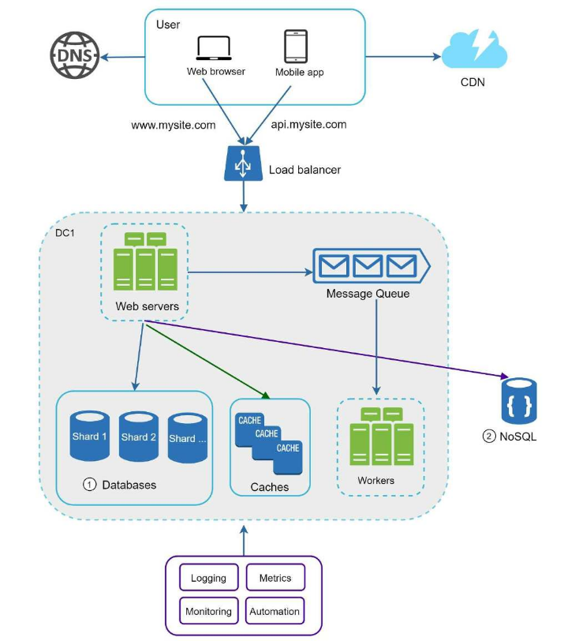


