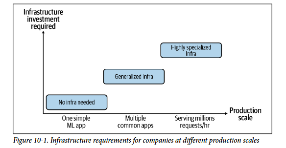
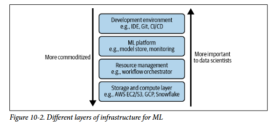

# **Infrastructure and Tooling for MLOps**

Infraestrutura é o **conjunto de instalacoes fundamentais que apoiam no desenvolvimento e manutencao de sistemas de ML**. O que é fundamental varia de empresa para empresa mas o que pode funcionar para maioria das empresas (generalizado) pode ser categorizado em 4 camadas: 

## **Camadas de armazenamento e computacao**

- **Armazenamento:** Sistemas de ML geralmente usam muitos dados e esses dados precisam ser armazenados em algum lugar. Eles podem ser armazenados localmente usando HDs e SSDs nos servidores da empresa ou armazenados em nuvém através de servicos como Amazon S3 ou Snowflake. 
    - **Amazon S3 (Simple Storage Service):** serviço de armazenamento de objetos da AWS. Cada objeto tem uma chave única (path/nome), os dados em si, e metadados... nao é um banco de dados tipo SQL/NoSQL é tipo um HD infinito e distribuido na nuvem, onde você guarda qualquer tipo de arquivo.

    - **Snowflake:** É um data warehouse (armazém de dados) na nuvem, focado em análise de dados estruturados.Você carrega dados estruturados (tabelas) para dentro do Snowflake. Ele separa armazenamento e processamento (compute) — isso permite escalar cada um independentemente (Pode ingerir diretamente de arquivos que estão no S3)

    é comum usar os dois juntos: os dados brutos ficam no S3 (barato, escalável), e o Snowflake lê/carrega esses dados para análises rápidas via SQL

- **Computacao:** Conjunto de recursos computacionais como CPUs e GPUs que executam os jobs/trabalhos pesados do sistema, como por exemplo treino, limpeza e inferencia. A camada de computacao pode ser dividida em unidades menores como threads, instancias de maquinas virtuais, jobs ou pods (kubernets). Para um job ser executado ele precisa:

    - **carregar os dados necessários** na memória da unidade de computacao e se nao houver memória suficiente utilizar algoritmos out-of-core
    - **executar as operacoes** do job (multiplicacoes, adicoes...)

    A unidade de computacao geralmente é caracterizada por 2 métricas principais:
    - **Memória:** Mais memória permite *carregar mais dados, usar modelos maiores* e memórias mais rapidas permite uma *largura de banda de I/O maior*
    - **FLOPS:** Operacoes de ponto flutuante realizadas por segundo que representa *quanto sua unidade de computacao consegue trabalhar*. Normalmente nao é muito confiavel devido a *falta de padronizacao da definicao e que o maximo raramento consegue ser usado*.

    A utilizacao (FLOPS usados / FLOPS maximos) é quase impossivel de ser 100% e é *limitado drasticamente pela velocidade de carregamento dos dados (largura de banda da memoria (limite maximo fisico daquela tecnologia de memória))*. Já que FLOPS é complicado é mais comum usarem memória e numero de nucleos como métricas... a AWS por exemplo usa o conceito de vCPUs que na prática equivale a meia CPU.

### **Public Cloud Versus Private Data Centers**

Com crescimento da computacao em nuvem se tornou muito comum empresas pequenas/medias pagarem provedores de nuvem como AWS e Azure pelo uso de suas maquinas. Isso faz todo sentido para empresas crescendo agora *uma vez que nao precisam se preocupar em montar seus proprios datacenters*. Cloud é especialmente util pela *possibilidade de pagar pelo que usa ao invés de sempre pagar uma quantia fixa*... imagine que seu sistema consegue lidar 90% do tempo com 10 CPUs e 10% precisa de 100 CPUs por causa de picos, se quisermos aguentar os picos com datacenters proprios teriamos que manter 100 CPUs sempre mas com cloud podemos ficar 90% do tempo com 10 CPUs e 10% do tempo com 100 CPUs e pagar pelo uso e *muitas vezes nem é necessário fazer isso manualmente pois existe autoscaling*.

Cloud parece escalar infinitamente mas tem limites claros impostos normalmente para cada usuário. Além disso, o preco da cloud aumenta constantemente e conforme a empresa cresce os gastos com cloud podem chegar em ate 50% dos gastos totais da empresa. *Comecar a usar a cloud dos provedores é muito rapido e facil mas parar é complicado devido as dependencias criadas e o custo de equipamentos e engenheiros*. Existem duas abordagens principais para sair da nuvem:

- **Hibrido:** Usar cloud junto com infraestrutura propria e ir aumentando a capacidade da infra da empresa de pouco em pouco.
- **Multicloud:** As vezes por imprevistos como compra de empresas e estrategias uma empresa acaba com mais de um provedor de cloud... isso também pode reduzir a dependencia em apenas um provedor.

## **Ambiente de desenvolvimento**

