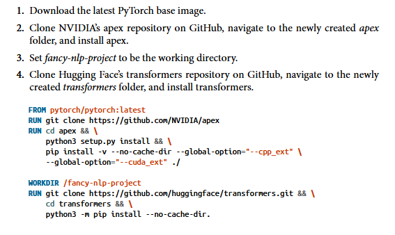

# **Infrastructure and Tooling for MLOps**


Infraestrutura é o **conjunto de instalacoes fundamentais que apoiam no desenvolvimento e manutencao de sistemas de ML**. O que é fundamental varia de empresa para empresa mas o que pode funcionar para maioria das empresas (generalizado) pode ser categorizado em 4 camadas: 


## **Camadas de armazenamento e computacao**

- **Armazenamento:** Sistemas de ML geralmente usam muitos dados e esses dados precisam ser armazenados em algum lugar. Eles podem ser armazenados localmente usando HDs e SSDs nos servidores da empresa ou armazenados em nuvém através de servicos como Amazon S3 ou Snowflake. 
    - **Amazon S3 (Simple Storage Service):** serviço de armazenamento de objetos da AWS. Cada objeto tem uma chave única (path/nome), os dados em si, e metadados... nao é um banco de dados tipo SQL/NoSQL é tipo um HD infinito e distribuido na nuvem, onde você guarda qualquer tipo de arquivo.

    - **Snowflake:** É um data warehouse (armazém de dados) na nuvem, focado em análise de dados estruturados.Você carrega dados estruturados (tabelas) para dentro do Snowflake. Ele separa armazenamento e processamento (compute) — isso permite escalar cada um independentemente (Pode ingerir diretamente de arquivos que estão no S3)

    é comum usar os dois juntos: os dados brutos ficam no S3 (barato, escalável), e o Snowflake lê/carrega esses dados para análises rápidas via SQL

- **Computacao:** Conjunto de recursos computacionais como CPUs e GPUs que executam os jobs/trabalhos pesados do sistema, como por exemplo treino, limpeza e inferencia. A camada de computacao pode ser dividida em unidades menores como threads, instancias de maquinas virtuais, jobs ou pods (kubernets). Para um job ser executado ele precisa:

    - **carregar os dados necessários** na memória da unidade de computacao e se nao houver memória suficiente utilizar algoritmos out-of-core
    - **executar as operacoes** do job (multiplicacoes, adicoes...)

    A unidade de computacao geralmente é caracterizada por 2 métricas principais:
    - **Memória:** Mais memória permite *carregar mais dados, usar modelos maiores* e memórias mais rapidas permite uma *largura de banda de I/O maior*
    - **FLOPS:** Operacoes de ponto flutuante realizadas por segundo que representa *quanto sua unidade de computacao consegue trabalhar*. Normalmente nao é muito confiavel devido a *falta de padronizacao da definicao e que o maximo raramento consegue ser usado*.

    A utilizacao (FLOPS usados / FLOPS maximos) é quase impossivel de ser 100% e é *limitado drasticamente pela velocidade de carregamento dos dados (largura de banda da memoria (limite maximo fisico daquela tecnologia de memória))*. Já que FLOPS é complicado é mais comum usarem memória e numero de nucleos como métricas... a AWS por exemplo usa o conceito de vCPUs que na prática equivale a meia CPU.

### **Public Cloud Versus Private Data Centers**

Com crescimento da computacao em nuvem se tornou muito comum empresas pequenas/medias pagarem provedores de nuvem como AWS e Azure pelo uso de suas maquinas. Isso faz todo sentido para empresas crescendo agora *uma vez que nao precisam se preocupar em montar seus proprios datacenters*. Cloud é especialmente util pela *possibilidade de pagar pelo que usa ao invés de sempre pagar uma quantia fixa*... imagine que seu sistema consegue lidar 90% do tempo com 10 CPUs e 10% precisa de 100 CPUs por causa de picos, se quisermos aguentar os picos com datacenters proprios teriamos que manter 100 CPUs sempre mas com cloud podemos ficar 90% do tempo com 10 CPUs e 10% do tempo com 100 CPUs e pagar pelo uso e *muitas vezes nem é necessário fazer isso manualmente pois existe autoscaling*.

Cloud parece escalar infinitamente mas tem limites claros impostos normalmente para cada usuário. Além disso, o preco da cloud aumenta constantemente e conforme a empresa cresce os gastos com cloud podem chegar em ate 50% dos gastos totais da empresa. *Comecar a usar a cloud dos provedores é muito rapido e facil mas parar é complicado devido as dependencias criadas e o custo de equipamentos e engenheiros*. Existem duas abordagens principais para sair da nuvem:

- **Hibrido:** Usar cloud junto com infraestrutura propria e ir aumentando a capacidade da infra da empresa de pouco em pouco.
- **Multicloud:** As vezes por imprevistos como compra de empresas e estrategias uma empresa acaba com mais de um provedor de cloud... isso também pode reduzir a dependencia em apenas um provedor.

## **Ambiente de desenvolvimento**

O ambiente de desenvolvimento é extamente onde os desenvolvedores trabalham, se esse lugar for improvisado ou pouco padronizado muito *tempo será perdido com trivialidades e problemas de compatibilidade*. Os principais componentes de um ambiente de desenvolvimento sao:
- **Ferramentas de versionamento:** *Git* para codigo, *DVC* para dados e *Wandb/MLflow* para exprimentos e artefatos
- **CI/CD:** Suite de testes automatizados através de *github actions*

IDEs e Notebooks sao outros dois componentes muito comuns para escrita de codigo e analises de dados... notebooks sao especialmente interessantes por *manterem o estados da execucao das celulas entao se a etapa 1 é pesada e o codigo falhou na etapa 2 apenas a 2 precisa ser reexecutada*. Papermil é uma extensao interessante de notebooks que permite parametrizar executacao dos notebooks e executar uma instancia com parametros diferentes em paralelo.

### **Padronizacao do ambiente de desenvolvimento**

Nao padronizar um ambiente deixa aberto para diversos problemas acontecerem:
- *pacotes/bibliotecas* com versoes diferentes 
- versoes diferentes da *linguagem* sendo usadas
- *hardwares novos ou muito antigos* que nao os softwares nao tem compatibilidade

Todos esses problemas convergem para levar o dev environment para instancias na nuvem em que usamos *IDEs diretamente na nuvem ou IDEs locais conectadas a maquinas na nuvem através de SSH*. Pois isso facilita o trabalho remoto, aumenta a seguranca e reduz o gap entre entre dev e production.

### **Containers**

Em desenvolvimento trabalhamos em uma maquina fixa entao uma vez que configurada para executar a aplicacao nao precisa mais. Agora em producao instancias de *servicos sao alocadas dinamicamente pelo autoscaling de acordo com a necessidade e cada nova instancia precisa ser configurada do zero sempre e ser exatamete igual as outras*. Quem resolve isso é o conceito de Containers usandos em ferramentas como Docker e Podman, conceitos importantes sobre:

- **Dockerfile:** É uma receita do zero de como criar seu ambiente de producao passo a passo com todas as etapas


- **Image Docker:** É o resultado do Dockerfile construido
- **Containers:** Instancias funcionando da imagem criada apartir da Dockerfile
- **Container Registry:** Imagens podem ser construidas do zero com dockerfile ou reutilizadas do registro do docker que armazena imagens otimizadas disponibilizadas por empresas.

Geralmente **varios containers sao executados simultaneamente para uma mesma aplicacao** pois eles permitem que:
- *Dependencias conflitantes* funcionem isoladamente
- *Permite executar containers diferentes em maquinas de diferentes custos* ...se uma etapa do pipeline como features precisa de muita memória e roda rapido e uma etapa de treino precisa de muita GPU e demora. Sabendo que maquinas com GPU e muita RAM sao extremamente mais caras podemos executar a primeira etapa em uma maquina mais barata com memória e a segunda em uma apenas com o necessário de GPU.

Quando lidamos com mais de uma container fica muito complexo lidar com isso manualmente e por isso existem ferramentas de **orquestracao de containers:**
- **Docker compose:** Orquestrador leve que gerencia containers em uma unica maquina 
- **Kubernetes(K8s):** Quando queremos containers em multiplas maquinas o Kube cuida disso criando uma rede entre elas para comunicacao e escalona automaticamente para manter a disponibilidade do sistema.

## **Gerenciamento de recursos**

Fluxos de trabalho (Workflows) em ML geralmente nao sao tao simples e *tem diversas dependencias entre etapas*, por exemplo para treinar um modelo precisamos criar features e para isso precisamos buscar dados... cada uma dessas etapas tem seus possiveis problemas e formas de resolver. Esses workflows (nao apenas em ML) geralmente sao representados por **DAGs (Grafos direcionados aciclicos)** em que as arestas representam a ordem das tarefas e nao ter ciclo para nao existir um job que executa infinitamente.

### **Schedulers**

Esses workflows geralmente sao *executados repetivivamente em intervalos de tempos fixos e por isso usamos ferramentas que permitem automatizar isso* chamadas **schedulers**. Uma dessas ferramentas é o **Cron**, um *agendador de tarefas simples nativo do Linux/Unix* que executa comandos de linha de comandos em intervalos de tempo determinados. Ele tem sua propria sintaxe que determina quando executar as tarefas:

- **Rodar todo dia às 3h da manhã:** ```0 3 * * * python meu_script.py```
- **Rodar no dia 1 de cada mês:** ```0 0 1 * * python fechamento_mensal.py```

O problema do Cron é que ele *nao lida com dependencias* de pipeline como por exemplo se a tarefa A é dependencia de B:
- Se A falhar, A nao será tentada novamente (mesmo que seja erro de conexao).
- Se A falha B ainda vai ser executada. 
- Se A atrasar B pode ser executada antes.
- OK mas entao podemos manter todos os Jobs em um mesmo script e agendar apenas ele. O problema aqui é se 90% do script executa com sucesso e falha no final temos que comecar tudo novamente.

Ai entra schedulers mais complexos que nao apenas lidam com o tempo mas *também com as dependencias, prioridades, recursos e multiplas maquinas*. Um exemplo de schedulers complexos é o **slurm** que tem uma abstracao mais alta de Jobs e permite:
- Dar prioridade diferente para alguns Jobs
- Disponibilizar mais recursos como RAM para alguns jobs (ate mesmo de outros computadores)
- Seguir etepas de DAGs e tentar novamente caso falhe

### **Orquestradores**

Quando os recursos ficam escarsos ou acabam o scheduler mantem esses jobs em filas para serem realizados depois mas em muitos casos esses jobs nao pode esperar como por exemplo em uma aplicacao rodando 24h e que chegou no limite das maquinas atuais. Um orquestrador é *quem lida com instanciacao/replicacao de maquinas de sobdemanda para que os jobs sejam direcionados para elas*, ou seja, ele disponibiliza mais recursos para o scheduler. Um exemplo disso é o Kubernetes que orquestra containers de forma automatica.

Ambos schedulers e orquestradores trabalham juntos na maioria das vezes em que um scheduler é executado em cima de um orquestrador. Um otimo exemplo desse uso conjunto deles sao em ferramentas que combinam schedulers e orquestradores abstraindo em um workflow. As principais sao:

- **Airflow:** Muito popular na industria e segue a ideia de configuracao com codigo usando python para organizar os workflows. A ideia é que criamos *tasks apartir de operadores que podem ser de varios tipos como BashOperator (executar na linha de comando) ou PythonOperator (executar um codigo python) e elas sao executadas por workers*.Ele tem algumas limitacoes:

    - **Monolitico:** Por padrao todas as tasks executam na *mesma maquina/ambiente* (podendo gerar conflitos e uso exessivo do hardware) a nao ser que usamos DockerOperator que cria containers para executar a task, fazendo com que precisemos lidar com Dockerfiles. 
    - **DAG estatica:** Uma vez que uma task esta em execucao nao podemos criar tasks (nós) 

    ainda é o padrão de mercado para *orquestração de pipelines de dados (ETL)* em geral, não necessariamente ML. Grande ecossistema, muita documentação, muitas empresas já o usam.

    ```python
    t1 = BashOperator(task_id='print_date', bash_command='date', dag=dag)
    t2 = BashOperator(task_id='sleep', bash_command='sleep 5', dag=dag)
    t1 >> t2  # define a dependência: t1 roda antes de t2
    ```

-  **Prefect Workflows**: workflows são funções Python decoradas, não classes/objetos DAG como no Airflow. As vantagens sao:
    - Parametrizacao facil igual funcoes em python
    - DAGs dinamicas
    - Ainda nao resolve o problema do Docker

    ```python
    from prefect import flow, task

    @task
    def extract():
        return [1, 2, 3]

    @task
    def transform(data, factor):
        return [x * factor for x in data]

    @flow
    def my_pipeline(factor: int):
        data = extract()
        result = transform(data, factor)
        return result

    my_pipeline(factor=10)  # parametrizado! Você passa argumentos normalmente
    ```
- **Argo Workflows:** nativo do Kubernetes. Cada etapa (step) do workflow roda no seu próprio container, isolado. Também é dinamico mas tem algumas desvantagens:
    - YAML extenso de configuracoes (centenas de configuracoes)
    - Acoplado ao Kubernetes entao só roda com ele

    ```yml
    - name: flip-coin
        script:
        image: python:alpine3.6
        command: [python]
        source: |
            import random
            result = "heads" if random.randint(0,1) == 0 else "tails"
    ```

- **Kubeflow:** é construído em cima do Argo, ou seja, por baixo dos panos, ainda gera Argo workflows (YAML) rodando em K8s.


- **Metaflow:** especifica requisitos de cada step com decorators simples, e o Metaflow monta o container automaticamente, sem você escrever Dockerfile ou YAML.

    ```python
    class RecSysFlow(FlowSpec):

        @step
        def start(self):
            self.data = load_data()
            self.next(self.fitA, self.fitB)  # branch: roda fitA e fitB em paralelo

        @conda(libraries={"scikit-learn": "0.21.1", "numpy": "1.13.0"})
        @step
        def fitA(self):
            self.model = fit(self.data, model="A")
            self.next(self.ensemble)

        @conda(libraries={"numpy": "0.9.8"})
        @batch(gpu=2, memory=16000)  # roda na AWS Batch, com 2 GPUs e 16GB
        @step
        def fitB(self):
            self.model = fit(self.data, model="B")
            self.next(self.ensemble)

        @step
        def ensemble(self, inputs):
            # junta os resultados de fitA e fitB
            ...
    ```

Todos sao open-source e podem ser mantidos pela empresa apenas com custos operacionais. Os que já usam kubernetes vale mais a pena usar Kubeflow e Argo. Alguns deles tem servicos pagos que facilitam a vida e deploy com um preco de assinatura.

## **ML Plataform**