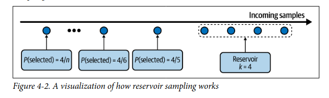

## Dados de treino

Esse capitulo era focar principalmente no dado usado para treinar modelos... como tratar e problemas mais comuns.

### Amostragem (Sampling)

Amostragem é o primeiro passo de um projeto de ML pois é o momento em que coletamos os dados para treino e validação... para isso precisamos pegar uma amostra representativa da população de maneira menos enviesada possivel. Amostrar também é util para testar modelos novos com uma pequena quantidade dos dados para ver se vale a pena treinar com muita. Existem dois grandes grupos de metodos de amostragem:

#### Amostragem Não-probabilistica:

Aqui não utilizamos nenhum tipo de probabilidade para coletar as amostras

- Amostragem por conveniencia (Convenience Sampling): Amostramos apenas quem esta a nosso alcance e disponivel... normalmente locais proximos ou comunidades conhecidas.

- Amostragem Snowball: Usamos amostras coletadas para coletar novas amostras... por exemplo podemos pegar pessoas amostradas e pedir para elas escolherem pessoas que conhecem e assim por diante. Outro exemplos é minerar perfis na web seguindo amigos de amigos.

- Amostragem por especialista: Um especialista na área de pesquisa decide se escolhemos ou não amostras com base na experiencia e conhecimento técnico dele... muito util em cenários clinicos raros.

- Amostragem Cota (quote): Escolhemos um cota de amostras por categoria definida independentemente da distribuição real. Por exemplos queremos 100 pessoas por faixa de idade.

Todas as amostragens não probabilisticas são enviesadas (viés de amostragem) e pode ser um problema utilizar esses dados para treinar modelos pois por exemplo os dados coletados do reddit por conveniencia para treinar modelos de linguagem nao representam a distribuicao real da lingua... porém muitas vezes o ponta pé inicial mais facil é utilizando esse tipo de amostragem e em sequencia quando já existir um modelo baseline partir para métodos probabilisticos.

#### Amostragem Probabilistica:

Aqui usamos conceitos de probabilidade para amostrar nossa população:

- Amostragem Aleatória Simples (Random Sampling): Aqui amostramos da população (ou amostra) em que cada amostra tem a mesma probabilidade... isso é uma suposição e que caso seja falsa terá uma amostra viciada. Um problema dessa amostragem é o fato de que se tivermos grupos muito raros dentro dessa população (1%), se amostrarmos 10% aleatoriamente a chance desse grupo não aparecer ou aparecer menos que deveria é muito grande.

- Amostragem estratificada: Aqui resolvemos o problema anterior primeiro dividindo a população em grupos chamados estratos e depois amostrando cada estrato igualmente. Se temos grupo A e B, pegamos 1% do grupo A e 1% do grupo B... um problema desse método é que nem sempre conseguimos dividir em grupos e nem sempre uma amostra se encaixa em apenas um dos grupos. E nem sempre a amostra coletada vai manter a distribuição da populaçao... pode haver casos que o grupo é tão raro que uma coleta dele gera muito poucas amostras.

- Amostragem com pesos: Esse metodo é ideal em cenários em que sabemos de antemação a importancia dos valores amostrados usando algum conhecimento prévio ou de experts. Aqui cada amostra terá um peso que é equivalente a probabilidade dele ser selecionado, ou seja, se A tem peso 0.7 e B peso 0.3 então A tem 70% de chance de ser selecionado e B 30%. Isso é util para corrigir vieses amostrais como por exemplo ter coletado de mais homens que mulheres e isso afetar o resultado... ai podemos corrigir através de pesos maiores para as mulheres. Também é util para dar peso em algoritmos de machine learning em que alguns exemplos afetam mais a loss que outros.

- Amostragem de reservoir: Esse já é ideal para casos em que temos streaming data, ou seja, dados em produção que vão chegando um atrás do outro de forma continua... especialmente util para amostrar para testes A/B e entre outros. Se coletarmos todos os dados que queremos de uma vez apenas em um intervalo de tempo fixo como entre 6h e 12h estaremos enviesados pelo horário e isso não representaria a população de clientes inteira... além disso, não sabemos o tamanho inteiro dos dados que vão vir ainda para dar a mesma probabilidade de coleta para cada amostra e nem podemos manter tudo em memória para calcular isso... A solução de reservoir é mantermos um vetor de tamanho **k** em que **k** é o tamanho da amostra que voce quer e um contador **n**... sempre que chegar um novo caso/amostra **i** voce gera um numero aleatório **j** entre **0 e n**, se **j** for menor que k nos substituimos o j-esimo elemento pelo **i**, senão não fazemos nada. Dessa forma, todo novo elemento que chegar terá exatamente **k/n** de probabilidade de estar entre os **k** primeiros elementos e todo elemento que já entre os k vai ter a mesma probabilidade de ser substituido... ou seja, todo mundo com a mesma probabilidade de estar na amostra.

- Amostragem por importância: é uma técnica estatística utilizada para estimar propriedades de uma distribuição alvo quando a amostragem direta é inviável. Em muitos cenários de Machine Learning e Simulação, sortear amostras de uma população com distribuição $P(x)$ é impossível, muito difícil ou computacionalmente caro. Nesses casos, utilizamos uma distribuição auxiliar $Q(x)$, que é fácil de ser amostrada. Entao amostramos de Q(x) e ajustamos a amostragem para se aproximar de P(x).

    Para corrigir o fato de estarmos usando a distribuição "errada", aplicamos um **peso de correção** (razão de verossimilhança) a cada amostra:

    $$w(x) = \frac{P(x)}{Q(x)}$$

    Dinâmica dos Pesos:
    * **Subestimados:** Se $Q(x) < P(x)$, damos um **peso grande** para compensar a baixa frequência de sorteio em $Q$.
    * **Sobreestimados:** Se $Q(x) > P(x)$, damos um **peso pequeno** para corrigir o excesso de amostras vindas de $Q$.

    Prova de Equivalência: esperança de $x$ em $P(x)$ é igual à esperança do valor ponderado em $Q(x)$:

    $$E_{P}[x] = \sum_{x} x P(x)$$

    Multiplicando por $\frac{Q(x)}{Q(x)}$:

    $$E_{P}[x] = \sum_{x} x \frac{P(x)}{Q(x)} Q(x)$$

    O que nos leva à identidade fundamental:

    $$E_{P}[x] = E_{Q} \left[ x \frac{P(x)}{Q(x)} \right]$$

    Requisito Fundamental: Para que a amostragem por importância seja válida, a distribuição auxiliar $Q(x)$ deve cobrir todo o espaço onde $P(x)$ existe. Matematicamente:
    $$Q(x) > 0 \text{ sempre que } P(x) > 0$$

    Uma aplicação é em aprendizado por reforço em que temos uma distribuição inicial de probabilidades de Q(a/s) de ações dado o um estado... para gerar a primeira distribuição normalmente são movimentos aleatórios... para não ter que repetir todos esse movimentos (pois é caro) estimamos a distribuição nova P(a/s) apartir da antiga ajustada por esses pesos P(a/s)/Q(a/s)...  e avaliamos elas em relação as recompensas.

### Rotulacao de dados (Labeling)

Rotulacao de dados deixou de ser algo opcional e raro para algo comum e muito importante para a maioria das empresas que tem algum sistema de ML... ainda mais que a maioria deles hoje em dia sao supervisionados. Dito isso, existem 2 abordagens principais em rotulacao:

- **Hand Labels:** Aqui usamos pessoas reais para rotular nossos dados que podem ser funcionários da empresa ou terceirizados... esse metodo é interessante quando nao temos outra opcao de rotulo e temos recursos e tempo para gastar com a rotulacao. Essa rotulacao ter alguns problemas como velocidade: rotulacao a mao é extremamente demorada, dificil de fazer alteracoes e pode talvez nao conseguir acompanhar a evolucao dos dados, expertise: problemas como deteccao de cancer sao faceis de se rotular e ensinar o rotulador mas deteccao de cancer nao é facil e nem barato para se conseguir rotuladores, privacidade: nem todos os dados podem ser vistos pelos rotuladores pois podem ser sensiveis. Outro problema é o que fazer quando 2 ou mais rotuladores discordam entre si ? é importante definir muito bem e mostrar exemplos para todos para evitar qualquer tipo de interpretacao diferente da desejada. Outra boa atitude é manter dados antigos e dados novos separados até um feedback certeiro da qualidade para caso o modelo piore podermos investigar o motivo... se sao dados de varias fontes manter divido pelas fontes também e por ultimo manter dividido pelo rotulador pois rotuladores tem acuracias diferentes... todas essas divisoes podem ser feitas através de uma coluna booleana ou flags para rastrear as origens dos dados e dos rotulos (data lineage).

- **Natural Labels:**  Aqui os rotulos vem naturalmente do proprio sistema... como por exemplo se queremos prever se a bolsa vai cair em 1 min, daqui 1 minuto teremos o label para essa predicao. Os sistemas em que isso é mais comum sao os de recomedaao pois logo apos recomendarmos algo o cliente ira interagir com essa recomendacao de alguma forma, seja por cliques, compras ou visualizacoes... o feedback desse usuário pode ser **explicito** em que ele explicitamente afirma gostar ou nao gostar de algo (like/deslike) ou pode ser **implicito** como cliques ou historico em que ele nao afirma nada mas podemos inferir algumas coisas de acordo com volume dessas interacoes (mesmo em sistemas que naturalmente nao conseguem o label natural podemos tentar conseguir com perguntas rapidas para o usuário). Outro ponto importante é o **tamanho do ciclo de feedback** do sistema que é basicamente o **tempo entre a inferencia do modelo (conteudo chegar no usuário) e o sistema decidir o rotulo dessa inferencia de acordo com o usuário**, por exemplo, o tempo entre mostrar um video do tiktok e o usuário passar rapidamente demonstando que ele nao gostou... loops pequenos permitem aprender rapidamente mudancas no comportamento/interesse do usuário e normalmente transmitem dados em streaming (tempo real), ja loops grandes em alguns casos permitem reduzir o numero de falsos negativos pois nem sempre pq eu cliquei e nao comprei é pq eu nao gostei... talvez eu compre alguns dias depois... esse tipo de dado pode ser processado em batch. Um perigo do ciclo curto sao as **bolhas de filtros (Vies de auto-afirmacao)** em que o modelo aprende o que o usuário gosta, recomenda mais disso e o usuário continua gostando ate chegar um momento em que o modelo ira recomendar apenas aquilo. (Um loop curto significa que os anotadores/modelos sabem rapidamente se cometeram erros, enquanto um loop longo significa que os erros podem ser repetidos por dias ou semanas antes de serem corrigidos.)

Se nenhum desses dois casos é possivel para seu problemas existem algumas possibilidades de lidar com essa falta de labels:

- **Supervisao fraca (weak supervision/programatic labeling):** Aqui usamos conhecimento previo e de rotuladores experts na area para desenvolver funcoes que modelam heuristicas de como rotular as instancias... com essas funcoes podemos aplicar de forma rapida e mais barata para todos os dados. Essas funcoes de heuristicas programaticas sao chamadas de Labeling Functions (LBs). Escala rapido pois sao apenas funcoes e se adaptam rapido também pois é só criar mais funcoes.

- **Semi-supervisao:** Aqui precisamos que pelo menos uma parte dos dados já exista e esteja rotulada corretamente (na mao mesmo se possivel)... usamos entao essa parte rotulada para rotular o restante. Existem tres principais estratégias: A primeira é treinar um modelo com os dados rotulados, fazer inferencia para o restante, pegar as inferencias com maior probabilidade (confianca) e rotular, depois repetir esse processo ate todos os dados serem rotulados. A segunda é usar algoritmos de clustering ou KNN para rotular instancias com base no rotulo que mais apareceu no seu cluster. A terceira consistem em adicionar ruido nos dados sem alterar os rotulos gerando mais exemplos de treino.

- **Transfer Learning:** Essa é comum em redes neurais em que usamos o conhecimento previo de treinamentos em tarefas ou dados parecidos mas que os dados sao muito abundantes... usamos os pesos desse treino e fazemos um fine-tuning com uma pequena quantidade de dados rotulados na tarefa que queremos e prontinho. Um exemplo é usar os modelos pretreinados de lingua como BERT para modelar qualquer outra tarefa atraves de um pequeno fine-tuning.

- **Active Learning:** Aqui quem decide o que voce (e os rotuladores) deven rotular é o proprio modelo... nos comecamos com um pequeno conjunto rotulado e treinamos o modelo neles, depois fazemos inferencia no dataset inteiro e apartir de alguma heuristica o modelo vai escolher os exemplos do treino mais valiosos para ele... normalmente essa inferencia é a entropia de decisao, ou seja, os exemplos que o modelo fica mais indeciso sao os que voce deve rotular manualmente e repetir esse processo ate o necessário.

### Desbalanceamento de Classes

