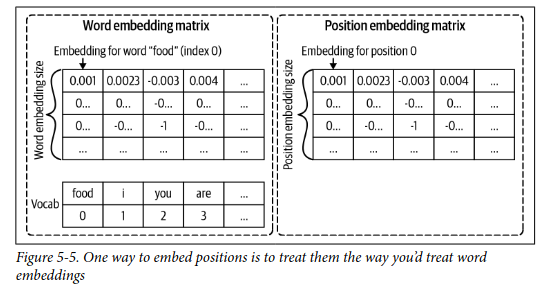

## Feature Engineering 

Engenharia de features tem a capacidade de melhorar o modelo de forma barata e normalmente muito maior que arquiteturas mais complexas e tunagem exagerada de hyperparametros... gastar um tempo estudando suas features e melhorando elas pode valer a pena mas com cuidado para não vazar dados.

### Features Aprendidas x Features Construidas 

Hoje em dia com o aumentos das arquiteturas de redes neurais problemas que antes era necessário muito feature engineering como os que lidam com NLP ou Imagem , como por exemplo, textos em modelos mais antigos de RNN precisavam passar por camadas de processamento como remover stopwords (que é remover palavras muito comuns em linguas como proposições e artigos), lemmatização (que reduz flexões para sua forma base como running virar run), tokenization e o ate mesmo n-grams (que consistem em fazer combinações contiguas dos tokens como "Ola tudo bem" vira ["Ola tudo", "Tudo bem"] em 2-gram)... hoje em dia em LLMs apenas tokenizamos o texto, criamos um dicionário e passamos para o proprio modelo aprender a melhor representação espacial das palavras. Isso em geral acontece com redes neurais pois a saida de uma camada anterior serve de entrada para a proxima camada saindo de uma função de ativação e isso permite ela testar diversas combinações de features ponderada pelos seus pesos de forma implicita. 

Entretanto isso não é o fim da engenharia de features uma vez que não existem apenas imagens e textos... ate mesmo para um classificador de sentimento que é majoritariamente textual pode e deve usar features do usuário, post e entre outras para enriquecer o modelo. Essas features podem ter uma distribuição assimétrica ou estarem faltando muitas e isso atrapalha os modelos.

### Operações comuns:

- **Lidar com valores faltantes(Handling missing values):** Geralmente os dados reais não vem totalmente lindos e completos... eles vem com muitos valores faltantes e nem todo valor faltante é igual... alguns valores faltantes carregam informação com eles. Eis como valores faltantes geralmente são classificados:

    - **MNAR (Missing not at random):** Aqui os valores estão faltando não de forma aleatória por algum erro mas sim pq o proprio valor faltante (não observado) causa essa falta. Imagine que ricos participam de questionários sobre sua renda anual... eles podem não querer compartilhar exatamente pelo valor alto da sua renda e privacidade... ou seja o valor esta faltando exatamente por causa do valor que iria assumir se fosse observado.

    - **MAR (Missing at random):** Aqui os valores estão faltando de forma quase aleatória mas ainda existe um padrão/correlação entre essa variavel faltando e alguma outra variavel do dataset. Por exemplo pode ser que pessoas do genero A tendam mais a não disponibilizar sua idade, ou seja, genero esta influenciando na falta de idade.

    - **MCAR (Missing completely at random):** Aqui os valores são completamente aleatorios e não tem correlação alguma com outras features.

    Quando valores faltantes aparecem geralmente são lidados de 2 formas: 

    - **Delete:** Aqui temos duas abordagens possiveis: Os valores de uma coluna estão quase todos faltantes e devido a isso voce apaga a coluna inteira. Uma linha esta com quase todas as colunas faltantes e por isso voce deleta ela inteira. Ambas as abordagens tem problemas... se deletarmos uma coluna inteira vamos perder informação de uma feature que poderia ser importante,agora se deletarmos linhas podemos ter problema dependendo da quantidade de linhas que estamos falando, se for 10% é um problemas mas se for 0.1% pode ser ok. Mas não apenas o volume é importante mas o tipo de missing pois se os missings forem do tipo MCAR tudo bem mas se forem MNAR podemos estar perdendo a informação implicita contida naquela falta... e se for MAR podemos ate mesmo adicionar vies no modelo pois ao apagar linhas que são nulas devido a um genero por exemplo poderiamos reduzir a quantidade de um genero e transformar isso em viés de genero.

    - **Imputation:** Outra maneira de lidar com dados faltantes é imputar o valor de acordo com o restante disponivel dos seus dados... existem diversas técnicas que assumem coisas diferentes sobre os seus dados como KNN, Media, Mediana, Moda ou um valor padrão. Mas podemos acabar introduzindo erro, viés e ate introduzindo vazamento de dados (data leakage) dependendo caso.Além disso, preencher com valores nunca vistos no treino antes pode causar diversos problemas na previsão/treino. (Imputação com mediana/media de grupos muito relacionados como dias de um mes pode ser eficiente)

    No geral não existe almoço gratis e nenhuma forma perfeita de lidar com valores faltantes... é necessário testar.

- **Dimensionamento (scaling):** Features com escalas muito diferentes podem influenciar seu modelo a dar mais importancia para os de maior escala (pois eles geram as maiores alterações no gradiente) e além disso isso estica o espaço dos parametros tornando a otimização menos estavel. Os metodos mais comuns para lidar com isso são:

    - **Normalization:** em que não assumimos nada sobre a variavel e colocamos eles dentro de um intervalo [a,b] que decidirmos como [0,1] ou [-1,1]. Como isso depende do max e do min se tivermos um outlier absurdo isso fará que todos os outros valores sejam comprimidos em um intervalo muito pequeno fazendo que a features não tenha importancia.

    - **Standardization:** em que assumimos a normalidade da distribuição da variavel e transformamos ela em desvios padrões de alguma métrica de posição como média ou mediana... se usarmos com a media ela também será muito afetada por outliers.

    Em geral ambas são ruins em casos que temos outliers e para isso existem **transformações** que podemos fazer nos dados e uma delas é a log que transforma valores em seu log10. Geralmente a **log** transforma distribuições assimétricas em proximas da normal melhorando bastante. Unico cuidado a se tomar é o fato de não estarmos mais falando de um valor e sim do log dele. Outro risco desse dimensionamento é o fato de que usamos os dados de treino (apenas para não vazar dados da avaliação) para calcular essas métricas como média, min e max... com o passar do tempo e novos dados chegando essas métricas ficam desatualizadas sendo necessário o retreino do modelo e essas métricas do treinamento tem que ser usadas na inferencia (as mesmas).

- **Discretização:** Na discretização transformamos variaveis continuas ou discretas em categoricas utilizando o conceito de bucket/classes... basicamente juntamos os valos em intervalos que podem ser por valor ([[1,4], [5,8]]) ou por quantidade ([50% iniciais], [50% finais]). Isso não é tão util pois cria distinção grande as vezes entre duas coisas muito proximas como por exemplo 10 e 9.99 pode ser muito diferente dependendo do bining que fizermos e isso não é verdade. Apesar disso pode ser util em datasets pequenos pelo fato de que aprender poucas categorias e mais facil que um intervalo continuo.

- **Encoding de Features Categóricas:** Como sabemos os modelos não entendem classes como "Feminino" e "Masculino"... portanto para levamos em consideração precisamos transformar em numeros. Existem varias formas de fazer isso como Ordinal encoding em que transformamos as classes em numeros que vão de [1,n_classes] mas isso assume que existe alguma relação de hierarquia e ordem entre as classes... quando não queremos isso usamos onehot encoding em que criamos uma coluna binária para cada classe mas isso é problemático quando temos um numero muito grande classes e essas classes aumentam consideravelmente durante o tempo pois se criarmos uma classe "Desconhecido" conseguiremos representar novas classes nesse valor mas todas as novas classes serão subrepresentadas e terão o mesmo valor... além disso se temos muitas classes é provavel que a maldição da dimensionalidade, tempo de treino e memória gasta serão muito maiores. Uma solução da industria para isso é escolher um numero K de bits em que cada bit será uma coluna, e gerar um espaço de hashing usando esses bits como por exemplo K = 2 teremos um espaço para 4 classes... K=10 temos 1024 possiveis classes... isso é chamado de hashing trick (feature hashing). Outra maneira de lidar com isso é usando embeddings aprendidades em redes neurais em que aprendemos uma representação em uma dimensão menor.

- **Feature Crossing:** Feature crossing consiste em criar uma feature nova x3 apartir de 2 outras como x1 e x2 em que os valores que x3 assume são o produto cartesiano entre o conjunto de valores de x1 e x2... por exemplo se x1 assume {A,B} e x2 assume {C,D} então x3 vai assumir {AC, AD, BC, BD}. Essa é uma forma util de atingir a não linearidade em modelos lineares como regressão linear.

- **Embedding Posicional Continua e Discreta:** Em problemas de imagem ou texto aplicados a RNNs as sequencias vão para o modelo sequencialmente então fica facil do modelo inferir posição... em transformers entretanto os tokens são processados em paralelo e uma consequencia disso é a perda de ordem. Não podemos apenas somar um numero representando a posição pois em geral as redes neurais e outros modelos são muito sensiveis a escala e somar uma posição 500 na feature com certeza terá um efeito indesejado... uma solução para isso é o chamado posicional embeddings em que somamos na embedding das palavras ou imagens um vetor de mesma dimensão que representa aquela posição, ou seja, se a frase tem 10 palavras o nosso vetor terá dim_emb x 10, sendo um vetor coluna para cada posição... esses vetores podem ser aprendidos com parametros ou fixos usando funções seno e cosseno (Embeddings conseguem fazer o encode apenas se os indexes forem discretos).

    

### Data Leakage 

Vazamento de dados ou data leakage é quando de alguma forma alguma informação do seu conjunto de teste ou validação é vazado para o treinamento e gerando um boost muito grande no desempenho de validação/treino mas em produção como não temos o vazamento o desempenho cair bastante. Existem algumas causas comuns de vazamento de dados:

- **Split incorreto:** Quando estamos fazendo split de treino/validação e teste em dados temporáis temos que ter em mente que não podemos amostrar aleatoriamente apenas... pois se estamos querendo prever algum valor de uma semana/dia não podemos usar dados dessa semana/dia no treino pois ela contem informação sobre o que estamos prevendo (Labels). Se temos por exemplo 5 semanas, use as 4 iniciais para treino e a ultima divida em teste/validação

- **Dimensionamento (scaling) ou Imputation global:** Quando estamos escalonando as features ou imputando algum valor, normalmente precisamos calcular algumas métricas sobre os dados como média, minimo, mediana... se calcularmos essas métricas antes de fazer o split e levarmos em consideração dados de treino ou ate mesmo a coluna target estaremos vazando dados do teste ou do proprio target.

- **Linhas duplicadas ou muito correlacionadas (parecidas):** Nos nossos dados podem ter exemplos duplicados ou quase iguais em que acabam um no treino e outro no teste... o problema disso é que nossos dados de teste terão exemplos que foram vistos no treino e consequentemente fará o modelo se sair muito bem. Outro caso é quando por exemplos temos no mesmo dataset 2 raio x do mesmo pasciente em tempos diferentes mas com labels iguais... ambos são muito correlacionados. Um grande causador disso é oversampling... por isso não podemos usar dados gerados de oversampling para teste.

- **Vazamento durante a geração (fonte) dos dados:** Os dados em si podem ser vazados enquanto são gerados. Como ? Imagine dois hospitais em que um deles o raio X só é pedido de um jeito especifico quando o médico tem quase certeza que tem um tumor e o outro hospital que sempre pede e sempre do mesmo jeito... isso é um vazamento de dados do proprio médico pois o modelo pode aprender a diferenciar esses 2 hospitais e esse tipos só pode ser identificado caso vc conheça muito bem a geração dos dados.Isso não pode ser evitado mas pode ser reduzido normalizando dados de fontes diferentes para que eles sejam "iguais" ou proximos.

**Como lidar com data leakage:** vazamento pode acontecer em multiplas etapas do ciclo de ciencia de dados e por isso devemos sempre estar atento a variaveis ou performace boas demais pois ou pode estar acontecendo algum tipo de vazamento ou seu modelo realmente é muito bom... sempre verificar variaveis extremamentos correlacionadas com o target. Nunca tocar no split de teste nem abri-lo para analise exploratória pois podemos vazar algum dado nos mesmo a partir de parametros ou processamento... além disso estudar as features tirando algumas e ver como o desempenho muda e investigar caso seja muito grande.

### Da

