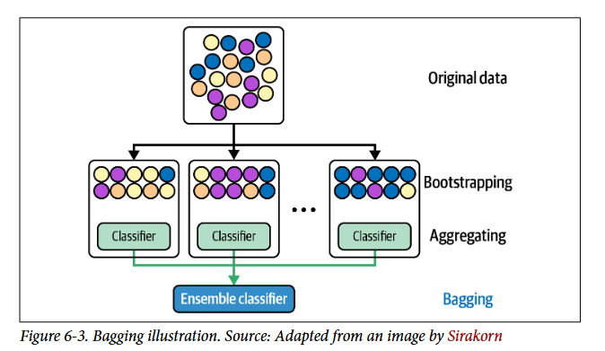
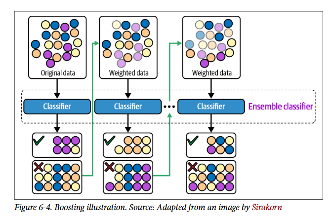
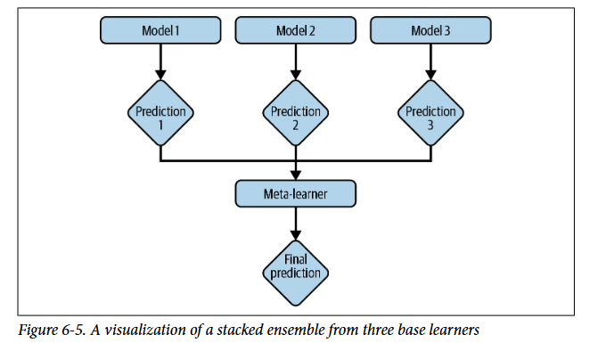
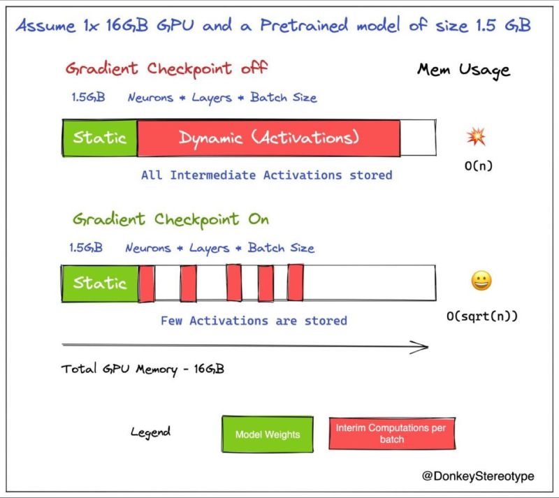
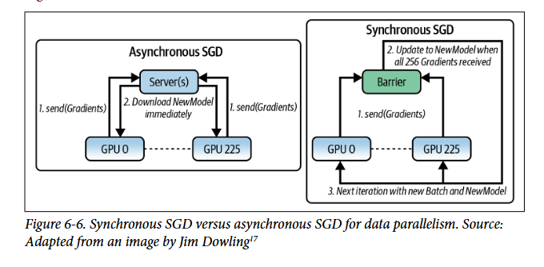
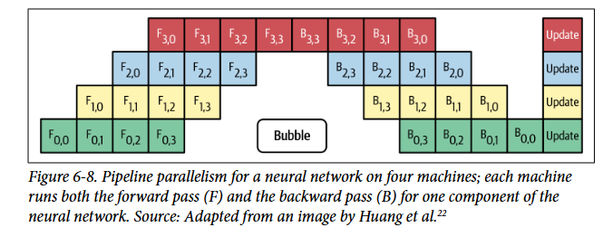

# **Desenvolvimento do modelo e avaliacao Offline**

## **Escolhendo um modelo de ML** 

Ao inicio de um projeto precisamos escolher qual modelo utilizar para nosso problema... normalmente começamos por algo mais simples e evoluimos essa escolha mas nem sempre temos tempo para testar todas as possibilidades possiveis de modelos/arquiteturas disponiveis. Essas escolhas são guiadas por diversas caracteristicas dos nossos dados, do problema, da disponibilidade de recursos, das restrições da empresa e do tempo disponivel... por exemplo se temos pouco tempo não podemos testar tudo e portanto temos que fazer uma busca guiada. Se nosso problema precisa de um tempo de inferencia baixo não é interessante modelos de redes neurais gigantescos (A não ser que tenha dinheiro e hardware disponivel mas mesmo assim nem sempre é possivel), se nossos recursos são poucos talvez modelos mais simples sejam a melhor escolhe provisória... se temos poucos dados modelos que aprendem com poucos dados, se temos muitos dados modelos que conseguem extrair o melhor disso como redes neurais. Precisamos de online learning ? nem todo modelo é capaz de aprender incrementalmente. Se precisa de explicabilidade talves redes neurais não sejam a melhor opção. Se precisa processar texto provavelmente transformers são a melhor opção.

Dicas para escolha de modelo:

- Evitar ao máximo o estado da arte atual: A maioria das arquiteturas/modelos estado da arte foram desenvolvidos no ambiente academico em que pesquisadores superam benchmarks definidos e estáticos com o unico objetivo de superar métricas de qualidade... independente do tempo, custo ou premiças. Muito dificilmente irá funcionar para uma quantidade maior de usuários... ou nos dados de produção que mudam constantemente. Sempre escolha o mais simples que resolva seu problema... se existe um modelo mais simples e barato ele é a melhor opção.

- Comece sempre usando modelos mais simples: Modelos simples são geralmente mais faceis de se utilizar, mais rapidos e mais interpretaveis... começar com eles nos permite ter um baseline de melhoria para modelos mais complexos e nos permite validar o pipeline de inferencia para identificar erros de forma mais simples antes de adicionar componentes complexos. Nem sempre simples significa o mais fraco de todos... hoje em dia por exemplo é muito facil ter acesso a LLMs pretreinadas e portanto tornando elas faceis de usar...

- Evitar viés humano ao escolher os modelos: Se você ou alguém da equipe esta muito animado com um novo lançamento de um modelo estado da arte ou com um novo benchmark de metodo que demonstrou bons resultados... querer usar/testar esse métodos é natural porém novos metodos são propostos diariamente. È muito improvavel que a nova arquitetura seja melhor em todos os contextos existentes pois existem muitas variaveis possiveis então não é pq bateu em uma comparação em um contexto que no seu vai funcionar.

- O melhor modelo agora pode não ser o melhor modelo no futuro: Se um modelo tem um desempenho pior agora isso não significa que esse modelo com novos dados não pode generalizar melhor no futuro... se plotarmos a learning curve, ou seja, a loss conforme aumentamos os dados de treinamento podemos ver como a generalização do modelo escala com a quantidade de dados. Se estivermos no começo de um sistema e não tivermos dados ainda é provavel que modelos mais simples como SVM vão se sair melhor... porém conforme vamos adquirindo mais dados é possivel que modelos como os de redes neurais generalizem melhor...

- Considerar trade-offs do contexto atual: Em muitos problemas resultados errados tem pesos diferentes... um falso negativo pode ser mais caro que um falso positivo então faz sentido escolher os modelos que sejam melhores nesses detalhes do problema. Outro ponto comum é o custo x performance, talvez trocar o modelo barato pelo caro não compense no final pois a diferença nos resultados não é tão relevante...

- Entender as suposições de cada modelo/arquitetura: Todo modelo é construido em cima de alguma suposições... seja sobre distribuição ou independencia... é importante considerar isso na hora de escolher algo para seu contexto.

## **Ensemble**

Ensemble de modelos consiste no uso de mais de varios modelos diferentes (ou o mesmo treinado em dados diferentes) para fazer uma unica previsão... se esses modelos forem independentes a acurácia é matematicamente aumentada, podemos verificar isso calculando as probabilidades de erro dos 3 juntos ou 2 deles juntos e depois olhar o complemento. Ensemble é muito usado em competições mas pode ser complexo usar em produção devido ao custo e tempo de inferencia... a não ser que uma previsão certa tenha um ROI muito alto. Existem 3 tipos principais de ensemble:

- **Bagging (Bootstrap bagging):** Aqui nos temos varios base learners (modelos) que não serão treinados nos mesmos dados... a ideia principal é que o dataset de treino de cada um desses base learners é gerado a partir de bootstraping (com reposição, ou seja, tratamos a amostra como uma população e amostramos dela supondo que ela seja representativa da população real) do dataset original. Assim teremos diversos modelos treinados em amostragens diferentes dos dados pegamos a saida deles e fazemos uma media/contagem... algumas vão ter amostragens melhores, outras piores e outras que tratam problemas ate de desbalanceamento (oversampling intriseco). Em geral, o metodo torna mais estavel metodos muito sensiveis aos dados como redes neurais... random forest é um bom exemplo de bagging pois ela treina diversas arvores de decisão com subsets aleatórios do total de features (ao inves de linhas o aleatório sao as colunas).

- **Boosting:** Aqui é um pouco diferente pois queremos treinar novos modelos do conjunto que sejam bons no que o ensemble atual não é bom ... começamos com um modelo simples (Nosso ensemble tem apenas um modelo no começo) e fazemos as previsões. Nos exemplos de treino que o modelo errar nos colocaremos um peso maior de loss e novo modelo do ensemble é treinado com os dados com pesos atualizados... consequentemente ele será melhor nos casos que foram errados e estavam com maior peso... depois fazemos as predições novamente com o ensemble (agora com 2 modelos) e repetimos o processo de dar maior peso para os erros nas iterações seguintes.Bons exemplos de boosting são as XGBoost e o LightGBM que usa aprendizado distribuido e portanto é mais rapido para grandes volumes de dados.

- **Stacking:** Esse é o mais simples em que treinamos varios modelos com o mesmo conjunto de dados, pegamos as predições deles e usamos como features em um modelo final que pode ser simples como simplesmente contar elas ou pode ser complexo como uma regressão linear e aprender padrões de quando dar mais peso para cada modelo base. 

## **Monitoramento (experiment tracking) e Versionamento**

È comum fazer experimentos com novas arquiteturas, hyperparametros e dados para testar teorias e encontrar novos resultados que podem ser melhores... cada experimento tem sua curva de loss, curva de learning, logs, arquivos de saida (como modelos torch .pt) e diversos outros artefatos. È importante manter todas as definições e parametros de um experimento para ser possivel recria-los e além disso salvar os outputs/resultados para comparar com outros experimentos. O processo de monitorar o progresso e resultados de um experimento é chamado de **experiment tracking** e o processo de criar logs de todos os detalhes do experimento com objetivo de recriar (Reprodutibilidade) o experimento ou compara-lo é chamado de **versionamento**. Existem diversas ferramentas como MLflow e Weights and bias que originalmente serviam apenas para monitoramento mas depois incluiram versionamento.

### **Experiment Tracking**

Monitorar o modelo durante o treinamento pode ser uma grande parte do processo de treino e é extremamente importanto já que várias coisas podem dar errado durante o treinamento... alguns itens importantes a se monitorar:

- **loss curve da validação e treino:** pode dar indicios de overfitting com treino descendo e validação subindo, underfitting com treino e validação descendo ou ate mesmo alguma estagnação na loss.

- **métricas de performace:** plotar métricas como F1, recall, precision, perplexity pode mostrar caracteristicas como por exemplo um recall baixo significa que a quantidade de falsos negativos esta muito alta.

- **inferencias de teste:** durante o treinamento a cada epoca ou um numero de epocas salvar log do input, predição e rotulo para analisar no futuro se a loss esta coerente com as predições... o modelo pode encontrar atalhos para roubar na loss e a saida não faz sentido algum.

- **velocidade do modelo:** quão rapido o modelo processa as epocas (epocas/segundo), ou seja, quão rapido vai ser o treinamento... isso é importante pois temos uma estimativa de gasto e tempo de treinamento.

- **métricas de hardware:** uso de memória, CPU/GPU ... pode mostrar subutilização (gargalos) do hardware, estouro de memória ou uso exessivo do hardware.

- **parametros e hyperparametros:** monitorar learning rate (quando não é fixo) e norma do vetor gradiente (tamanho do vetor)... pode ser util para verificar se o gradiente não esta crescendo muito (infinito) ou reduzindo muito.

Esses itens (estado atual do treino e modelo) nos permite comparar experimentos, entender melhor nosso modelo e encontrar problemas de forma mais facil (debug)... pode ajudar a entender o efeito de pequenas alterações na performace do modelo. Idealmente deveriamos monitorar tudo porém é um esforço cognitivo muito grande que pode nos distrair do que for importante e além disso pode ser pesado para as ferramentas disponiveis atualmente.

### **Versionamento**

Imagine que nosso resultado atual conseguiu um desempenho mas você viu em algum lugar uma configuração especifica que parece promissora... voce muda o codigo do experimento e acabou que os resultados não foram tão bons quanto o esperado. Porém voce não lembra exatamente como o codigo antigo era e pode ter perdido para sempre seus resultados ou gastar tempo para recuperar... por isso versionamento de codigo é importante. Já é comum versionar codigo através de ferramentas git/github mas e os dados ?

Existem alguns motivos para o versionamento de dados não ser exatamente igual ao de codigo:

- **Tamanho:** dados podem ter diversos tamanhos em memória como 10GiB que é bem diferente de um arquivo de codigo de alguns kib... codigo é versionado mantendo todas as versões antigas dos dados mas não podemos fazer isso com dados pois ocuparia muita memória com duplicatas. A mesma lógica se aplica ao clone que fazemos de codigo em que trazemos todo codigo para maquina local porém ao fazer isso com dados não temos garantia que caiba.

- **Operações indefinidas:** O que são operações de diff entre dois dadasets ? como resolver conflitos de dados com merge ? 

Versionamento e monitoriamento ajudam muito com a reprodutibilidade mas não garantem graças ao não determinismo que alguns métodos possuem e também o hardware... uma mesma semente em computadores diferentes não necessáriamente tera resultados iguais tornando a reprodutibilidade 100% igual impossivel sem saber todos os detalhes do ambiente. Além disso, ao invés de executar infinitos experimentos é importante entender a teorica e premissas de cada cenário para reduzir ao maximo o numero de experimentos com conhecimento previo.

### **Debugging ML Models**

Debugar um modelo de ML é desafiador principalmente por 3 motivos: 

- **Bug/Falha silenciosa:** o pipeline inteiro de inferencia pode estar funcionando mas o valor da inferencia estar errado... isso é silencioso tanto para os desenvolvedores como para os clientes que assumem que o resultado esta correto.
- **Validação lenta:** mesmo descobrindo o problema, para resolver é possivel que o modelo terá que ser treinado do zero novamente e talvez também feito deploy... teriamos que esperar todo esse tempo para saber se o bug foi corrigido.
- **Muitos componentes:** o pipeline inteiro é formado por diversos componentes como arquitetura, dados e software... nem sempre a mesma equipe é responsavel por todo e portanto é necessário algum tipo de comunicação entre equipes.

Um modelo pode falhar principalmente por:

- **Premissas erradas:** Cada modelo segue algumas premissas sobre os dados e problema... se elas não são respeitadas é improvavel que o resultado seja bom. Um exemplo disso é usar regressão linear em dados não lineares.

- **Implementação errada:** Erros de implementação em redes neurais em que mexemos manualmente na arquitetura da rede

- **Hyperparametros ou features ruins:** A escolha errada de hyperparametros pode levar o modelo a divergir e de features a ter um overfitting/underfitting

- **Problema nos dados:** Varios problemas podem ser causados pelos dados como data shift, ruido nos dados ou rotulos incorretos.

Não existe formula mágica de como de como se debugar mas algumas recomendações de pessoas experientes... eis 3 delas especiais para redes neurais: 

- **Começar simples e aumentar os componentes:** Começar com redes/modelos pequenos e ir aumentando gradativamente e verificando como isso afeta a performace.

- **Ajustar (fit) em um batch:** Antes de treinar com todos os dados -> pegar um batch pequeno e ajustar o modelo nele e avaliar em cima do mesmo batch, o esperado é que a métrica de qualidade seja total ou muito alta pois o treino e validação são nos mesmos dados. Isso é um teste de sanidade.

- **setar random seed:** Existe muitas partes que possuem aleatoriedade nesses modelos... setar uma seed evita que a diferença de um experimento tenha sido causada exclusivamente pela aleatoriedade.

- **Mais aqui:** https://karpathy.github.io/2019/04/25/recipe/

## **Treino distribuido**

Conforme os modelos vao crescendo em numero de parametros, eles ficam mais dificeis de armazenar e treinar, consequentemente as empresas comecam a se preocupar mais com a escalabilidade desses modelos. É comum ter que treinar modelos com **dados que nem cabem em uma maquina**, isso pode levar a problemas como:

- **Pre-processamento:** processamentos como normalizacao precisam ser out-of-core (consegue ser feito carregando pedacos dos dados em memoria)
- **Batchs pequenos:** se só conseguimos carregar algumas linhas (samples) desses dados em memória o tamanho do batch de treinamento terá que ser menor. Isso faz com que o **treinamento seja mais instavel** (poucas amostras por atualizacao) e que o **hardware de treino seja subutilizado**.
- **Casos extremos:** Em casos extremos em que um modelo neural com seus parametros junto com os dados e as ativacoes intermediarias do treino nao cabem em memória estratégias especificamos sao necessárias como:
    - **gradient checkpointing:** ao invés de armazenar todas as ativacoes (saidas de uma camada depois da funcao de ativacao) de todas as camadas na memória, armazenamos apenas algumas camadas específicas (checkpoints) e deletamos o restante. Quando precisamos de uma ativação descartada durante o passo de volta (Backward Pass), usamos o último checkpoint salvo para recalcular rapidamente aquele trecho do Forward Pass sob demanda. Isso é um **tradeoff de memória e tempo de computacao** porém ao liberar memoria o tamanho do batch pode ser aumentado e reduzir o tempo de computacao ainda mais.

A escalabilidade de um modelo envolve tanto os dados (usados no treino) quanto os parametros (tamanho do modelo).

### **Paralelismo de dados**

Quando os seus dados nao cabem em uma unica maquina é quando o paralelismo de dados brilha, a ideia aqui é treinar o modelo utilizando varias maquinas/GPUs que mantem modelos locais em que cada um calcula um gradiente independente e entao juntamos esses gradientes de alguma forma. Isso pode ser feito de 2 formas diferentes:

- **Sincrono:** Aqui se temos **N maquinas/GPUs cada uma delas tem um modelo local e vai receber um pedaco do mini-batch de dados (mini-batch/N)**, computar seu foward de maneira independente e esperar todas as outras terminarem, depois fazem uma computacao da media do gradiente juntas e atualizam seus modelos locais. 

    - **Vantagem:** matematicamente identico ao gradiente calculado em uma maquina sozinha 
    - **Desvantagem:** O elo mais fraco dita o ritmo. Se uma única máquina atrasar ou cair (problema conhecido como Straggler), todas as outras ficam ociosas aguardando a sincronização.

- **Assincrono:** Aqui, as $N$ máquinas também recebem pedaços dos dados, mas o ciclo de computação é totalmente independente. Geralmente coordenado por um **servidor centralizado (Parameter Server)**, cada máquina calcula seu gradiente local e o envia imediatamente para atualizar o modelo global, **sem esperar pelas outras**.

    - **Desvantagem:** Introduz o problema de Stale Gradients (gradientes obsoletos). Enquanto uma máquina lenta estava calculando seus gradientes baseada na versão X do modelo, outras máquinas mais rápidas já atualizaram o servidor central para a versão X+5. Quando a máquina lenta envia seu resultado, ela está tentando atualizar o modelo com informações defasadas, o que torna o treino instável e atrasa a convergência. Por isso na pratica nao é muito usado recentemente com LLMs.

Outros 2 problemas que ambas as abordagens sofrem é:

- **Batch Size gigante:** Se uma maquina tem batch size de 100, entao um cluster com 100 maquinas vai ter batch size de 10000. O resultado disso é que a **quantidade de atualizacoes nos parametros** do modelo (steps_p_epoch = N_dados / Batch_sz) vai ser muito pequeno pequeno e consequentemente o modelo **vai aprender pouco**. Uma tentativa de mitigar é aumentar o learning rate mas isso aumenta o risco do modelo divergir. Além disso, batchs muito grandes aumentam a chance de **Diminishing Returns (Retornos Decrescentes)** que é: colocar mais poder de computação ou aumentar o tamanho do lote (batch size) não acelera o aprendizado do modelo de forma linear para sempre. Chega um ponto em que gastar o dobro de recursos traz um ganho quase imperceptível de performance pois o seu **gradiente esta quase igual ao gerado pelo dataset inteiro (BGD)**.

- **Worker principal sobrecarregado:** O worker principal consome muito mais recursos que os outros seja para sincronizar ou juntar parametros. Isso gera um desbalanceamente que pode ser mitigado de forma burra reduzindo o batch size apenas dele.

### **Paralelismo de modelos**

Paralelismo de dados funciona muito bem quando uma copia do seu modelo (parametros) cabe em uma unica GPU mas isso nem sempre é verdade. Se um **modelo é maior que a capacidade de uma unica GPU ele precisa ser dividido em varias GPUs** e existem varias formas de fazer isso:

- **Divisao das matrizes de pesos (Tensor Parallelism - TP):** Parte da matriz de peso do modelo fica em uma enquanto parte fica em outra (calculos podem ser feitos em paralelo e juntados depois)
- **Divisao em camadas (Naive Inter-Layer Parallelism):** Primeiras camadas ficam em uma GPU e as ultimas em outra GPU. Nao pode ser paralelizado pois a segunda GPU precisa do resultado da primeira e isso faz com que crie uma bolha de ociosidade enquanto espera resultados.
- **Pipeline (Pipeline Parallelism - PP):** Mesma logica de instrucoes de processador. Segue a logica da divisao em camadas porém divide o trabalho de cada GPU em micro trabalhos, a primeira GPU termina o primeiro micro trabalho e envia o resultado para a segunda GPU que comeca a processar o resultado da primeira GPU. A primeira GPU pode ir computando a seu segundo micro trabalho enquanto a segunda GPU trabalha. Isso mitiga o problema da bolha de ociosidade.

Outro detalhe importante é que paralelismo de modelo e de dados nao sao mutuamente exclusivos.

## **AutoML**

Consiste na ideia de usar tempo de computacao para encontrar os melhores algoritmos/modelos para um problema real de ML. Ao invés de tert 100 engenheiros de ML gaste 100x mais para encontrar o melhor modelo sozinho.

- **Soft AutoML (Hyperparametros):** A forma mais simples e mais popular de autoML é o **tunagem de hyperparametros** que sao configuracoes que modificam o espaco de busca do modelo durante o treino (diferente de parametros que sao o proprio espaco do modelo). Essa busca pode ser manual mas exitem formas aleatoras, de grid ou otimizacao bayesiana (HyperOPT) que sao bem mais eficientes (alguns hyperparametros sao mais sensiveis e necessitam mais cuidado). Além disso, a tunagem tem que ser feita no grupo de validacao pois se nao iremos overfittar o modelo ao teste.

- **Hard AutoMl (Architeture e Otimizador Aprendido)**: E se ao invés de fazer uma busca apenas no universo dos hyperparamtros fizessemos uma busca na arquitetura de redes neurais ? Isso é chamado de NAS (Neural Architeture Search) em que varios componentes como quantidade de blocos convolucionais. Uma NAS é composta de 3 elementos: 
- **Espaco de busca:** Blocos de arquitetura que serao combinados
- **Heuristica de performace:** Nao queremos treinar todas as redes testadas do zero entao precisamos de uma forma rapida de avaliar qualidade.
- **Estrategia de exploracao:** A forma que os componentes serao combinados, como grid, porém os de ML classico acabam sendo muito caros entao solucoes com aprendizado por reforco e algoritmos geneticos existes.

No processo comum de treino em ML voce tem um modelo e um algoritmo de otimizacao (Adam, SGD) que te ajuda a encontrar os parametros que minimizam uma funcao de custo para um determinado dataset. Uma abordagem proposta foi ao invés de otimizar uma funcao fixa, **colocamos uma rede neural para aprender a ensinar seu modelo (quanto devemos ajustar os pesos)**. Learned Optimizer sao redes que tem o objetivo unico de ensinar outras redes. Existem duas abordagens principais:

- **Otimizacao conjunta:** Treinamos a "Otimizador" e nosso modelo junto do zero. Isso é muito caro e demorado.
- **Meta-learning:** Treinamos o otimizador para otimizar diversos problemas/tarefas diferentes, assim ensinando ele a aprender e consequentemente ter um bom desempenho em qualquer tarefa que de ele. 

## **4 Fases do desenvolvimento de modelos ML**

1. **Heuristicas Basicas:** Aqui testamos as solucoes (baseline fraco) mais simples (if/else e estatistica) e vemos quao bem elas se saem na realidade. Depois, se necessário abordar com ML.

2. **Modelos Simples:** A ideia aqui é comecar com modelos simples e faceis de colocar em producao mesmo que o resultado deles nao seja o melhor eles servem para validar o pipeline e infraestrutura.

3. **Otimizar os modelos simples:** Aqui tentamos chegar ao máximo que o simples consegue oferecer

4. **Modelos mais complexos e lidar com mudancas:** chegamos ao limite dos modelos simples, mas o negócio ainda precisa de métricas melhores para se pagar ou evoluir. Só agora você tem permissão para usar "IAs pesadas". Também precisa monitorar o Data Drift ou decaimento do modelo (o quão rápido o seu modelo fica "burro" ou desatualizado em produção), para planejar a infraestrutura de retreinamento automático.

## Offline Evaluation

