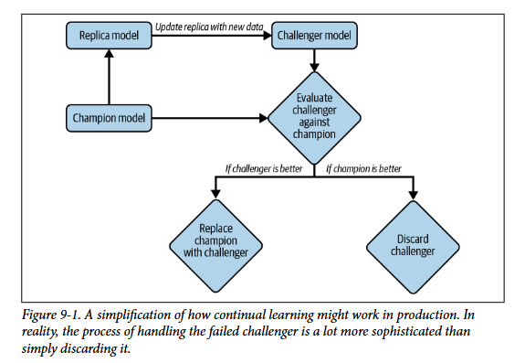
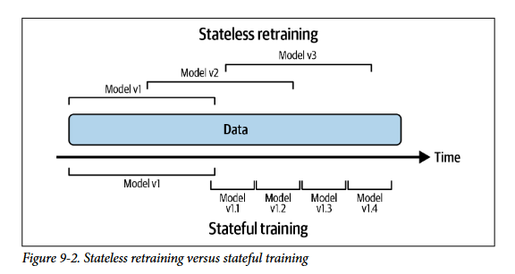

# **Continual Learning and Test in Production**

## **Continual learning** 

Antes de entender o que é continual learning é bom lembrar de um conceito parecido mas que é essencial: **online/incremental learning** que é uma caracteristica de modelos/algortimos que permite que o aprendizado seja feito em etapas separadas usando pedacos dos dados (mini-batchs), ou seja, o **modelo consegue aprender sem ter que usar todos os dados de uma vez**. Isso é um pre-requisito essencial para continual learning! O continual learning consiste em um **paradigma (que envolve infraestrutura e arquitetura específicas) que permite atualizar o modelo continuando o treino anterior (stateful), de forma rápida e sempre que necessário, sem depender de um ciclo de retreino manual e demorado**. Um equivoco comum é pensar:

- **Retreinamos a cada nova linha de dado?:** isso nao acontece pois é extremamente **caro e subutilizamos o hardware** (na verdade os treinos acontecem em micro-batchs) e além disso essa quantidade absurda de atualizacoes de parametros pode levar redes neurais a **esquecimento catastrofico**.

Além disso, depois de treinar o modelo nao podemos simplesmente colocar ele em producao apenas com avaliacao offline pois nao é pq ele se saiu melhor no conjunto de teste que ele vai se sair melhor em producao (Distribuicao do teste é um snapshot aproximado da real) e por isso precisamos de testes online (em producao). Também **nao podemos deixar os usuários sem um modelo** enquanto treinamos e avaliamos... ai entao vem a estrategia de:

1. Fazemos **copias** do modelo atual em producao
2. **Treinamos** varias versoes desse modelo com dados novos (experimentos)
3. Avaliamos essas versoes novas com a que esta em producao com **testes online e offline** (só os que passam nos testes offline vao para online)
4. **Pegamos a melhor** versao e colocamos em producao enquanto as outras sao refinadas ou descartadas

Agora quantas vezes treinar esse modelo ? depende de varios fatores. Se o **trafego do sistema é baixo e gera poucos dados novos** provavelmente nao vale a pena treinar em intervalos pequenos. Se a **qualidade do modelo nao decai rapido** também nao é necessário... entao **se treinar mais vezes nao tras retornos** e gera mais custos nao tem motivos para isso.

### **Stateless Retraining Vs Stateful Retraining**

- Stateless learning é uma forma de treino em que **treinamos o modelo sempre do zero utilizando alguma janela temporal para calcular as features**.
- Stateful training (também chamado de fine-tuning ou incremental learning) é uma forma de treino que **usa a capacidade de online/incremental learning do algoritmo para continuar atualizando o modelo existente com dados novos, sem reiniciar os pesos do zero**

Stateful Training tem a vantagem de **permitir que o modelo seja atualizado com menos dados** ao invés de precisar de todos os dados da ultima janela temporal como 3 ou 6 meses atrás... dependendo do tipo de dado que estamos lidando esses dados nem em memória cabem. Isso **tira a necessidade de armazenar dados muito antigos** pois de certa forma eles ja estao incrementados no modelo, entretanto **ainda é bom armazenar para versionamento**.

**Utilizar um nao significa que nao se pode utilizar o outro**, em alguns momentos pode ser interessante fazer um modelo com todos os dados para calibrar ou ate mesmo os dois tipos de treinamento em paralelo para pegar o melhor. Uma vez que é possivel fazer ambos a unica coisa a se definir é **com que frequencia fazer os treinamentos?**

Tem dois tipos de iteracoes/alteracoes que podem ser feitas em um modelo:

- **Novos dados:** Stateful resolve  
- **Nova camada/feature:** Quando você adiciona uma nova feature ou muda a arquitetura, os pesos/parâmetros do checkpoint anterior não são mais compatíveis com a nova estrutura de entrada. Aqui provavelmente seria necessário um **treino do zero ou alguma tecnica como transfer learning ou finetuning mais cuidadoso**

### **Why continual learning ?**
