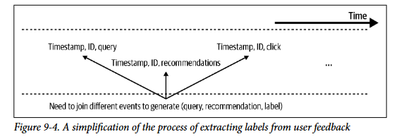

# **Continual Learning and Test in Production**

## **Continual learning** 

Antes de entender o que é continual learning é bom lembrar de um conceito parecido mas que é essencial: **online/incremental learning** que é uma caracteristica de modelos/algortimos que permite que o aprendizado seja feito em etapas separadas usando pedacos dos dados (mini-batchs), ou seja, o **modelo consegue aprender sem ter que usar todos os dados de uma vez**. Isso é um pre-requisito essencial para continual learning! O continual learning consiste em um **paradigma (que envolve infraestrutura e arquitetura específicas) que permite atualizar o modelo continuando o treino anterior (stateful), de forma rápida e sempre que necessário, sem depender de um ciclo de retreino manual e demorado**. Um equivoco comum é pensar:

- **Retreinamos a cada nova linha de dado?:** isso nao acontece pois é extremamente **caro e subutilizamos o hardware** (na verdade os treinos acontecem em micro-batchs) e além disso essa quantidade absurda de atualizacoes de parametros pode levar redes neurais a **esquecimento catastrofico**.

Além disso, depois de treinar o modelo nao podemos simplesmente colocar ele em producao apenas com avaliacao offline pois nao é pq ele se saiu melhor no conjunto de teste que ele vai se sair melhor em producao (Distribuicao do teste é um snapshot aproximado da real) e por isso precisamos de testes online (em producao). Também **nao podemos deixar os usuários sem um modelo** enquanto treinamos e avaliamos... ai entao vem a estrategia de:

1. Fazemos **copias** do modelo atual em producao
2. **Treinamos** varias versoes desse modelo com dados novos (experimentos)
3. Avaliamos essas versoes novas com a que esta em producao com **testes online e offline** (só os que passam nos testes offline vao para online)
4. **Pegamos a melhor** versao e colocamos em producao enquanto as outras sao refinadas ou descartadas

Agora quantas vezes treinar esse modelo ? depende de varios fatores. Se o **trafego do sistema é baixo e gera poucos dados novos** provavelmente nao vale a pena treinar em intervalos pequenos. Se a **qualidade do modelo nao decai rapido** também nao é necessário... entao **se treinar mais vezes nao tras retornos** e gera mais custos nao tem motivos para isso.

### **Stateless Retraining Vs Stateful Retraining**

- Stateless learning é uma forma de treino em que **treinamos o modelo sempre do zero utilizando alguma janela temporal para calcular as features**.
- Stateful training (também chamado de fine-tuning ou incremental learning) é uma forma de treino que **usa a capacidade de online/incremental learning do algoritmo para continuar atualizando o modelo existente com dados novos, sem reiniciar os pesos do zero**

Stateful Training tem a vantagem de **permitir que o modelo seja atualizado com menos dados** ao invés de precisar de todos os dados da ultima janela temporal como 3 ou 6 meses atrás... dependendo do tipo de dado que estamos lidando esses dados nem em memória cabem. Isso **tira a necessidade de armazenar dados muito antigos** pois de certa forma eles ja estao incrementados no modelo, entretanto **ainda é bom armazenar para versionamento**.

**Utilizar um nao significa que nao se pode utilizar o outro**, em alguns momentos pode ser interessante fazer um modelo com todos os dados para calibrar ou ate mesmo os dois tipos de treinamento em paralelo para pegar o melhor. Uma vez que é possivel fazer ambos a unica coisa a se definir é **com que frequencia fazer os treinamentos?**

Tem dois tipos de iteracoes/alteracoes que podem ser feitas em um modelo:

- **Novos dados:** Stateful resolve  
- **Nova camada/feature:** Quando você adiciona uma nova feature ou muda a arquitetura, os pesos/parâmetros do checkpoint anterior não são mais compatíveis com a nova estrutura de entrada. Aqui provavelmente seria necessário um **treino do zero ou alguma tecnica como transfer learning ou finetuning mais cuidadoso**

### **Pq continual Learning ?**

A ideia do CL é que uma vez que a arquitetura esteja pronta podemos atualizar e fazer deploy de modelos na velocidade que quisermos, mas **pq iriamos querer a habilidade de atualizar o modelo em velocidades diferentes ?** 

- **Adaptacao a data drifts repentinos e eventos raros:** O mundo real é inconstante e muda a todo momento, uma bairro que geralmente é muito rapido para motoristas de carro pode em algum dia estar interditado por eventos/construcoes e isso muda totalmente a dinamica do bairro. Além disso, em comercios datas especiais como black friday mudam completamente a distribuicao dos dados em apenas alguns dias... em ambos os casos nao se adaptar a esses eventos pode levar a perder dinheiro.

- **Lidar rapidamente com cold start:** Outra vantagem do CL é que ele consegue resolver o problmea do cold start de forma mais rapida pois assim que um usuário entra no aplicativo, com poucas interacoes e uma atualizacao no modelo ja é possivel fazer recomendacoes melhores para ele.

CL consegue fazer tudo que estrategias de treino anteriores conseguem pois o tempo entre as atualizacoes do modelo é uma configuracao. Entao, **se implementar ambos tem o mesmo custo nao existe motivo de pq nao usar o continual learning** pois te da a possibilidade de atualizacoes rapidas quando precisar.

### **Desafios do continual learning**

- **Dados novos:** Se queremos atualizar o modelo de hora em hora entao precisamos de dados novos e disponiveis de hora em hora. 
    - Se **buscamos os dados periodicamente em um banco** entao a taxa de busca de dados vai ser coerente com a taxa de entrada de dados naquele banco, a **entrada pode ser lenta** dependendo da quantidade de fontes e processamento e isso pode ser o gargalo para busca de dados. Uma solucao para isso é usar **transporte de tempo real (event-driven)** como Kafka e **pegar alguns dados antes de serem salvos no banco**
    - Buscar **dados frescos nao é suficiente** pois também **precisamos de rotulos** prontos e geralmente a rotulacao de dados é lenta. Os melhores casos de uso para CL sao dados com **rotulacao natural (Ou rotulacao programatica) com feedback loop bem curto**, por exemplo recomendacao de conteudo online, predicao de cliques e predicao de tempo de chegada. 
    - A geracao dos rotulos nao é tao direta assim pois para gerarmos uma instancia de dado temos que **linkar 3 eventos: query do usuário (tempo, id, query), depois resposta do sistema (tempo, id, resposta) e por fim feedback explicito e implicito do usuário (tempo, id, feedbacks)**. Ligar essas coisas exige computacao nao trivial e fazer isso para milhoes pode ser pesado... é possivel fazer o **processamento em batch ou streaming e essa decisao depende do quao rapido queremos novos dados prontos**.

    

- **Avaliacao:** O maior problema de CL é ter certeza (de forma rapida) que esse modelo atualizado é realmente melhor que o modelo atual em producao.
    - Toda vez que o modelo é atualizado existe **chance de falhas catastroficas** como discriminacao em massa ou risco a vida humana. Entao, **quanto mais atualizamos maiores as chances** de acontecer isso se nao avaliarmos corretamente.
    - Outro ponto é que atualizar muito os parametros da mais espaco para ataques adversariais através do input do modelo.
        - **Ataque adversarial:** técnica que **manipula intencionalmente os dados de entrada** de um modelo de ML, forçando-o a tomar decisões, predições ou classificações incorretas. Isso é feito através de alterações sutis ou imperceptíveis nos .
    - Portanto é **importante manter a avaliacao offline e online sempre atualizadas** e boas mesmo que tome algum tempo e atrase o deploy.

- **Algoritmo:** Alguns algoritmos exigem o dataset inteiro para serem atualizados, ou seja, nao suportam online/incremental learning, apenas offline/batch learning.
    - Modelos de **matriz e arvore originalmente nao sao compativeis com incremental learning**, recomendadores que funcionam com fatoracao de matriz como funk-svd precisariam adicionar linhas na matriz e **recalcular tudo, o que é muito caro**. Já arvores orginalmente também tinham o mesmo problema mas existe variacoes que conseguem aprender incrementalmente como a **Hoeffding Tree** mas nao é muito usado na industria.

    - Outro problema é que o **pre-processamento das features também precisam aceitar atualizacoes parciais pois muitos deles usam media, mediana ou variancia**, isso muda conforme novos dados chegam e nao queremos recacular sempre do zero. Muitos frameworks hoje em dia tem isso ja implementado como sklearn com partial_fit() em transformacoes como StandardScaler().

### **4 estagios do aprendizado continuo**

Existem 4 etapas de maturidade rumo ao continual learning:

1. **Manual e Stateless:** Empresas que comecaram com ML a pouco tempo, tem poucos ou nenhum modelo e esta buscando novos modelos para resolver problemas de negocio. Aqui nada é automatizado e atualizar o modelo acontece sob demanda, ou seja, quando ele comeca a dar muito problema. Como o processo é manual é muito comum bugs e vazamentos de dados.

2. **Automatizado e Stateless:** A empresa tem já tem seus modelos principais e agora a preocupacao é manter e atualizar esses modelos. Agora o treino é automatizado através de scripts ... como existem varios modelos cada um tem uma frequencia de treino diferente e muitas vezes eles tem dependencias entre eles, se essa dependencia for atualizada todos que dependem dela também tem que ser. O script de treino vai passar por um processo parecido com coletar/unir dados -> features -> processamento e labels -> treino -> avaliacao -> deploy, os 3 fatores que mais afetam a automatizacao sao:

    - **Scheduler:** ferramenta de agendamento de tarefas (ex: Airflow, Argo)

    - **Disponibilidade:** precisa coletar/unir dados de múltiplas fontes? Precisa rotular do zero? Quanto mais "sim", mais tempo o setup leva

    - **Armazenamento do modelo:** onde versionar e armazenar os artefatos do modelo de forma reproduzível. Pode ser algo simples (S3) ou mais robusto (SageMaker, MLflow, Wandb).

3. **Automatizado e Stateful:** Aqui queremos treinar com maior frequencia e portanto fica caro treinar sempre do zero. Aqui mudamos o script para carregar o checkpoint anterior e treinamos ele com os dados novos. 
    - Agora **precisamos versionar bem os dados e modelos para sempre saber qual checkpoint veio antes de qual e que dados foram usados** para cada avanco de versao. Esse versionamento também é chamado de linhagem de dados e modelos.

    - Aqui ja pode ser implementado um pipeline de streaming para conseguir os dados novos sempre frescos

4. **Continual Learning:** O problema aqui é que modelo é sempre atualizado em intervalos de tempo fixos. A ideia aqui é o modelo ser atualizado automaticamente sempre que necessário baseado em data shift, queda de performace ou outros. Se combinado com edge deployment fica mais eficiente ainda. Para isso ser possivel 2 coisas sao necessárias:
    - **Trigger:** disparar a atualização automaticamente com base em algo podendo ser
        - Time-based: ex: a cada 5 minutos
        - Performance-based: ex: quando a performance despenca
        - Volume-based: ex: quando o volume de dados rotulados aumenta 5%
        - Drift-based: ex: quando um shift significativo é detectado

        Para isso funcionar corretamente o monitoramento tem que ser solido

    - **Pipeline de avaliacao robusto:** garantir que o modelo atualizado está funcionando bem antes de ir pra produção

### **Quao frequentemente atualizar os modelos?**

Para responder essa pergunta de forma facil precisamos saber **quanto eu ganho de dinheiro/performace treinando mais frequentemente ?** 

- Uma forma de medir isso é **separar dados recentes** de hoje ou essa semana como um conjunto de teste. Em seguida **treinar varios modelos com gaps de tempo diferentes do conjunto de treino**, ou seja, se nosso teste é o mes de dezembro, podemos treinar um modelo A com dados de JAN a JULHO (5 meses de diferenca), depois outro modelo B com a janela (de mesmo tamnho) de ABRIL a OUTUBRO (um mes de diferenca do teste) e assim por diante. 

- Se comparamos um modelo treinado com dados até 6 meses atrás com um treinado até 1 mês atrás, e a performance é praticamente igual, isso **indica que o modelo não decai rápido com o tempo, logo, não precisamos retreinar com mais frequência do que essa janela de ~6 meses**. Por outro lado, se a diferença de performance for **grande mesmo entre janelas próximas (ex: 1 mês vs. 2 meses), isso é sinal de que o modelo decai rápido e precisa ser atualizado** com bastante frequência. Esse gap é um parametro e pode ser usado ate semanas dependendo do dominio do problema.

#### **Model iteration vs. Data iteration**

Nao decidimos apenas com que frequencia treinar o modelo mas também entre **treinar o modelo com dados novos ou atualizar a arquitetura do modelo**. Ambas podem levar a melhorias na performace entretanto **atualizar a arquitetura é 100x mais complexo e caro** para no fim ganhar 1% a mais... talvez **atualizar com dados novos leve a mesma melhoria com 1/100 do custo**. Mas tudo isso depende da situacao especifica e nao existe uma regra.

## **Testes em producao**

