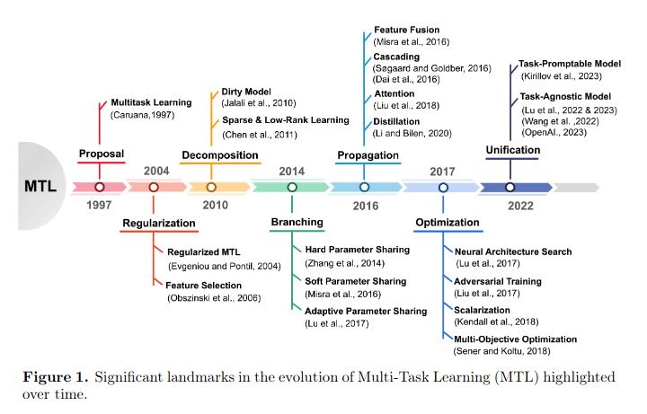
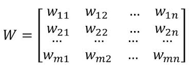
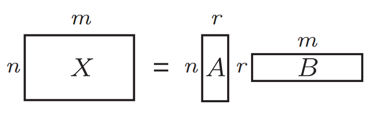
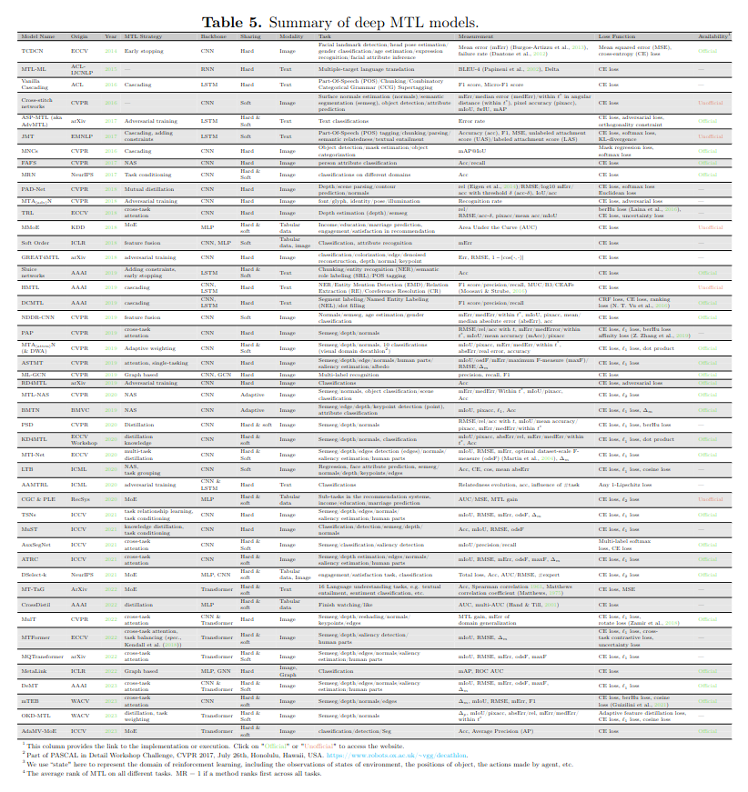
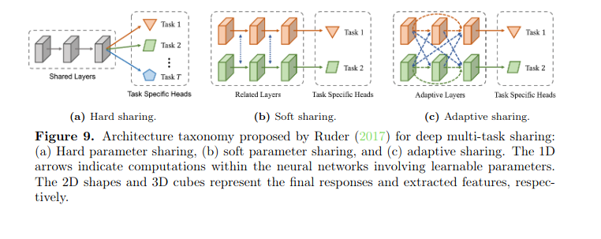

# Conceito 

No **Single-Task Learning** temos uma matriz de características (features) $X$ e um vetor alvo $y$. O modelo otimiza seus parâmetros para minimizar o erro em relação a esse único $y$. O problema/desvantagem dessa abordagem é se temos 2+ problemas de dominios proximos, cada um seria modelado e otimizado de forma independente sem trocar informações.

No **Multi-task learning** tentamos compartilhar informações do mesmo dominio (ou dominios proximos) através da otimização de varias tarefas simultaneamente. Principais vantagens:

- **Data augmentation:** Se antes tinhamos duas tarefas independentes de dominios proximos em que uma delas possui poucos rotulos e outra muitos, podemos usar parte do conhecimento/parametros obtidos da tarefa com muitos dados para auxiliar na tarefa esparsa.

- **Generalization:** Um modelo que antes otimizava apenas uma tarefa e sofria de overfitting agora tem que otimizar simultaneamente varias tarefas e portanto terá que generalizar mais.

# Possiveis configurações

Podemos ter diferentes configurações de entrada e saida:

- **Single-input multi-output (SIMO):** Um exemplo seria um modelo que apartir dos dados do usuário preve simultaneamente a confiança de clique e de compra.

- **Multi-input single-output (MISO):** Um bom exemplo são modelos multimodais que processam diversas fontes para uma saida.

- **Multi-input multi-output (MIMO):** Um exemplo seria um modelo que recebe tanto imagens médicas como relatórios textuais e é treinado para fazer duas coisas ao mesmo tempo no final como gerar um laudo e um diagnóstico.

# Evolução

O MTL foi proposto em 1997 e vem evoluindo ate hoje

# Metodos

## Pre Deep Learning

- **Feature Selection:** A ideia aqui é regularização de varias tarefas em conjunto, em que cada tarefa sem seus pesos independentes gerando uma matriz de pesos de dimensões n_tarefas x n_features. Cada tarefa tem uma regularização global gerada através da matriz e/ou uma regularização especifica da tarefa. 

- **Feature Transformation:** A ideia aqui é que, em vez de apenas escolher as features originais (como no método anterior), o modelo aplica uma matriz de transformação para combinar os dados brutos e criar uma representação totalmente nova. Depois de criar esse novo espaço de dados, as tarefas selecionam as características compartilhadas a partir dele.

- **Low-Rank Factorization (Fatoração de Baixo Posto):** A ideia aqui é organizar os pesos de todas as tarefas em uma matriz (ou tensor) e forçar matematicamente que essa matriz seja "enxuta" (de baixo posto, usando penalidades como normas). Na prática, isso obriga todas as tarefas a basearem suas predições em um pequeno conjunto compartilhado de variáveis ocultas (latentes), reduzindo a dimensionalidade.

- **Decomposition (Decomposição):** A ideia aqui é quebrar a matriz de pesos global do modelo em duas matrizes menores (geralmente uma soma, como W=P+Q). Uma matriz recebe uma regularização para aprender exclusivamente o que é compartilhado entre o grupo, enquanto a outra matriz recebe outra regularização focada em capturar apenas o que é exclusivo de cada tarefa (ou para isolar tarefas "rebeldes"/outliers)

- **Priori Sharing (Compartilhamento a Priori):** A ideia aqui é injetar o nosso conhecimento prévio (a priori) direto na matemática do modelo. Se sabemos de antemão que certas tarefas são parecidas ou possuem uma estrutura de correlação/covariância, nós adicionamos uma penalidade que força os pesos dessas tarefas a ficarem próximos ou a respeitarem essa estrutura predefinida durante o treinamento.

- **Task Clustering/Grouping (Agrupamento de Tarefas):** A ideia aqui é assumir que, em um mar de muitas tarefas, nem todas são "amigas" ou igualmente relacionadas. O algoritmo divide as tarefas em pequenos grupos (clusters) ou hierarquias (árvores). Assim, a regularização e o compartilhamento forte de informações acontecem apenas entre as tarefas que caíram no mesmo grupo, evitando forçar similaridade com tarefas irrelevantes.

## Deep Learning

Muuuitas arquiteturas possiveis e abordadas na survey mas em geral seguem uma taxonomia:

- **Hard Sharing:** A ideia aqui é que todas as tarefas **compartilhem exatamente as mesmas camadas iniciais** (e os mesmos pesos) da rede neural. Essas camadas rasas funcionam como um extrator de características universal e idêntico para o grupo todo. Depois de passar por essa base comum, a rede se **ramifica em "cabeças" (heads) separadas**, onde cada tarefa tem suas próprias camadas finais exclusivas para gerar a sua previsão específica.

- **Soft Sharing:** A ideia aqui é dar mais independência: cada tarefa tem sua **própria rede neural separada** do início ao fim (incluindo as camadas iniciais). No entanto, para que o modelo continue sendo multitarefa, essas redes são incentivadas a "conversar" entre si durante o processamento. Elas **trocam informações e características usando técnicas de propagação (como as de fusão, agregação ou atenção)** para capturar similaridades, mas sem a obrigação de terem pesos matematicamente idênticos. Algumas técnicas: 

    - **Fusão de features:** combina representações de atrvés de somas ponderadas ou concatenação.
    - **Cascateamento:** tarefas mais simples são resolvidas (output) nas camadas mais rasas e as mais complexas recebem o output das rasas para ajudar.
    - **Destilação:** Usar uma ou mais redes especialistas treinadas em tarefas especificas para guiar a rede multi-task no aprendizado.
    - **Cross-attention:** Projetar as duas representações juntas em um espaço unico igual Transformers.
    - **Mixture-of-Experts:** Logica identica usada nos LLMs em que tem redes especializadas e um direcionador (gate).

- **Adaptative Sharing:** A ideia aqui é não assumir nada de antemão e deixar o p**róprio modelo descobrir a melhor estrutura**. A rede começa como uma estrutura massiva onde todos os caminhos e conexões possíveis entre as camadas e as tarefas estão ativos. Durante o treinamento, as **conexões que não ajudam "desaparecem" em uma busca por comprimir o modelo**. No final desse processo de ramificação dinâmica, o que sobra é uma rede enxuta e montada sob medida para as necessidades daquele grupo específico de tarefas.

## Pontos negativos

- **Negative Transfer:** Quando as tarefas agregadas são pouco relacionadas, o treinamento simultâneo pode introduzir ruídos e interferências irrelevantes. Além disso, a otimização de uma tarefa pode prejudicar o desempenho de outra.

- **Parâmetros e Complexidade:** Número de parâmetros cresce bastante à medida que novas tarefas são adicionadas. Além disso, técnicas de MTL exigem alta carga computacional.

