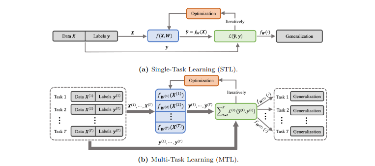
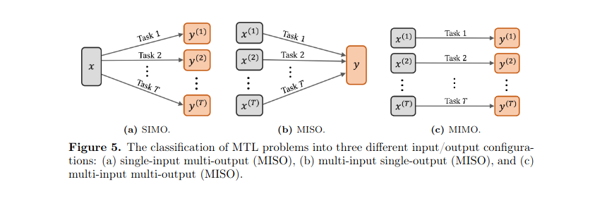

## Conceito 

No **Single-Task Learning** temos uma matriz de características (features) $X$ e um vetor alvo $y$. O modelo otimiza seus parâmetros para minimizar o erro em relação a esse único $y$. O problema/desvantagem dessa abordagem é se temos 2+ problemas de dominios proximos, cada um seria modelado e otimizado de forma independente sem trocar informações.

No **Multi-task learning** tentamos compartilhar informações do mesmo dominio (ou dominios proximos) através da otimização de varias tarefas simultaneamente. Principais vantagens:

- **Data augmentation:** Se antes tinhamos duas tarefas independentes de dominios proximos em que uma delas possui poucos rotulos e outra muitos, podemos usar parte do conhecimento/parametros obtidos da tarefa com muitos dados para auxiliar na tarefa esparsa.

- **Generalization:** Um modelo que antes otimizava apenas uma tarefa e sofria de overfitting agora tem que otimizar simultaneamente varias tarefas e portanto terá que generalizar mais.

## Possiveis configurações

Podemos ter diferentes configurações de entrada e saida:

- **Single-input multi-output (SIMO):** Um exemplo seria um modelo que apartir dos dados do usuário preve simultaneamente a confiança de clique e de compra.

- **Multi-input single-output (MISO):** Um bom exemplo são modelos multimodais que processam diversas fontes para uma saida.

- **Multi-input multi-output (MIMO):** um modelo que recebe tanto imagens médicas como relatórios textuais em paralelo (Multi-Input) e é treinado para fazer duas coisas ao mesmo tempo no final (Multi-Output): gerar um novo laudo descritivo em texto e extrair um grafo causal estruturado que mapeia as relações entre os sintomas e os achados clínicos.

## Negative Transfer
