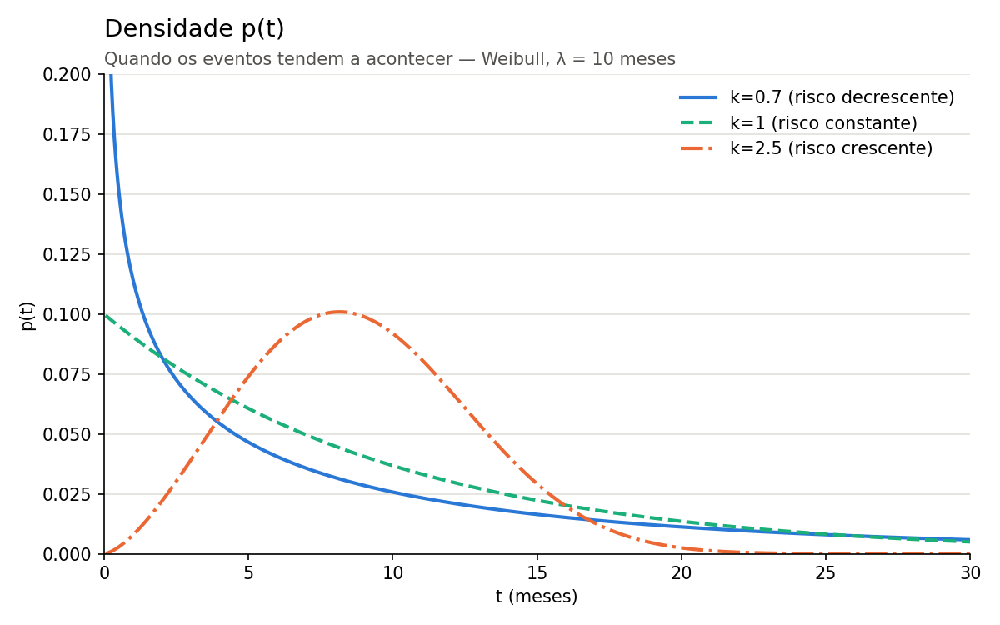
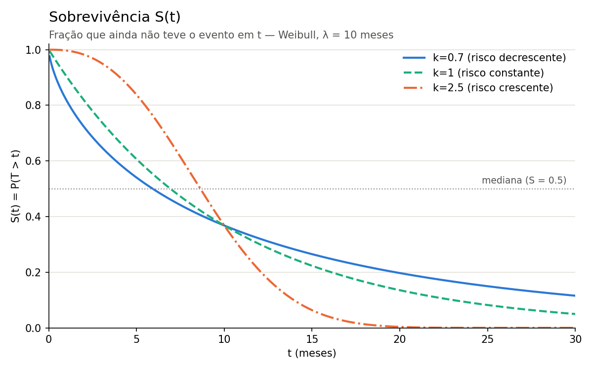
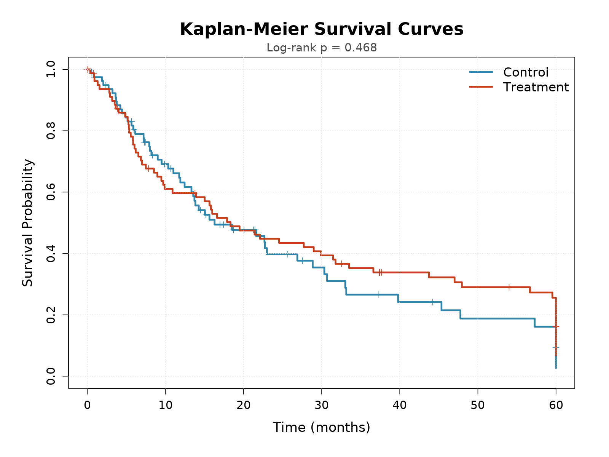
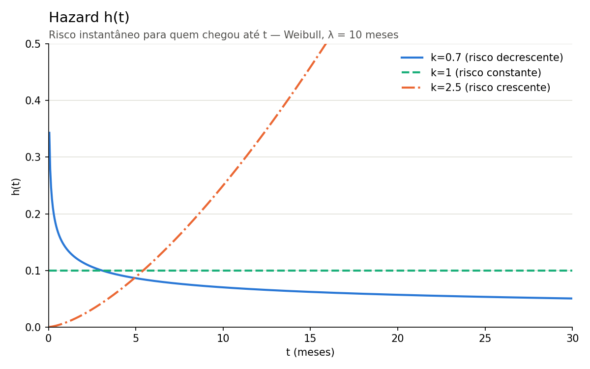
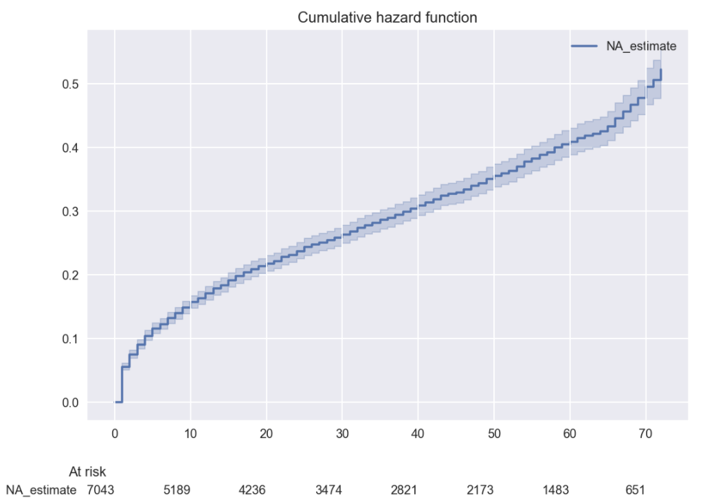
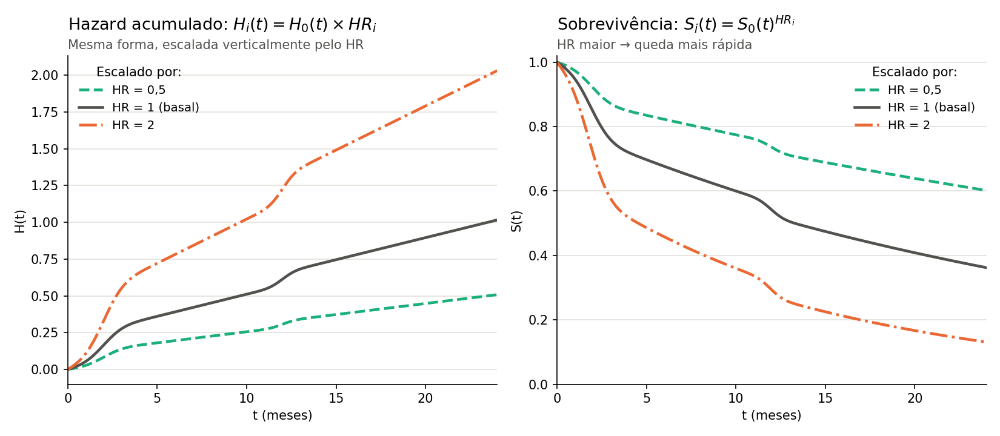

# **Analise de sobrevivencia**

Análise de sobrevivência é um conjunto métodos estatísticos para analisar dados em que nosso objetivo de analise/predição é o tempo até a ocorrência de um evento, e em que parte das observações é censurada. Um problema de sobrevivencia depende da definição de 3 coisas:

- *evento:* Algo bem definido que acontece com um individuo em algum intervalo de tempo (como churn, compra, morte)

- *origem/inicio:* O ponto em que começamos observar o individuo (começamos a observar o individuo desde o diagnostico ? desde a ultima compra ? desde hoje ?)
- *censura:* sabemos que o evento não aconteceu até o tempo x, e depois disso não observamos mais o indivíduo. Isso é *censura a direita* mas existem casos em que existe a suposição de *censura não informativa* em que o individuo deixar de ser observado não esta ligado ao evento.

A maior diferença aqui é que sobrevivencia lida com a censura, sem esse detalhe outros metodos de modelagem de tempo poderiam ser usados como regressão simples ou classificação.

## **Funções (Discretas)** 

Quase todos os métodos dentro de analise de sobrevivencia tentam estimar ou modelar uma das seguintes funções. Seja T a variável aleatória do tempo até o evento, assumindo valores t = 1, 2, 3, ..., e seja f(t) = P(T = t) a sua função de probabilidade, isto é, a probabilidade de o evento acontecer exatamente no período t e F(t) a função acumulada. Quase todos os métodos dentro de análise de sobrevivência tentam estimar ou modelar uma das seguintes funções:

### **Curva de Sobrevivencia**

Curva de sobrevivencia é a distribuição de probabilidade de S(t), ou seja, distribuição de probabilidade do evento não acontecer até o tempo t.

- *Função de sobrevivência S(t):* probabilidade de o indivíduo passar do tempo t sem o evento, S(t) = P(T > t) = 1 - F(t). Por exemplo, a probabilidade de um paciente não morrer até o tempo t. Ela é a soma da cauda da distribuição após t, então é não crescente: quando t aumenta, S(t) diminui ou fica constante. Por definição, S(0) = 1.

    - O complemento 1 − S(t) = P(T ≤ t) = F(t) é a probabilidade de o evento acontecer até o tempo t, isto é, a função de distribuição acumulada do tempo até o evento.

#### **Kaplan-Meier (KM)**

Estimador *não paramétrico* de S(t), descreve a curva a partir dos dados, sem supor distribuição e sem distinguir indivíduos.

Em cada tempo tᵢ com evento, estima o hazard discreto entre quem ainda está **em risco** e multiplica as probabilidades de sobreviver a cada instante:

$$\hat{S}(t) = \prod_{t_i \le t} \left(1 - \frac{d_i}{n_i}\right)$$

- *dᵢ*: eventos em tᵢ
- *nᵢ*: indivíduos em risco antes de tᵢ (sem evento e não censurados)

A censura entra pelo denominador: o censurado conta em *nᵢ* enquanto é observado e depois sai, sem nunca ser contado como evento.

**Características:**

- **Censura não informativa:** supõe que censurados têm o mesmo risco de quem continua sendo observado.
- **Homogeneidade:** supõe que todos seguem a mesma curva, o resultado é uma curva média.
- **Mediana:** primeiro t com S(t) ≤ 0,5.
- **Limitação:** permite comparar poucos grupos (teste log-rank)

#### **Teste log-rank**

Testa se as curvas KM de dois ou mais grupos são diferentes de verdade ou só por acaso a ideia é usar qui-quadrado para ver se as 2 distribuições são iguais ou diferentes 

### **Curva de Hazard**

Curva de hazard é a distribuição de probabilidade de h(t), ou seja, distribuição de probabilidade do evento acontecer em t dado que não aconteceu ainda mostrando a evolução do risco com o tempo.

- *Função de hazard h(t):* probabilidade de o evento acontecer no tempo t, dado que ainda não tinha acontecido até t. Por exemplo, a probabilidade de um paciente morrer no dia 20, dado que chegou vivo ao dia 20. É a probabilidade condicionalnão = f(t) / S(t − 1), ou seja, a probabilidade de o evento ocorrer exatamente em t dividida por toda a cauda a partir de t (incluindo t), que corresponde a quem ainda está em risco.

    - O complemento do hazard 1 - h(t) é a probabilidade do evento não acontecer no tempo t dado que não aconteceu antes de t
    - H(t) é o somatório de h(t) de t variando de 1 a t, cada uma dessas probabilidades é condicionada de forma diferente e por isso essa soma não é uma probabilidade e sim um sinal acumulado de quanto risco acumulado temos ate t. Quanto mais risco acumulado menor o S(t) pois os complementos serão menores.

- *Relação entre h e S:* para passar de t sem o evento, o indivíduo precisa sobreviver a cada período até t, então S(t) = ∏ (1 − h(i)), para i de 1 até t. É assim que a curva de sobrevivência é construída a partir do hazard, e é exatamente a lógica do Kaplan-Meier.

#### **Nelson-Aalen (NA)**

Estimador *não paramétrico* do hazard acumulado H(t). Usa a mesma lógica do KM (hazard discreto entre quem está **em risco**), mas em vez de multiplicar as probabilidades de sobreviver, **soma os hazards**:

$$\hat{H}(t) = \sum_{t_i \le t} \frac{d_i}{n_i}$$

- *dᵢ*: eventos em tᵢ
- *nᵢ*: indivíduos em risco antes de tᵢ (sem evento e não censurados)

A censura entra da mesma forma que no KM: pelo denominador *nᵢ*.

**Relação com o KM:** a partir do NA também dá para obter a sobrevivência, com S(t) = exp(−H(t)).

**Características:**

- **Mesmas suposições do KM:** censura não informativa e homogeneidade.
- **Não é probabilidade:** é uma curva em degraus crescente que pode passar de 1.
- **Lê o formato do hazard:** estimar h(t) direto é muito ruidoso, mas a inclinação de H(t) é o hazard. 
    - H(t) reta -> hazard constante, risco constante e portanto pode ser modelado como uma exponencial
    - côncava -> hazard decrescente, ou seja, risco de evento diminiu com tempo
    - convexa -> hazard crescente, ou seja, risco de evento aumenta com tempo
- **Base de outros métodos:** Usado em Cox 

## **Modelo Semiparamétrico**

### **Cox**

$$
H(t \mid X) = H_0(t) \exp(\beta_1 X_1 + \beta_2 X_2 + \dots + \beta_p X_p)
$$

A fórmula original do Cox é definida em cima do hazard instantâneo, mas como o mesmo fator multiplicativo se aplica ao hazard acumulado, as duas formas geram a mesma curva de sobrevivência. Gerar a curva pelo acumulado é mais fácil, porque é isso que se estima diretamente dos dados (Breslow), sem precisar "desacumular" para achar o instantâneo.

A ideia da fórmula:

- **H₀(t):** o hazard acumulado de um indivíduo de referência (features = 0), comum a toda a base. É basicamente o Nelson-Aalen, e S₀(t) = exp(−H₀(t)) dá uma curva próxima da KM.
- **exp(β₁X₁ + ...):** o *relative hazard* (risco desse indivíduo em relação à referência), ponderado pelos β aprendidos.
  - RH < 1 → risco menor que a referência
  - RH > 1 → risco maior que a referência

A curva H₀(t) é fixa, estimada uma vez com a base inteira. Para gerar a curva de uma nova instância, não se recalcula nada do zero: só se escala H₀(t) pelo RH daquela instância, o que já dá H(t) em todo t.

### **Como encontrar os parâmetros β**

#### **Verossimilhança (likelihood)**

Mede o quão bem parâmetros de um modelo explicam os dados observados, invertendo a lógica da probabilidade:

- Na probabilidade, temos os parâmetros e perguntamos qual a chance de observar tais dados.
- Na verossimilhança, temos os dados observados e perguntamos para quais parâmetros esses dados são mais prováveis.

A função de verossimilhança L retorna um valor maior para parâmetros mais prováveis. Para maximizar, usam-se métodos baseados em derivadas (gradiente, Newton-Raphson, mais eficiente quando a função é côncava, como aqui, pois usa a curvatura para convergir mais rápido). Geralmente maximiza-se o log de L, porque a derivada fica mais simples e o cálculo é numericamente mais estável.

#### **Como o Cox faz**

O Cox maximiza uma verossimilhança **parcial**: ela não estima H₀ junto com os β, então não depende de nenhuma suposição sobre a forma de H₀.

$$L(\beta) = \prod_{i:\, \text{evento}} \frac{e^{\beta x_i}}{\sum_{j \in R(t_i)} e^{\beta x_j}}$$

- **Numerador:** o relative hazard do indivíduo que teve o evento em t.
- **Denominador:** a soma dos relative hazard de todos em risco em t (ainda sem evento, ainda não censurados), incluindo o próprio i.

Cada fração é a probabilidade de ter sido justamente o indivíduo i a ter o evento, entre todos os candidatos daquele instante. O produtório é maximizado quando o modelo dá risco relativo mais alto para quem de fato teve o evento em cada t, ou seja, os β são ajustados para que o modelo ordene corretamente quem tinha mais risco no momento certo.

A fórmula original assume que dois eventos não acontecem no mesmo instante. Quando há empates (comum em dados discretizados por dia), usam-se aproximações: **Breslow** ou **Efron**

### **Premissas**

- **Riscos proporcionais:** a razão entre o hazard de dois indivíduos precisa ser constante ao longo do tempo. Se o efeito de uma variável muda de intensidade com t (ex.: proteção que só vale nos primeiros meses), a razão deixa de ser constante, sintoma visível disso são curvas KM que se cruzam, e nenhum HR fixo consegue representar essa mudança.
- **Independência:** as observações precisam ser independentes entre si. Múltiplas linhas do mesmo indivíduo (ex.: janelas deslizantes) violam isso, os β continuam razoáveis, mas os erros padrão ficam subestimados; corrige-se com erro padrão robusto agrupado por indivíduo.
- **Censura não informativa:** o motivo da censura não pode estar relacionado ao risco do indivíduo. Se quem sai da observação tem risco sistematicamente diferente de quem continua, a curva de sobrevivência fica enviesada.

### **Cox XGBoost**

Mesma estrutura do Cox linear, $H(t|X) = H_0(t)\exp(f(X))$, mas o termo linear $\beta X$ vira $f(X)$ = soma de previsões de várias árvores (BOOSTING), o que permite capturar não linearidades e interações sem precisar especificar manualmente.

A loss continua sendo a mesma verossimilhança parcial do Cox. O que muda é como ela é maximizada: em vez de resolver os β de uma vez com Newton-Raphson, o XGBoost ajusta uma árvore por vez via **gradient boosting**.

**Como as árvores treinam sem ter o T como rótulo direto:**

Gradient boosting sempre treina cada árvore para prever o **gradiente da loss** em relação à previsão atual, o que no fundo é sempre alguma forma de "rótulo − previsão".

Em Cox, para cada tempo de evento tₖ, a "previsão" do modelo é a mesma fração da verossimilhança parcial menos a probabilidade de ter sido aquele indivíduo entre todos em risco:

$$p_i(t_k) = \frac{e^{f(x_i)}}{\sum_{j \in R(t_k)} e^{f(x_j)}}$$

E o "rótulo" é binário: foi essa linha quem teve o evento em tₖ (1) ou ela só estava em risco, sem vencer (0). O gradiente de cada linha soma essa diferença em **todos os tempos em que ela participou como candidata**:

$$\text{gradiente}_i = [1 - p_i(t_i)] - \sum_{t_k < t_i} p_i(t_k)$$

- No seu próprio tempo de evento: `1 − p` (quanto o modelo ainda subestima o risco dela).
- Em todo tempo anterior em que ela só era candidata: subtrai `p` (penaliza o modelo por ter dado risco alto demais a quem não venceu ainda).

É assim que censura entra no treino: uma linha censurada nunca contribui com o termo positivo, só com os termos negativos como concorrente, o mesmo papel que ela tem no denominador da verossimilhança parcial do Cox linear.

## **Modelos não paramétricos e AFT**

O cox é semiparamétrico pois ele deixa o H₀(t) livre, sem forma definida, e só estima o efeito das features. Os modelos paramétricos vão além: eles *assumem uma distribuição de probabilidade inteira para T (o tempo até o evento)* como Weibull e exponencial.

## **Metricas** 

### **C-index (Harrell e Uno)**

Para todos os pares comparaveis, ou seja, todos os pares não censurados em que conseguimos ter acesso ao evento (proxima compra por exemplo) mede a capacidade do modelo de ordenar corretamente os tempos até o evento, não a probabilidade em si. Pergunta: "entre dois clientes, o modelo prevê tempo menor para quem realmente comprou primeiro?"

$$
C_{\text{Harrell}} = \frac{\displaystyle\sum_{i,j} \mathbb{1}\left[T_i < T_j\right] \cdot \mathbb{1}\left[\hat{\eta}_i > \hat{\eta}_j\right] \cdot \delta_i}{\displaystyle\sum_{i,j} \mathbb{1}\left[T_i < T_j\right] \cdot \delta_i}
$$

O problema do C-index de Harrell é que, quando há muita censura, ele fica enviesado, pares envolvendo indivíduos censurados cedo são simplesmente descartados, e isso distorce a estimativa se a censura não for uniforme ao longo do tempo.

$$
C_{\text{Uno}} = \frac{\displaystyle\sum_{i,j} \mathbb{1}\left[T_i < T_j\right] \cdot \mathbb{1}\left[\hat{\eta}_i > \hat{\eta}_j\right] \cdot \delta_i \cdot \dfrac{1}{\hat{G}(T_i)^2}}{\displaystyle\sum_{i,j} \mathbb{1}\left[T_i < T_j\right] \cdot \delta_i \cdot \dfrac{1}{\hat{G}(T_i)^2}}
$$

- $T_i, T_j$: tempos observados (evento ou censura)
- $\delta_i$: indicador de evento ($1$ = evento observado, $0$ = censurado)
- $\hat{\eta}_i$: score de risco previsto pelo modelo
- $\hat{G}(t)$: estimativa Kaplan--Meier da distribuição de censura (probabilidade de não estar censurado até $t$)

### **IBS (Integrated Brier Score)**

